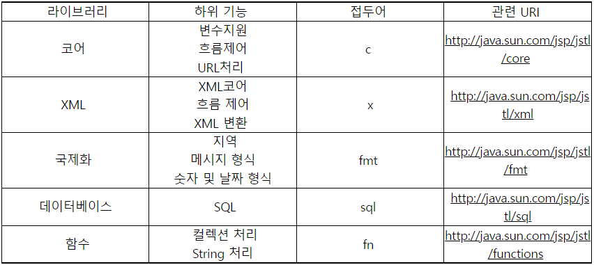
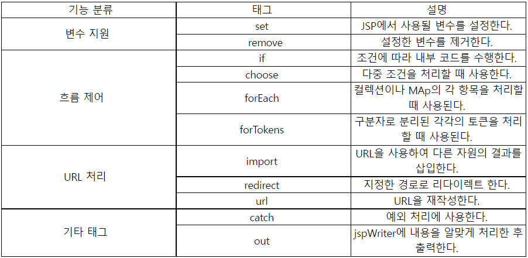
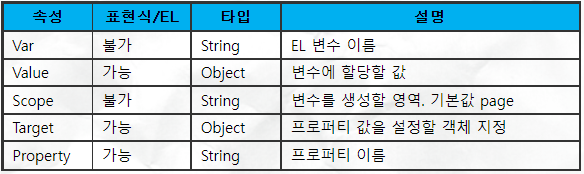
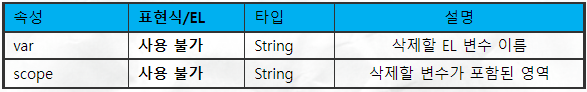

- [JSTL(JSP Standard Tag Library)](#jstljsp-standard-tag-library)
  - [JSTL이 제공하는 태그의 종류](#jstl이-제공하는-태그의-종류)
  - [JSTL 라이브러리 받기](#jstl-라이브러리-받기)
- [코어 태그](#코어-태그)
  - [변수 지원 태그](#변수-지원-태그)
    - [<c:set> 태그](#cset-태그)
  - [<c:remove> 태그](#cremove-태그)
  - [흐름 제어 태그](#흐름-제어-태그)

---

# JSTL(JSP Standard Tag Library)

JSP 페이지에서 많이 사용되는 논리적인 판단, 반복 처리, 포맷 처리를 위한 커스텀 태그를 표준으로 만들어서 정의한 것

- JSP는 HTML코드와 스크립트릿, 표현식 등의 스크립트 코드가 섞이기 때문에 코드를 보는게 쉽지 않다. 그래서 HTML태그와 비슷한 코드를 사용해서 처리할 수 있도록 만든 것이다. 이렇게 JSTL을 이용하므로써 보기 좋고 이해하기 쉬운 코드를 작성할 수 있다.

## JSTL이 제공하는 태그의 종류



## JSTL 라이브러리 받기

JSTL을 사용하려면 jar 파일을 다운로드해서 WEB-INF/lib 디렉터리에 복사한다.

---

# 코어 태그

코어 태그 라이브러리



코어 태그 라이브러리를 사용하려면 JSP 페이지에 다음과 같이 taglib 디렉티브를 추가해야 한다.

```jsp
<%@ taglib prefix="c" uri="http://java.sun.com/jsp/jstl/core"%>
```

- prefix 속성에 지정한 값은 JSP 코드에서 코어 태그 라이브러리를 호출할 때 사용할 접두어가 된다.
- uri 속성은 위의 표에 있는 관련 uri와 같다.

## 변수 지원 태그

JSTL이 지원하는 태그에서 사용할 수 있는 변수를 설정하기 위해 사용한다.

- set
- remove

### <c:set> 태그

<c:set> 태그 EL 변수의 값이나 EL 변수의 프로퍼티 값을 지정할 때 사용된다.

```jsp
<c:set var="변수명" value="값" [scope="영역"]/>

<c:set var="변수명" [scope="영역"]>값</c:set>
```

- scope
  - 변수를 저장할 영역을 지정한다.
  - page, request, session, application 중 하나가 온다.
    - 기본값은 page

`<c:set>`

- scope 속성에 지정한 영역에 값을 저장한다.
- 예)
  - scope 속성이 page이고 var, value 속성이 각각 "varName"과 "varValue"라고할 경우
    - 내부적으로 pageContext.setAttribute(varName, varValue, scope)를 호출해서 지정한 영역의 속성으로 설정한다.

```jsp
 <c:set target = "대상" property = "프로퍼티이름" value = "값"/>

 <c:set target = "대상" property = "프로퍼티이름">값</c:set>
```

- target
  - 프로퍼티 값을 설정할 대상 객체를 지정한다.
  - 표현식이나 EL변수로 지정한다.
  - 대상 객체는 자바빈 객체나 Map이어야 한다.
- property
  - 설정할 프로퍼티의 이름을 지정한다.
  - target이 자바빈 객체인 경우 프로퍼티 이름에 해당하는 set(setName 등) 메소드를 제공해 주어야 한다.
- value
  - 프로퍼티의 값을 지정한다.

member.setName("홍길동")과 동일

```jsp
<% Member member = new Member(); %>
<c:set target="<%= member %>" property="name" value="홍길동"/>
<%= member.getName() %> <%-- 값 홍길동 출력 --%>


<c:set var="m" value="<%=member %>"/>
<c:set target="${ m }" property="name" value="홍길동" />
${ m.name } <%-- 값 홍길동 출력 --%>
```

prop.set("host", localhost")와 동일

```jsp
<% Map<String, String> prop = new HashMap<>(); %>
<c:set target="<%= prop %>" property="host" value="localhost" />
<%= prop.get("host") %> <%-- 값 localhost 출력 --%>
```

target 속성을 설정할 때 주의할 점

- 다음과 같이 프로퍼티 값을 설정할 EL 변수의 이름만 지정하는 실수를 하기 쉽다.

```jsp
<c:set var="member" value="<%= member %>"/>
<c:set targete="member" property="name" value="최범균2"/>
```

- target 대상이 EL 변수인 경우 target 속성의 값을 ${member}와 같이 EL을 이용해서 설정해야 한다.

<c:set> 태그 속성 설명 요약



## <c:remove> 태그

set 태그로 지정한 변수를 삭제할 때 사용한다.

```jsp
<c:remove var = "varName" [scope = "영역"]/>
```

- 삭제할 변수의 scope를 지정하지 않으면 동일한 이름으로 저장된 모든 영역의 변수를 삭제한다.



## 흐름 제어 태그

ㅐㅏ