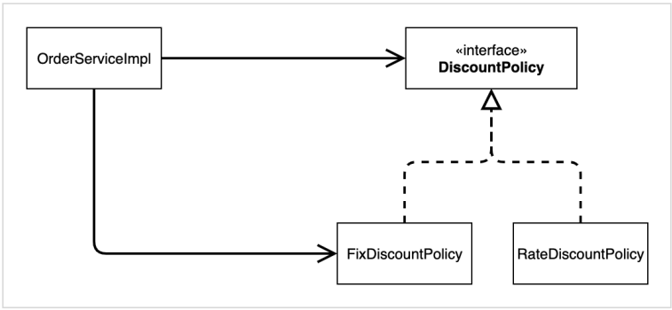
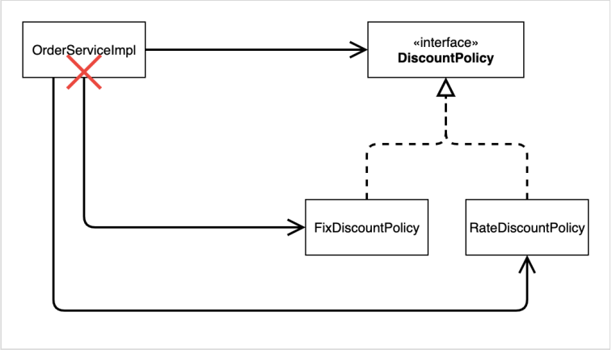

# 할인 정책 추가

```java
package yback.board.discount;

import yback.board.member.Grade;
import yback.board.member.Member;

public class RateDiscountPolicy implements DiscountPolicy{

     private int dicountPercent1 = 10;
     private int dicountPercent2 = 20;

     @Override
     public int discount(Member member, int price) {
          if (member.getGrade() == Grade.MANAGER) {
               return price * dicountPercent2 / 100;
          } else if (member.getGrade() == Grade.VIP) {
               return price * dicountPercent1 / 100;
          } else {
               return 0;
          }
     }
}
```

DiscountPolicy를 구현하여 discount함수를 오버라이딩한다.

- grade에 따라서 할인율에 대한 할인액을 반환하게 오버라이딩한다.

## 할인 정책 테스트

```java
package yback.board.discount;

import org.assertj.core.api.Assertions;
import org.junit.jupiter.api.DisplayName;
import org.junit.jupiter.api.Test;
import yback.board.member.Grade;
import yback.board.member.Member;

import static org.junit.jupiter.api.Assertions.*;

class RateDiscountPolicyTest {

     RateDiscountPolicy discountPolicy = new RateDiscountPolicy();

     @Test
     @DisplayName("Manager는 20% 할인이 적용된다.")
     void managerDiscount() {
          //given
          Member member = new Member(1L, "memberMANAGER", Grade.MANAGER);

          //when
          int discount = discountPolicy.discount(member, 10000);

          //then
          Assertions.assertThat(discount).isEqualTo(2000);
     }

     @Test
     @DisplayName("VIP는 10% 할인이 적용된다.")
     void vipDiscount() {
          //given
          Member member = new Member(2L, "memberVIP", Grade.VIP);

          //when
          int discount = discountPolicy.discount(member, 10000);

          //then
          Assertions.assertThat(discount).isEqualTo(1000);
     }

     @Test
     @DisplayName("Basic은 할인이 적용되지 않는다.")
     void basicDiscount() {
          //given
          Member member = new Member(3L, "memberBASIC", Grade.BASIC);

          //when
          int discount = discountPolicy.discount(member, 10000);

          //then
          Assertions.assertThat(discount).isEqualTo(0);
     }
}
```

# 새로운 할인 정책 적용과 문제점

위에서 추가한 할인 정책을 적용하기 위해선 `OrderServiceImpl` 코드를 고쳐야 한다.

```java
package yback.board.discount;

import yback.board.member.Member;
import yback.board.member.MemberRepository;
import yback.board.member.MemberRepositoryImpl;

public class OrderServiceImpl implements OrderService{
     private final MemberRepository memberRepository = new MemberRepositoryImpl();
//     private final DiscountPolicy discountPolicy = new FixDiscountPolicy();
     private final DiscountPolicy discountPolicy = new RateDiscountPolicy();

     @Override
     public Order CreateOrder(Long memberId, String itemName, int itemPrice) {
          Member member = memberRepository.findById(memberId);
          int discountPrice = discountPolicy.discount(member, itemPrice);

          return new Order(memberId, itemName, itemPrice, discountPrice);
     }
}
```

- 문제점
  - DIP 위반, 클래스 의존관계
    - 인터페이스 뿐만 아니라 구현 클래스에도 의존하고 있다.
      - 인터페이스 의존: DiscountPolicy
      - 구현 클래스 의존: FixDiscountPolicy, RateDiscountPolicy
  - OCP 위반



- `OrderServiceImpl`이 인터페이스인 `DiscounPolicy` 뿐만 아니라 구현 클래스인 `FixDiscountPolicy`나 `RateDiscountPolicy`에 의존하고 있다.
  - DIP 위반
    - 구현 클래스는 인터페이스에만 의존하도록 변경해줘야 한다.



- `FixDiscountPolicy`에서 `RateDiscountPolicy`로 변경하려면 `OrderServiceImpl`의 소스 코드도 변경해야 한다.
  - OCP 위반

구현 클래스가 인터페이스에만 의존하게 만들기 위해서는 누군가각 클라이언트인 `OrderServiceImpl`에 `DiscountPolicy`의 구현 객체를 대신 생성하고 주입해줘야 한다.

# AppConfig

구현 객체를 생성하고, 연결하는 책임을 가지는 별도의 설정 클래스

```java
package yback.board;

import yback.board.discount.FixDiscountPolicy;
import yback.board.discount.OrderService;
import yback.board.discount.OrderServiceImpl;
import yback.board.member.MemberRepositoryImpl;
import yback.board.member.MemberService;
import yback.board.member.MemberServieImpl;

public class AppConfig {

     public MemberService memberService() {
          return new MemberServieImpl(new MemberRepositoryImpl());
     }

     public OrderService orderService() {
          return new OrderServiceImpl(
                  new MemberRepositoryImpl(),
                  new FixDiscountPolicy()
          );
     }
}
```

>코드를 추가하면 컴파일 에러가 발생하는데, 바로 고칠 것이다.
AppConfig에서 new 연산자로 애플리케이션의 실제 동작에 필요한 구현 객체를 생성한다.

- MemberServiceImpl
- MemberRepositoryImpl
- OrderServiceImpl
- FixDiscountPolicy

또한 AppConfig에서 생성한 구현 객체를 그대로 생성자를 통해 주입(연결)해준다.

- MemberServiceImpl <- MemberRepositoryImpl
- OrderServiceImpl <- MemberRepositoryImpl, FixDiscountPolicy

# DIP를 위반하고 있던 다른 구현 클래스 고치기

## MemberServiceImpl (생성자 주입)

```java
package yback.board.member;

public class MemberServieImpl implements MemberService{

     private final MemberRepository memberRepository;

     public MemberServieImpl(MemberRepository memberRepository) {
          this.memberRepository = memberRepository;
     }

     @Override
     public void join(Member member) {
          memberRepository.save(member);
     }

     @Override
     public Member findMember(Long memerId) {
          return memberRepository.findById(memerId);
     }
}
```

 원래는 `private final MemberRepository memberRepository = new MemberRepositoryImpl()`처럼 `MemberServiceImpl`에서 인터페이스인 `MemberRepository`와 구현 클래스인 `MemberRepositoryImpl`에 모두 의존하고 있었지만, 코드를 위와 같이 바꾸면서 오직 인터페이스에만 의존하고 있게 만들었다.

- 이렇게 인터페이스에만 의존하면 MemberServiceImpl에서는 어떤 구현 객체가 주입될지는 알 수 없다.
  - AppConfig가 전격적으로 담당하게 된다.
  - MemberServiceImpl은 실행에만 집중할 수 있게 된다.
  - MemberServiceImpl 입장에서 보면 의존관계를 외부에서 주입해주는 것 같다고 해서 DI(Dependency Injection), 의존관계 주입이라고 한다.

## OrderServiceImpl (생성자 주입)

```java
package yback.board.discount;

import yback.board.member.Member;
import yback.board.member.MemberRepository;

public class OrderServiceImpl implements OrderService{
     private final MemberRepository memberRepository;
     private final DiscountPolicy discountPolicy;

     public OrderServiceImpl(MemberRepository memberRepository, DiscountPolicy discountPolicy) {
          this.memberRepository = memberRepository;
          this.discountPolicy = discountPolicy;
     }


     @Override
     public Order CreateOrder(Long memberId, String itemName, int itemPrice) {
          Member member = memberRepository.findById(memberId);
          int discountPrice = discountPolicy.discount(member, itemPrice);

          return new Order(memberId, itemName, itemPrice, discountPrice);
     }
}
```

- OrderServiceImpl에서도 인터페이스에만 의존하게 변경했다.
  - 이 외(구현 클래스 객체 생성, 주입)는 모두 AppConfig가 담당

# AppConfig 테스트

모든 test들에 `AppConfig`를 적용시키자.

## MemberApp

```java
package yback.board;

import yback.board.member.Grade;
import yback.board.member.Member;
import yback.board.member.MemberService;
import yback.board.member.MemberServieImpl;

public class MemberApp {
     public static void main(String[] args) {
          AppConfig appConfig = new AppConfig();
          MemberService memberService = appConfig.memberService();
          Member member = new Member(1L, "memberA", Grade.VIP);
          memberService.join(member);

          Member findMember = memberService.findMember(1L);
          System.out.println("new member = " + member.getName());
          System.out.println("find member = " + findMember.getName());
     }
}
```

`MemberApp`이 의존하는 것은 `MemberService`뿐이다.

- 다른 의존관계 주입은 `AppConfig`가 담당

## OrderApp

```java
package yback.board;

import yback.board.discount.Order;
import yback.board.discount.OrderService;
import yback.board.member.Grade;
import yback.board.member.Member;
import yback.board.member.MemberService;

public class OrderApp {
     public static void main(String[] args) {
          AppConfig appConfig = new AppConfig();
          MemberService memberService = appConfig.memberService();
          OrderService orderService = appConfig.orderService();

          long memberId = 1L;
          Member member = new Member(memberId, "memberA", Grade.VIP);
          memberService.join(member);

          Order order = orderService.createOrder(memberId, "itemA", 10000);
          System.out.println("order = " + order);
     }
}
```

## MemberServiceTest, OrderServiceTest

```java
package yback.board.member;

import org.assertj.core.api.Assertions;
import org.junit.jupiter.api.BeforeEach;
import org.junit.jupiter.api.Test;
import yback.board.AppConfig;

public class MemberServiceTest {

     MemberService memberService;

     @BeforeEach
     public void beforeEach() {
          AppConfig appConfig = new AppConfig();
          memberService = appConfig.memberService();
     }

     @Test
     void join() {
          //given
          Member member = new Member(1L, "memberA", Grade.VIP);

          //when
          memberService.join(member);
          Member findMember = memberService.findMember(1L);

          //then
          Assertions.assertThat(member).isEqualTo(findMember);
     }
}
```

```java
package yback.board.discount;

import org.assertj.core.api.Assertions;
import org.junit.jupiter.api.BeforeEach;
import org.junit.jupiter.api.Test;
import yback.board.AppConfig;
import yback.board.member.Grade;
import yback.board.member.Member;
import yback.board.member.MemberService;
import yback.board.member.MemberServieImpl;

class OrderServiceTest {

     MemberService memberService;
     OrderService orderService;

     @BeforeEach
     public void beforeEach() {
          AppConfig appConfig = new AppConfig();
          memberService = appConfig.memberService();
          orderService = appConfig.orderService();
     }

     @Test
     void createOrder() {
          //given
          long memberId = 1L;
          Member member = new Member(memberId, "memberA", Grade.VIP);
          memberService.join(member);

          //when
          Order order = orderService.createOrder(memberId, "itemA", 10000);

          //then
          Assertions.assertThat(order.getDiscountPrice()).isEqualTo(1000);
     }
}
```

`@BeforeEach` annotation을 사용해서 각 테스트 실행 전에 한 번씩 호출되도록 설정

# AppConfig 리펙토링

## AppConfig 리펙터링 전

```java
package yback.board;

import yback.board.discount.FixDiscountPolicy;
import yback.board.discount.OrderService;
import yback.board.discount.OrderServiceImpl;
import yback.board.member.MemberRepositoryImpl;
import yback.board.member.MemberService;
import yback.board.member.MemberServieImpl;

public class AppConfig {

     public MemberService memberService() {
          return new MemberServieImpl(new MemberRepositoryImpl());
     }

     public OrderService orderService() {
          return new OrderServiceImpl(
                  new MemberRepositoryImpl(),
                  new FixDiscountPolicy()
          );
     }
}
```

위의 코드를 보면 알 수 있듯이, MemberRepositoryImpl 객체가 두 번 생성되었다.

## AppConfig 리펙터리 후

```java
package yback.board;

import yback.board.discount.DiscountPolicy;
import yback.board.discount.FixDiscountPolicy;
import yback.board.discount.OrderService;
import yback.board.discount.OrderServiceImpl;
import yback.board.member.*;

public class AppConfig {

     public MemberService memberService() {
          return new MemberServieImpl(memberRepository());
     }

     public OrderService orderService() {
          return new OrderServiceImpl(
                  memberRepository(),
                  discountPolicy()
          );
     }

     public MemberRepository memberRepository() {
          return new MemberRepositoryImpl();
     }

     public DiscountPolicy discountPolicy() {
          return new FixDiscountPolicy();
     }
}
```

이렇게 코드를 바꾸게 되면 객체 중복 생성을 막을 수 있고, 객체 생성 부분과 주입 부분을 나눠서 `AppConfig`의 전체 구성을 비교적 쉽게 확인할 수 있다.

