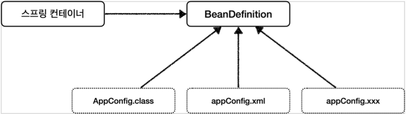
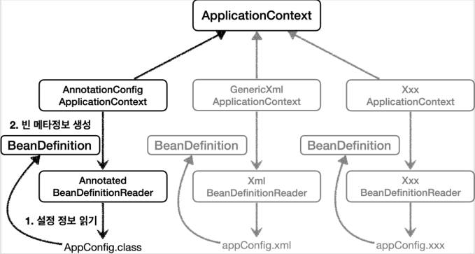
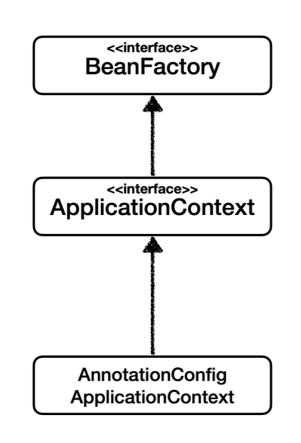
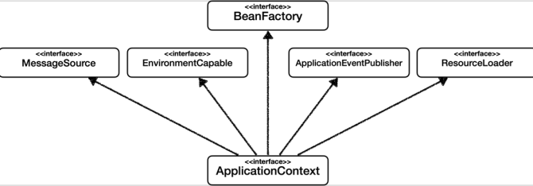

- [스프링 적용하기](#스프링-적용하기)
  - [AppConfig](#appconfig)
  - [MemberApp, OrderApp](#memberapp-orderapp)
- [스프링 컨테이너](#스프링-컨테이너)
  - [스프링 컨테이너 생성](#스프링-컨테이너-생성)
  - [스프링 컨테이너에 등록된 모든 빈 조회](#스프링-컨테이너에-등록된-모든-빈-조회)
    - [스프링 빈 조회 (기본)](#스프링-빈-조회-기본)
    - [스프링 빈 조회 (동일한 타입이 둘 이상)](#스프링-빈-조회-동일한-타입이-둘-이상)
    - [스프링 빈 조회 (상속 관계)](#스프링-빈-조회-상속-관계)
    - [스프링 빈 설정 메타 정보 (BeanDefinition)](#스프링-빈-설정-메타-정보-beandefinition)
- [BeanFactory와 ApplicationContext](#beanfactory와-applicationcontext)

# 스프링 적용하기

## AppConfig

기존의 AppConfig에 annotation을 추가한다.

```java
package yback.board;

import org.springframework.context.annotation.Bean;
import org.springframework.context.annotation.Configuration;
import yback.board.discount.DiscountPolicy;
import yback.board.discount.FixDiscountPolicy;
import yback.board.discount.OrderService;
import yback.board.discount.OrderServiceImpl;
import yback.board.member.*;

@Configuration
public class AppConfig {

     @Bean
     public MemberService memberService() {
          return new MemberServieImpl(memberRepository());
     }

     @Bean
     public OrderService orderService() {
          return new OrderServiceImpl(
                  memberRepository(),
                  discountPolicy()
          );
     }

     @Bean
     public MemberRepository memberRepository() {
          return new MemberRepositoryImpl();
     }

     @Bean
     public DiscountPolicy discountPolicy() {
          return new FixDiscountPolicy();
     }
}
```

class에 `@Configuration` annotation을 붙여주고, 각 메서드에는 `@Bean` annotation을 붙여준다.

- 이렇게 추가해주면 스프링 컨테이너에 스프링 빈으로 등록된다.

## MemberApp, OrderApp

AppConfig에서 빈으로 등록했으니, main 클래스들을 바꿔서 실행해본다.

MemberApp

```java
package yback.board;

import org.springframework.context.ApplicationContext;
import org.springframework.context.annotation.AnnotationConfigApplicationContext;
import yback.board.member.Grade;
import yback.board.member.Member;
import yback.board.member.MemberService;

public class MemberApp {
     public static void main(String[] args) {
          ApplicationContext ac = new AnnotationConfigApplicationContext(AppConfig.class);
          MemberService memberService = ac.getBean("memberService", MemberService.class);
          Member member = new Member(1L, "memberA", Grade.VIP);
          memberService.join(member);

          Member findMember = memberService.findMember(1L);
          System.out.println("new member = " + member.getName());
          System.out.println("find member = " + findMember.getName());
     }
}
```

OrderApp

```java
package yback.board;

import org.springframework.context.ApplicationContext;
import org.springframework.context.annotation.AnnotationConfigApplicationContext;
import yback.board.discount.Order;
import yback.board.discount.OrderService;
import yback.board.member.Grade;
import yback.board.member.Member;
import yback.board.member.MemberService;

public class OrderApp {
     public static void main(String[] args) {
          ApplicationContext ac = new AnnotationConfigApplicationContext(AppConfig.class);
          MemberService memberService = ac.getBean("memberService", MemberService.class);
          OrderService orderService = ac.getBean("orderService", OrderService.class);

          long memberId = 1L;
          Member member = new Member(memberId, "memberA", Grade.VIP);
          memberService.join(member);

          Order order = orderService.createOrder(memberId, "itemA", 10000);
          System.out.println("order = " + order);
     }
}
```

스프링 컨테이너

- ApplicationContext를 스프링 컨테이너라고 한다.
- AppConfig를 사용해서 직접 객체를 생성하고 DI를 했지만, 스프링 컨테이너를 사용하면 모든게 자동으로 된다.
- 스프링 컨테이너는 @Configuration이 붙은 AppConfig를 설정 정보로 사용한다.
  - @Bean이 붙은 메소드를 모두 호출해서 반환된 객체를 스프링 컨테이너에 등록하고 이 때의 메소드를 스프링 빈이라고 부르고, 메소드의 이름은 스프링 빈의 이름이 된다.

# 스프링 컨테이너

## 스프링 컨테이너 생성

```java
ApplicationContext ac = new AnnotationConfigApplicationContext(AppConfig.class);
```

ApplicationContext

- 인터페이스
- 스프링 컨테이너

AnnotationConfigApplicationContext

- 인터페이스 구현체

~.class

- 구성 정보를 지정해 주는 것
- `@Configuration` annotation이 붙은 클래스
- `AppConfig.class`

>스프링 빈의 이름은 변경 가능하다.
>`@Bean(name="myMemberService")"`

`new` 연산자로 객체를 생성할 때 파라미터로 들어온 구성 정보를 바탕으로 스프링 빈을 등록하고 의존관계도 모두 설정하여 최종적으로 스프링 컨테이너의 구성을 마친다.

## 스프링 컨테이너에 등록된 모든 빈 조회

```java
package yback.board.beanfind;

import org.junit.jupiter.api.DisplayName;
import org.junit.jupiter.api.Test;
import org.springframework.beans.factory.config.BeanDefinition;
import org.springframework.context.annotation.AnnotationConfigApplicationContext;
import org.springframework.validation.ObjectError;
import yback.board.AppConfig;

public class ApplicationContextInfoTest {
     AnnotationConfigApplicationContext acac = new AnnotationConfigApplicationContext(AppConfig.class);

     @Test
     @DisplayName("모든 빈 출력하기")
     void findAllBean() {
          String[] beanDefinitionNames = acac.getBeanDefinitionNames();
          for (String beanDefinitionName : beanDefinitionNames) {
               Object bean = acac.getBean(beanDefinitionName);
               System.out.println("name =  = " + beanDefinitionName + ", object = " + bean);
          }
     }

     @Test
     @DisplayName("애플리케이션 빈 출력하기")
     void findApplicationBean() {
          String[] beanDefinitionNames = acac.getBeanDefinitionNames();
          for (String beanDefinitionName : beanDefinitionNames) {
               BeanDefinition beanDefinition = acac.getBeanDefinition(beanDefinitionName);
               if (beanDefinition.getRole() == BeanDefinition.ROLE_APPLICATION) {
                    Object bean = acac.getBean(beanDefinitionName);
                    System.out.println("name = " + beanDefinitionName + ", object = " + bean);
               }
          }
     }
}
```

모든 빈 출력

- 스프링에 등록된 모든 빈 정보를 출력
- `acac.getBeanDefinitionNames()`
  - 스프링의 등록된 모든 빈 이름 조회
- `acac.getBean()`
  - 빈 이름으로 빈 객체를 조회

애플리케이션 빈 출력

- 스프링이 내부에서 사용하는 빈은 제외하고, 내가 등록한 빈만 출력
- `getRole()`로 구분 가능하다.
  - `ROLE_APPLICATION`
    - 일반적으로 사용자가 정의한 빈
  - `ROLE_INFRASTRUCTURE`
    - 스프링이 내부에서 사용하는 빈

### 스프링 빈 조회 (기본)

스프링 컨테이너에서 스프링 빈을 찾는 가장 기본적인 조회 방법

- `acac.getBean(빈 이름, 타입);`
- `acac.getBean(타입);`

조회한 스프링 빈이 컨테이너에 없는 빈이라면 예외 발생

- `NoSuchBeanDefinitionException: No bean named 'xxxxx' available`

```java
package yback.board.beanfind;

import org.junit.jupiter.api.DisplayName;
import org.junit.jupiter.api.Test;
import org.springframework.beans.factory.NoSuchBeanDefinitionException;
import org.springframework.context.annotation.AnnotationConfigApplicationContext;
import yback.board.AppConfig;
import yback.board.member.MemberService;
import yback.board.member.MemberServiceImpl;

import static org.assertj.core.api.Assertions.assertThat;
import static org.junit.jupiter.api.Assertions.*;

public class ApplicationContextBasicFindTest {

     AnnotationConfigApplicationContext acac = new AnnotationConfigApplicationContext(AppConfig.class);

     @Test
     @DisplayName("빈 이름으로 조회")
     void findBeanByName() {
          MemberService memberService = acac.getBean("memberService", MemberService.class);
          assertThat(memberService).isInstanceOf(MemberServiceImpl.class);
     }

     @Test
     @DisplayName("이름 없이 타입만으로 조회")
     void findBeanByType() {
          MemberService memberService = acac.getBean(MemberService.class);
          assertThat(memberService).isInstanceOf(MemberServiceImpl.class);
     }

     @Test
     @DisplayName("구체 타입으로 조회")
     void findBeanByName2() {
          MemberServiceImpl memberService = acac.getBean("memberService", MemberServiceImpl.class);
          assertThat(memberService).isInstanceOf(MemberServiceImpl.class);
     }

     @Test
     @DisplayName("빈 이름으로 조회X")
     void findBeanByNameX() {
//          MemberService xxxx = acac.getBean("xxxx", MemberService.class);
          assertThrows(NoSuchBeanDefinitionException.class, () ->
                  acac.getBean("xxxx", MemberService.class));
     }
}
```

- `MemberService.class` 타입으로 `getBean을` 하고 `MemberServiceImpl.class`와 비교를 하는 이유
  - `MemberServiceeImpl가` `MemberService의` 구현체이기 때문에 가능하다.
  - 물론 `MemberService.class`로 비교해도 된다.
- `findBeanByNameX에서` 보면 `"xxxx"`라는 이름의 스프링빈이 스프링 컨테이너에 존재하지 않기 때문에 `NoSuchBeanDefinitionException` 예외가 터지므로 `assertThrows` 메서드를 람다식으로 활용하여 예외가 뜨는지 확인한다.

### 스프링 빈 조회 (동일한 타입이 둘 이상)

```java
package yback.board.beanfind;

import org.assertj.core.api.Assertions;
import org.junit.jupiter.api.DisplayName;
import org.junit.jupiter.api.Test;
import org.springframework.beans.factory.NoUniqueBeanDefinitionException;
import org.springframework.context.annotation.AnnotationConfigApplicationContext;
import org.springframework.context.annotation.Bean;
import org.springframework.context.annotation.Configuration;

import yback.board.member.MemberRepository;
import yback.board.member.MemberRepositoryImpl;

import java.util.Map;

public class ApplicationContextSameBeanFindTest {

     AnnotationConfigApplicationContext acac = new AnnotationConfigApplicationContext(SameBeanConfig.class);

     @Test
     @DisplayName("타입으로 조회시 같은 타입이 둘 이상 있으면, 중복 오류가 발생한다.")
     void findBeanByTypeDuplicate() {
//          MemberRepository bean = acac.getBean(MemberRepository.class);
          org.junit.jupiter.api.Assertions.assertThrows(NoUniqueBeanDefinitionException.class, () ->
                  acac.getBean(MemberRepository.class));
     }

     @Test
     @DisplayName("타입으로 조회시 같은 타입이 둘 이상 있으면, 빈 이름을 지정하면 된다.")
     void findBeanByName() {
          MemberRepository memberRepository = acac.getBean("memberRepository1", MemberRepository.class);
          Assertions.assertThat(memberRepository).isInstanceOf(MemberRepositoryImpl.class);
     }

     @Test
     @DisplayName("특정 타입을 모두 조회하기")
     void findAllBeanByType() {
          Map<String, MemberRepository> beansOfType = acac.getBeansOfType(MemberRepository.class);
          for (String key : beansOfType.keySet()) {
               System.out.println("key = " + key + ", value = " + beansOfType.get(key));
          }
          System.out.println("beansOfType = " + beansOfType);
          Assertions.assertThat(beansOfType.size()).isEqualTo(2);
     }

     @Configuration
     static class SameBeanConfig {

          @Bean
          public MemberRepository memberRepository1() {
               return new MemberRepositoryImpl();
          }

          @Bean
          public MemberRepository memberRepository2() {
               return new MemberRepositoryImpl();
          }
     }

}
```

- `MemberRepository bean = acac.getBean(MemberRepository.class);`
  - `acac`가 `@Configuration` annotation이 붙은 `SameBeanConfig`를 설정 정보 파라미터로 받은 스프링 컨테이너인데, `SameBeanConfig`를 보면 반환 타입이 `MemberRepository`인 빈이 두 개가 있다. 이렇게 중복된 반환타입이 있다면, getBean() 메소드로 조회할 때 둘 중 어떤 빈을 사용할지 모호하기 때문에 예외가 발생한다.
  - 이럴 때는 빈 이름을 조회를 하거나 특정 타입을 모두 조회하는 방법을 사용해야 한다.
- `getBeansOfType()`
  - 반환타입이 `Map<String, T>`이므로 String 부분에 스프링 빈의 이름이 저장된다.

### 스프링 빈 조회 (상속 관계)

부모 타입으로 조회하면, 자식 타입까지 함께 조회하게 된다.

- 모든 스프링 빈을 조회하려면 Object 타입으로 조회하면 된다.

```java
package yback.board.beanfind;

import org.assertj.core.api.Assertions;
import org.junit.jupiter.api.DisplayName;
import org.junit.jupiter.api.Test;
import org.springframework.beans.factory.NoUniqueBeanDefinitionException;
import org.springframework.context.annotation.AnnotationConfigApplicationContext;
import org.springframework.context.annotation.Bean;
import org.springframework.context.annotation.Configuration;
import yback.board.discount.DiscountPolicy;
import yback.board.discount.FixDiscountPolicy;
import yback.board.discount.RateDiscountPolicy;

import java.util.Map;

public class ApplicationContextExtendsFindTest {
     AnnotationConfigApplicationContext acac = new AnnotationConfigApplicationContext(TestConfig.class);

     @Test
     @DisplayName("부모 타입으로 조회시, 자식이 둘 이상 있으면, 중복  오류가 발생한다.")
     void findBeanByParentTypeDuplicate() {
//          DiscountPolicy bean = acac.getBean(DiscountPolicy.class);
//          Assertions.assertThat(bean).isInstanceOf(DiscountPolicy.class);
          org.junit.jupiter.api.Assertions.assertThrows(NoUniqueBeanDefinitionException.class, () ->
                  acac.getBean(DiscountPolicy.class));
     }

     @Test
     @DisplayName("부모 타입으로 조회시, 자식이 둘 이상 있으면, 빈 이름을 지정하면 된다.")
     void findBeanByParentTypeBeanName() {
          DiscountPolicy rateDiscountPolicy = acac.getBean("rateDiscountPolicy", DiscountPolicy.class);
          Assertions.assertThat(rateDiscountPolicy).isInstanceOf(RateDiscountPolicy.class);
     }

     @Test
     @DisplayName("특정 하위 타입으로 조회")
     void findBeanBySubType() {
          RateDiscountPolicy bean = acac.getBean(RateDiscountPolicy.class);
          Assertions.assertThat(bean).isInstanceOf(RateDiscountPolicy.class);
     }

     @Test
     @DisplayName("부모 타입으로 모두 조회하기")
     void findAllBeanByParentType() {
          Map<String, DiscountPolicy> beansOfType = acac.getBeansOfType(DiscountPolicy.class);
          Assertions.assertThat(beansOfType.size()).isEqualTo(2);
          for (String key : beansOfType.keySet()) {
               System.out.println("key = " + key + ", value = " + beansOfType.get(key));
          }
     }

     @Test
     @DisplayName("부모 타입으로 모두 조회하기 - Object")
     void findAllBeanByObjectType() {
          Map<String, Object> beansOfType = acac.getBeansOfType(Object.class);
          for (String key : beansOfType.keySet()) {
               System.out.println("key = " + key + ", value = " + beansOfType.get(key));
          }
     }

     @Configuration
     static class TestConfig {


          @Bean
          public DiscountPolicy rateDiscountPolicy() {
               return new RateDiscountPolicy();
          }

          @Bean
          public DiscountPolicy fixDiscountPolicy() {
               return new FixDiscountPolicy();
          }
     }

}
```

- `TestConfig`를 설정정보로 acac라는 스프링 컨테이너를 생성했다.
  - `TestConfig`에는 `DiscountPolicy`를 상속한 `RateDiscountPolicy`와 `FixDiscountPolicy`가 있다. 하지만 반환타입은 `DiscountPolicy`인 스프링 빈이 두 개가 있다. 그러므로 그냥 `acac.getBean(DiscountPolicy.class)`와 같이 모호하게 `DiscountPolicy`타입의 스프링 빈을 조회하면 `NoUniqueBeanDefinitionException` 예외가 발생한다.
    - 이를 방지하기 위해 이름으로 조회를 하거나 부모에게 상속받은 특정 하위 타입으로 조회를 한다. 아니면 그냥 부모 타입으로 조회를 하면서, `getBeansOfType()` 메소드를 사용하면 된다.

### 스프링 빈 설정 메타 정보 (BeanDefinition)

스프링은 다양한 설정 형식을 지원한다.

- 그 중심에는 BeanDefinition이라는 추상화가 있다.
  - 역할과 구현을 개념적으로 나눈 것
    - 자바 코드를 읽어서 BeanDefinition을 만들면 된다.
- BeanDefinition
  - 빈 설정 메타 정보
  - @Bean 당 각각 하나씩 메타 정보가 생성된다.
- 스프링 컨테이너는 이 메타 정보를 기반으로 스프링 빈을 생성한다.





- AnnotationCofigApplicationContext는 AnnotatedBeanDefinitionReader를 사용해서 AppConfig.class를 읽고 BeanDefinition을 생성한다.

```java
package yback.board.beandefinition;

import org.junit.jupiter.api.DisplayName;
import org.junit.jupiter.api.Test;
import org.springframework.beans.factory.config.BeanDefinition;
import org.springframework.context.annotation.AnnotationConfigApplicationContext;
import yback.board.AppConfig;

public class BeanDefinitionTest {

     AnnotationConfigApplicationContext acac = new AnnotationConfigApplicationContext(AppConfig.class);

     @Test
     @DisplayName("빈 설정 메타정보 확인")
     void findApplicationBean() {
          String[] beanDefinitionNames = acac.getBeanDefinitionNames();
          for (String beanDefinitionName : beanDefinitionNames) {
               BeanDefinition beanDefinition = acac.getBeanDefinition(beanDefinitionName);

               if (beanDefinition.getRole() == BeanDefinition.ROLE_APPLICATION) {
                    System.out.println("beanDefinitionName = " + beanDefinitionName + ", beanDefinition = " + beanDefinition);
               }
          }
     }
}
```

# BeanFactory와 ApplicationContext



BeanFactory

- 스프링 컨테이너의 최상위 인터페이스
- 스프링 빈을 관리하고 조회하는 역할 담당
- getBean() 제공

ApplicationContext

- BeanFactory 기능을 모두 상속받아서 제공
- 애플리케이션을 개발할 때는 빈을 관리하고 조회하는 기능은 물론이고, 많은 부가기능이 있다.


