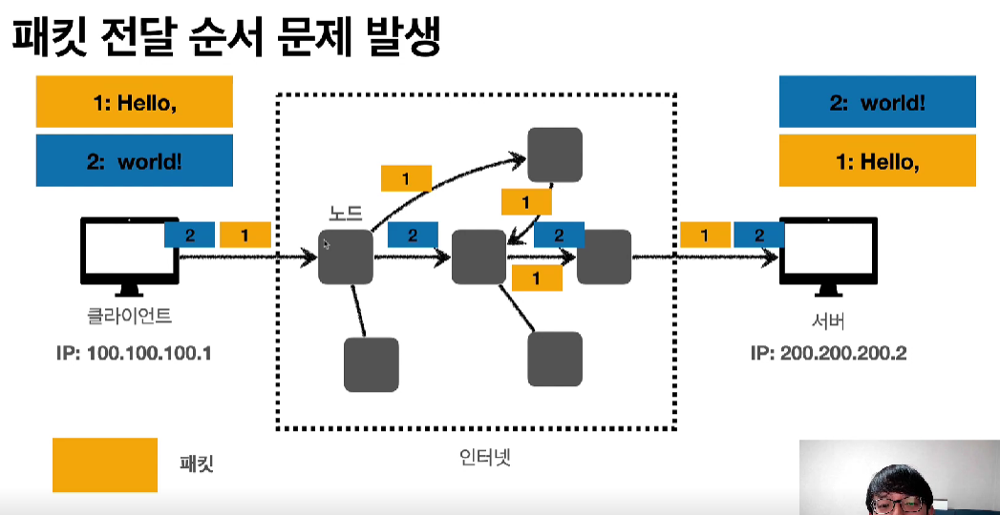
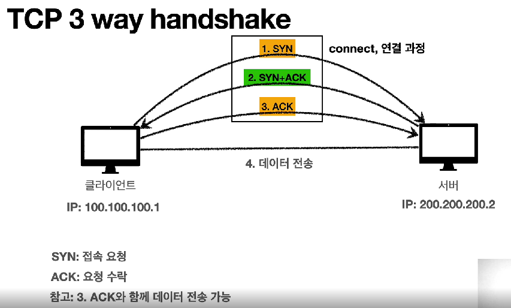
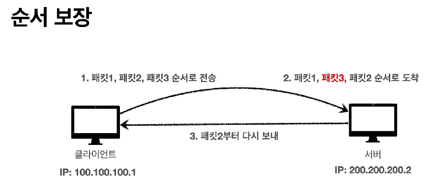

# 인터넷 통신

인터넷에서 컴퓨터 둘의 통신

- 간단한 인터넷 망
- 복잡한 인터넷 망
  - IP(인터넷 프로토콜) 필요

# IP

IP 주소를 통해서 통신한다.

IP 역할

- 지정한 IP 주소에 데이터 전달
- 패킷이라는 통신 단위로 데이터 전달

위의 패킷을 복잡한 인터넷 망을 거쳐서 목적지까지 전달한다.

클라이언트가 서버로 패킷을 전달하는데 이 패킷에는 출발지와 목적지가 저장되어 있으므로 결국에는 목적 IP 주소까지 도착하게 된다.

서버에서도 응답 패킷을 클라이언트로 같은 방법으로 줄 수 있다.

## IP 프로토콜의 한계

비연결성

- 패킷이 받을 대상이 없거나 서비스 불능 상태여도 그냥 패킷을 전송해버린다.

비신뢰성

- 중간에 패킷이 사라질 수도 있다.
- 패킷 전달 순서에 문제가 발생할 수도 있다.

- 처음에 2를 보냈는데, 중간에 노드를 이상하게 타서 1이 먼저 도착하는 경우가 발생할 수도 있다.

프로그램 구분

- 같은 IP를 사용하는 서버에는 어떻게 구분해서 전달할 것인가?

# TCP, UDP

- 웹 브라우저에서 프로그램이 메시지를 생성하면 socket 라이브러리를 통해 OS에 전달한다.

- OS에서 TCP 정보를 생성해서 메시지를 감싼다.
- 그리고 그 감싼 것을 또 IP 패킷으로 만들어 IP 정보를 포함시킨다.

- 이 감싼 것을 Ethernet frame이라는 물리적인 정보를 포함시켜 포장한 후에 인터넷을 통해 전송한다.

## TCP(Transmission Control Protocol) 특징

연결지향적

- 연결이 돼야 데이터를 전송한다.

데이터 전달 보증

- 메시지가 잘 전달되는지 확인할 수 있다.

순서 보장

신뢰성 높다.

### TCP 3 way handshake(가상 연결)

- 클라이언트가 서버에게 SYN(접속 요청)을 보낸다.
- 서버가 클라이언트의 SYN을 받으면 ACK(요청 수락)를 SYN과 함께 보낸다.
- 클라이언트는 서버의 SYN에 대한 ACK를 서버에게 보낸다.

위의 과정이 잘 처리되었다면 그제서야 데이터를 전송한다.

### 데이터 전달 보증

만약 클라이언트가 서버에 데이터를 전송했으면, 서버엣서 데이터를 잘 받았을 때 잘 받았다고 메시지를 전송한다.

### 순서 보장

순서가 중간에 잘못 되었다면 잘못 전달된 패킷부터 다시 보내라고 메시지를 보낸

>TCP 패킷 정보를 보면 전송 제어, 순서, 검증 정보 등이 이미 패킷에 저장되어있기 때문에, 위와 같은 특징들이 있을 수 있는 것이다.

## UDP(User Datagram Protocol) 특징

기능이 거의 없다.

- 연결지향, 데이터 전달 보증, 순서 보장 없다.
  - 하지만 위의 정보 보장 특징이 없기 때문에 단순하고 빠르다.
- IP와의 차이
  - IP에는 없는 PORT 정보가 있다.
    - PORT는 IP가 여러 곳에 공유되어 있을 경우(게임을 하면서, 음악을 들을 경우 게임에 대한 패킷과 음악에 대한 패킷의 구분이 필요하다.)에 구분하기 위해서 주어지는 정보이다.

# PORT

- 클라이언트 PC가 한 번에 여러 대의 서버와 통신해야 하는 상황

- TCP/IP 패킷에는 이미 IP에 대한 정보 뿐만 아니라 PORT에 대한 정보까지 담겨져 있다.

TCP/IP 패킷을 전송하면 여러 대의 서버와 통신이 수월하게 이뤄진다.

일반적인 PORT

# DNS

Domain Name System
- 도메인 명을 IP 주소로 변환
  - IP 주소가 너무 어렵기 때문

- 도메인 명은 당연히 어디서 사야 하지만, DNS 서버에 한 번 저장해 놓으면 도메인 명에 대한 IP 주소를 클라이언트에 전달해서 접속을 도와준다.