# URI(Uniform Resource Identifier)

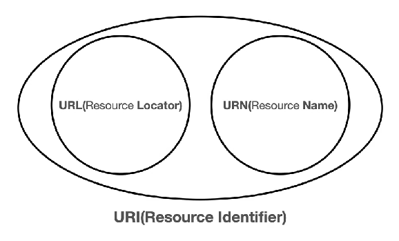

URL(Resource Locator)

- 리소스의 위치

URN(Resource Name)

- 리소스의 이름

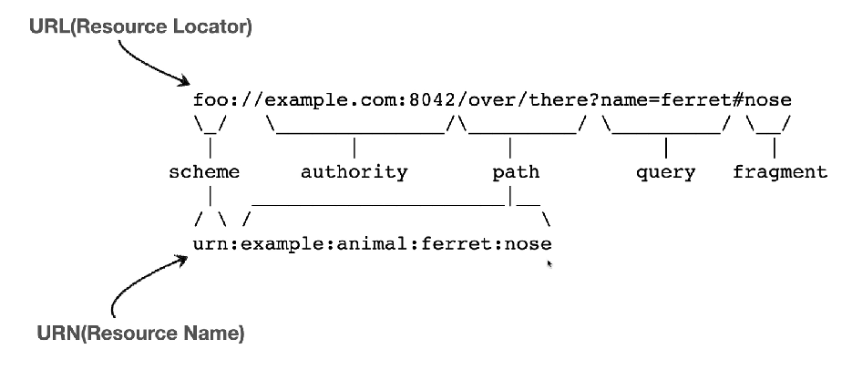

URI

- Uniform
  - 리소스 식별하는 통일된 방식
- Resource
  - 자원, URI로 식별할 수 있는 모든 것
- Identifier
  - 다른 항목과 구분하는데 필요한 정보

URL

- Locator
  - 리소스 있는 위치 지정

URN

- Name
  - 리소스에 이름 부여
- URN 이름만으로 실제 리소스를 찾을 수 있는 방법이 보편화 되어있지 않다.
  - URI를 URL과 같은 의미로 봐도 무관한 이유

# URL 전체 문법

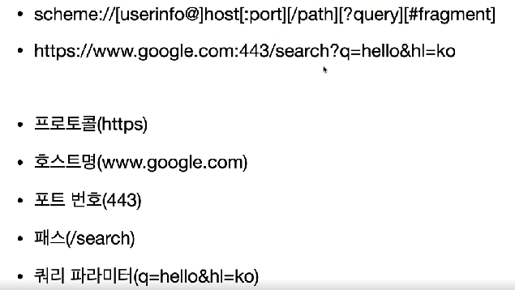

## URL - scheme

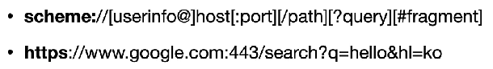

주로 프로토콜을 적는다.

- 프로토콜
  - 어떤 방식으로 자원에 접근할 것인가 하는 약속, 규칙
  - 예)http, https, ftp 등
    - http : 80 포트
    - https : 443 포트
    - 포트는 생략 가능하다.

## URL - userinfo

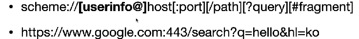

URL에 사용자 정보를 포함해서 인증

거의 사용하지 않는다.

## URL - host

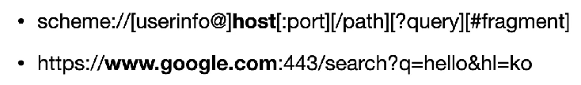

호스트명

- 도메인 명이나 IP 주소

## URL - PORT

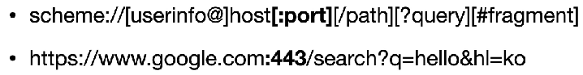

접속 포트

- 일반적으로 생략한다.
- 생략할 때는 80 or 443

## URL - path

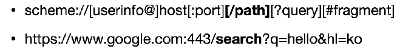

리소스 경로(path)

- 계층적 구조
- 예)
  - /home/file1.jpa
  - /members/100

## URL - query

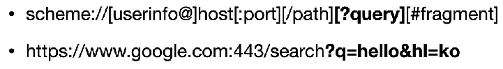

- `<key>=<value>` 형식으로 작성
- `?`로 시작, `&`로 query 추가
- query parameter, query string 등으로 불린다.

# 웹 브라우저 요청 흐름

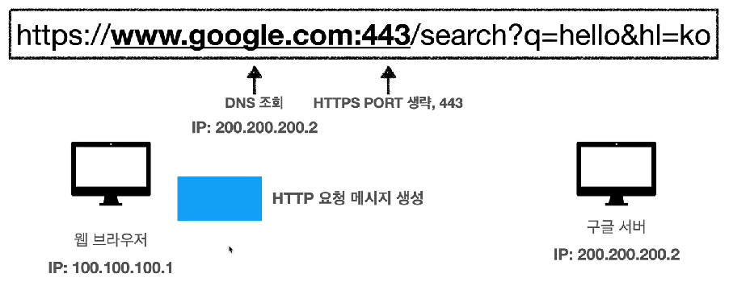

- 먼저 DNS에 조회해서 IP 주소를 얻어온다.
- 그 IP 주소를 가지고 HTTP 요청 메시지를 생성

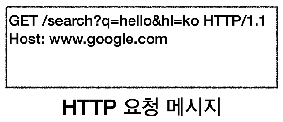

- HTTP 요청 메시지는 딱 위와 같이 생겼다.

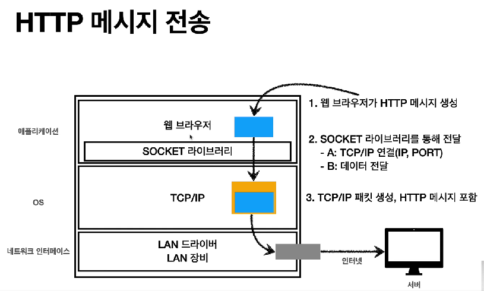

- 메시지를 생성했으면 위의 과정을 밟는 것이다.

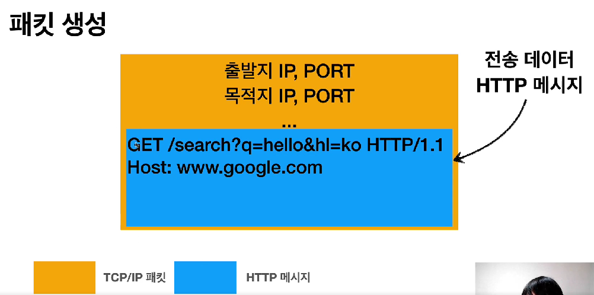

- 패킷의 전송 데이터에 HTTP 메시지가 들어가는 것이다.
- 패킷이 전송 목적지에 도착하면 TCP/IP 패킷을 벗겨내서 전송 데이터인 HTTP 메시지를 보는 것이다.

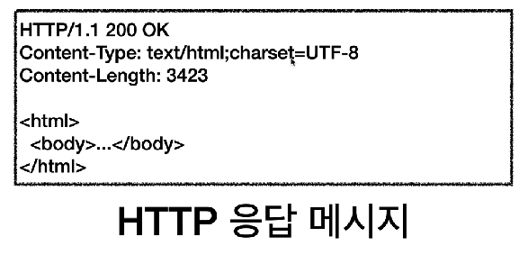

- 전송 받은 메시지에 대한 HTTP 응답 메시지를 만들어낸다.
- 이 HTTP 메시지를 다시 클라이언트가 받아서 웹 브라우저가 렌더링을 한다.
