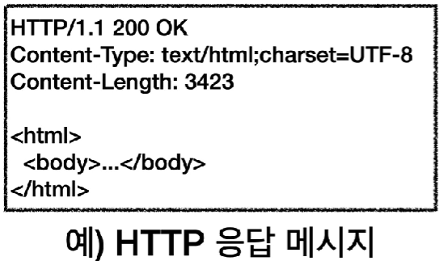

- [HTTP](#http)
  - [HTTP - 클라이언트 서버 구조](#http---클라이언트-서버-구조)
  - [HTTP - 무상태 프로토콜 (stateless)](#http---무상태-프로토콜-stateless)
  - [HTTP - 비연결성](#http---비연결성)
  - [HTTP - 메시지](#http---메시지)
    - [시작 라인](#시작-라인)
    - [HTTP 헤더](#http-헤더)
    - [HTTP 메시지 바디](#http-메시지-바디)

# HTTP

HyperText Transfer Protocol

HTTP

- 처음에는 HTML 파일을 전송하기 위한 프로토콜
- 현재는 거의 모든 형태의 데이터를 전송할 수 있다.
- 특징
  - 클라이언트 서버 구조
  - 무상태 프로토콜(stateless), 비연결성
  - 단순함, 확장 가능
  - HTTP 메시지를 통해서 동작한다.

## HTTP - 클라이언트 서버 구조

Request Response 구조

- 클라이언트가 요청하고, 서버는 응답

## HTTP - 무상태 프로토콜 (stateless)

서버가 클라이언트의 상태를 보존하지 않는다.

- 서버 증설이 자율적
  - stateful
    - 한 서버가 클라이언트에 대한 데이터를 기억하고 있으면, 다른 서버는 전혀 그 클라이언트에 대한 데이터가 없다.
      - 서버에 의존적
  - stateless
    - 한 서버가 데이터를 저장하고 있지 않으므로 클라이언트는 항상 같은 데이터를 서버에 알려줘야 한다.
      - 항상 데이터를 알려줘야 하므로, 서버를 증설해도 클라이언트는 응답 서버를 쉽게 바꿀 수 있다.
    - 갑자기 클라이언트 요청을 증가해도 단순하게 서버를 대거 투입하면 방어가 가능하다.

stateful

- 이렇게 한 서버에만 클라이언트A의 데이터가 저장된다면 클라이언트A는 해당 서버에 의존적이게 된다.
- 서버가 죽는다면 클라이언트A는 다른 서버에 처음부터 모두 다시 저장을 시켜야한다.

stateless

- 클라이언트A가 요청할 때마다 모든 정보를 담아서 서버에 보낸다.
- 서버는 클라이언트A의 요청에만 응답하고 잊어도 상관없으므로, 클라이언트는 어떠한 서버에 접근해도 된다.
  - 클라이언트 요청이 증가하면 저장된 데이터를 걱정하지 않고 단순히 서버를 증설하기만 하면 된다.

stateless의 한계

- 로그인 같이 상태를 유지해야 하는 경우에는 stateless로는 힘들다.
  - 일반적으로 브라우저 쿠키와 서버 세션등을 사용해서 상태를 유지한다.
    - 상태유지를 최소한만 사용
- 한 번씩 전송할 때마다 데이터의 양이 크다.

## HTTP - 비연결성

TCP/IP - 연결을 유지하는 모델

- 클라이언트와 서버가 연결을 유지한다.
  - 불필요한 서버 자원 소모

TCP/IP - 연결을 유지하지 않는 모델

- 클라이언트와 서버가 연결을 유지하지 않는다.
  - 최소한의 자원 유지

HTTP

- 기본적으로 연결을 유지하지 않는다.
- 요청이 비교적 적은 웹 브라우저는 비연결성으로 하였을 시에 비교적 서버 자원을 매우 효율적으로 사용할 수 있다.

비연결성의 한계

- TCP/IP 연결을 계속 새로 맺어야 한다.
  - 3way handshake 시간 추가
- 웹 브라우저로 사이트를 요청하면 HTML, JS, CSS 등 수많은 자원이 함께 다운로드 된다.

HTTP 지속연결(Persistent Connections)로 문제를 해결

- 지속 연결을 유지

## HTTP - 메시지

HTTP 요청 메시지

HTTP 응답 메시지

HTTP 메시지 구조

### 시작 라인

요청 메시지의 start-line은 request-line이라고 부른다.

- HTTP 메서드
  - GET: 조회
  - 종류
    - GET(리소스 조회), POST(요청 내역 처리), PUT, DELETE...
  - 서버가 수행해야 할 동작 지정
- 요청 대상
  - /search?q=hello&hl=ko
  - 절대경로로 시작한다(/).
- HTTP Version

응답 메시지의 start-line은 status-line이라고 부른다.

- HTTP Version
- HTTP 상태 코드(요청 성공 or 실패)
  - 200 ~: 성공
  - 400 ~ : 클라이언트 요청 오류
  - 500 ~ : 서버 내부 오류
  
### HTTP 헤더

- HTTP 전송에 필요한 모든 부가정보
  - 예) 메시지 바디의 내용, 메시지 바디의 크기, 요청 클라이언트 정보, 서버 애플리케이션 정보 등

### HTTP 메시지 바디

- 실제 전송할 데이터가 들어있다.
- HTML문서, 이미지, 영상, JSON 등 byte로 표현할 수 있는 모든 데이터 전송 가능
