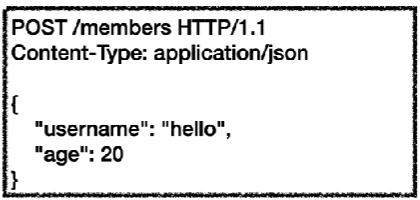
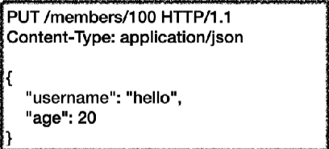
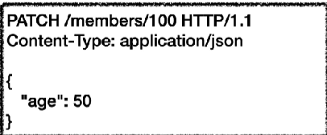
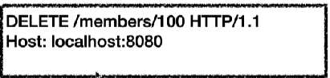
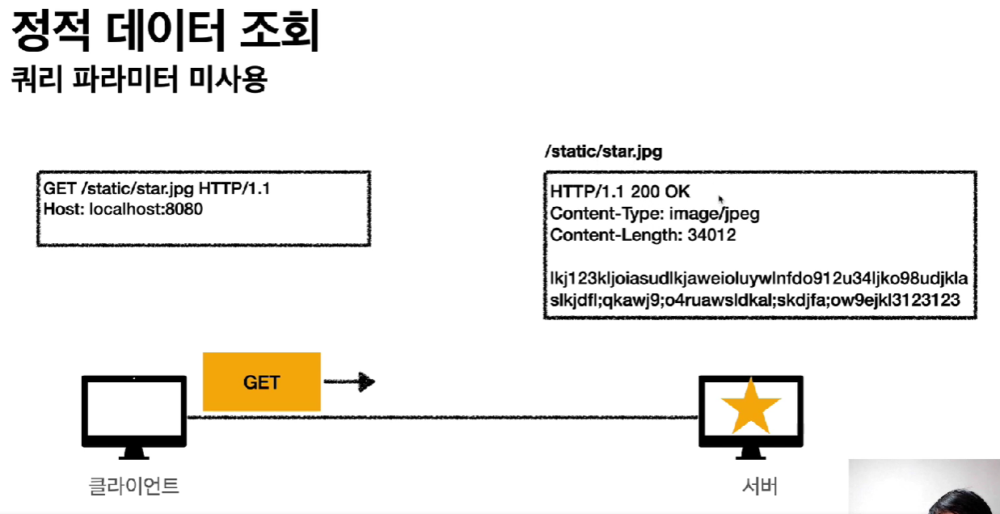
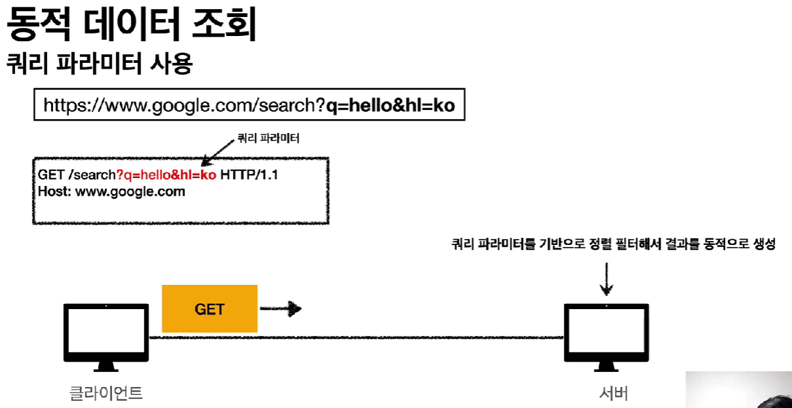
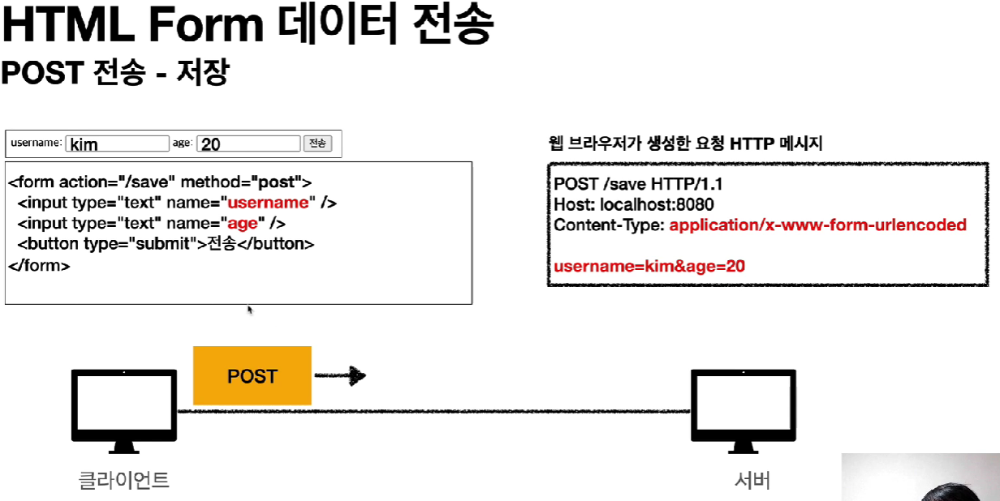
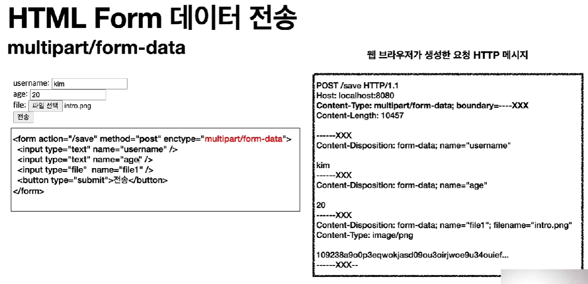

- [HTTP 메서드](#http-메서드)
  - [HTTP API 설계](#http-api-설계)
  - [GET](#get)
  - [POST](#post)
  - [PUT](#put)
  - [PATCH](#patch)
  - [DELETE](#delete)
- [HTTP 메서드의 속성](#http-메서드의-속성)
- [클라이언트에서 서버로 데이터 전송](#클라이언트에서-서버로-데이터-전송)
  - [4가지 상황](#4가지-상황)
    - [정적 데이터 조회](#정적-데이터-조회)
    - [동적 데이터 조회](#동적-데이터-조회)
    - [HTML Form 데이터 전송](#html-form-데이터-전송)
    - [HTML Form 데이터 전송(multipart/form-data)](#html-form-데이터-전송multipartform-data)
    - [HTML API 데이터 전송](#html-api-데이터-전송)
- [HTTP API 설계 예시](#http-api-설계-예시)
  - [회원 관리 시스템 - POST 기반 등록](#회원-관리-시스템---post-기반-등록)
  - [파일 관리 시스템 - PUT 기반 등록](#파일-관리-시스템---put-기반-등록)
  - [HTML Form 사용](#html-form-사용)

# HTTP 메서드

## HTTP API 설계

리소스를 정확히 식별하고, URI 계층 구조를 활용

- 예
  - 회원 목록 조회
    - `/members`
  - 회원 조회
    - `/members/{id}`
  - 회원 등록
    - `/memvers/{id}`
  - 회원 수정
    - `/memvers/{id}`
  - 회원 삭제
    - `/memvers/{id}`

- 이렇게 계층적으로 만들었는데 이걸 어떻게 구분하는가?
  - URI는 리소스만 식별하게 해야한다!
    - 리소스: 회원
    - 행위: 조회, 등록, 삭제, 변경
      - 이 행위는 어떻게 구분시키는가? (HTTP 메서드)

HTTP 메서드 종류

- GET: 리소스 조회
- POST: 요청 데이터 처리(주로 등록에 사용)
- PUT: 리소스를 대체, 해당 리소스가 없으면 생성
- PATCH: 리소스 부분 변경
- DELETE: 리소스 삭제

## GET

- 리소스 조회
- 서버에 전달하고 싶은 데이터는 query를 통해서 전달
- 메시지 바디를 사용해서 전달할 수도 있다.
  - 지원하지 않는 곳이 많아서 권장하지 않는다.

## POST

- 요청 데이터 처리
- 메시지 바디를 통해 서버로 요청 데이터 전달
  - 서버는 요청 데이터를 처리
    - 메시지 바디를 통해 들어온 데이터를 처리하는 모든 기능을 수행한다.
- 주로 전달된 데이터로 신규 리소스 등록, 프로세스 처리에 사용된다.
- 다른 메서드로 처리하기 애매한 경우 사용
  - 예) JSON으로 조회 데이터를 넘겨야 하는데, GET 메서드를 사용하기 어려운 경우

## PUT

- 리소스를 대체(그냥 덮어버린다.)
  - 있으면 대체, 없으면 생성
- 클라이언트가 리소스를 식별
  - 클라이언트가 리소스 위치를 알고 URI를 직접 지정한다.
  - 예) `/member/100`
    - POST의 경우에는 `/member`까지

## PATCH

PUT과는 달리 데이터를 부분적으로만 변경한다.

## DELETE

리소스 제거

# HTTP 메서드의 속성

안전(Safe Methods)

- 리소스를 호출해도 변경하지 않는다.

멱등(Idempotent Methods)

- 몇 번을 호출하든 결과가 똑같다.
  - GET: 조회 몇 번을 하든 같은 결과가 조회된다.
  - PUT: 리소스를 덮어버리므로, 계속 덮어진 결과만 보여주기 떄문에 항상 결과가 같다.
  - DELETE: 리소스를 삭제한 후의 결과는 항상 같다.
- 자동 복구 메커니즘에 활용할 수 있다.
  - 서버가 TIMEOUT 등으로 정상 응답을 주지 못했을 경우, 클라이언트가 같은 요청을 다시 해도 상관없다.
    - 언제나 결과가 같기 때문에

캐시기능(Cacheable Methods)

- 응답 결과 리소스를 캐시(잠시 저장)해서 사용해도 되는가?
- GET, HEAD, POST, PATCH 캐시 가능
  - 실제로는 GET, HEAD 정도만 캐시로 사용
  - POST, PATCH는 본문 내용까지 캐시 키로 고려해야 해서 구현이 쉽지 않다.

# 클라이언트에서 서버로 데이터 전송

데이터 전달 방식(크게 2가지 방식)

- URI 끝에 쿼리 파라미터를 넣어서 데이터 전송
  - GET
  - 주로 정렬 필터(검색어) - 게시판 리스트
- 메시지 바디를 통한 데이터 전송
  - POST, PUT, PATCH
  - 주로 회원가입, 상품 주문, 리소스 등록, 리소스 변경

## 4가지 상황

정적 데이터 조회

- 이미지, 정적 텍스트 문서 조회

동적 데이터 조회

- 주로 검색, 게시판 목록에서 정렬 필터(조회 조건을 줄여 주는 필터)

HTML Form을 통한 데이터 전송

- 회원 가입, 상품 주문, 데이터 변경

HTML API를 통한 데이터 전송

- 회원 가입, 상품 주문, 데이터 변경

### 정적 데이터 조회

- 그냥 경로를 사용해서 서버에 요청하면, 서버는 경로에 대한 리소스를 넘겨준다.
- 정적 데이터는 일반적으로 쿼리 파라미터 없이 리소스 경로로 단순하게 조회 가능하다.
- 조회는 GET 사용

### 동적 데이터 조회

- 검색 등을 할 때 추가적인 데이터를 쿼리 파라미터를 통해서 전달한다.
- 서버에서는 쿼리 파라미터를 읽고, key-value로 매칭하여 value를 넘겨준다.
- 조회는 GET 사용

### HTML Form 데이터 전송

HTML Form 전송은 GET, POST만 지원한다.

- HTML Form submit 버튼을 누르면 웹 브라우저가 Form에 대한 HTTP 메시지를 생성한다.
- 메시지 바디를 보면 쿼리 파라미터랑 유사하다.(key-value 스타일)
- HTTP 메서드가 POST면 브라우저가 자동으로 메시지 바디에 key-value를 넣고, GET이면 URL 경로에 쿼리로 넣는다.
  - GET은 되도록 조회에서만 사용하자.

### HTML Form 데이터 전송(multipart/form-data)

위와 같은 상황일 때는 username과 같은 텍스트 뿐만 아니라 byte단위의 파일까지 전송해야 한다.

- enctype을 multipart/form-data로 넘겨주면, 브라우저가 알아서 input type마다 자동으로 경계를 만들어 예쁘게 HTTP 메시지를 생성한다.

### HTML API 데이터 전송

- 서버 to 서버
  - 백엔드 시스템 통신
- 앱 클라이언트
  - 아이폰, 안드로이드
- 웹 클라이언트
  - HTML에서 Form 전송 대신 자바 스크립트를 통한 통신에 사용(AJAX)
- POST, PUT, PATCH
  - 메시지 바디를 통해 데이터 전송
- GET
  - 조회, 쿼리 파라미터로 데이터 전달
- ContentType
  - application/json을 주로 사용(사실상 표준)

# HTTP API 설계 예시

## 회원 관리 시스템 - POST 기반 등록

- 회원 목록 `/members`
  - GET
- 회원 등록 `/members`
  - POST
- 회원 조회 `/members/{id}`
  - GET
- 회원 수정 `/members/{id}`
  - PATCH, PUT, POST
    - PATCH로 쓰는 것이 가장 좋다.
    - PUT 같은 경우는 게시판의 글을 수정할 때
    - POST는 애매할 때 천하무적
- 회원 삭제 `/members/{id}`
  - DELETE

>`/members`를 컬렉션이라고 한다.

클라이언트는 등록될 리소스의 URI를 모른다.

- POST로 리소스 등록을 한다면, 서버가 직접 경로를 만들어서 응답한다.
  - POST /members -> Location: /members/100
- 컬렉션(Collection)
  - 서버가 관리하는 리소스 디렉토리
  - 서버가 리소스의 URI를 생성하고 관리한다.
  - 여기서의 컬렉션은 `/members`

## 파일 관리 시스템 - PUT 기반 등록

- 파일 목록 `/files`
  - GET
- 파일 조회 `/files/{filename}`
  - GET
- 파일 등록 `/files/{filename}`
  - PUT
- 파일 삭제 `/files/{filename}`
  - DELETE
- 파일 대량 등록 `/files`
  - POST

PUT으로 신규 자원 등록을 하려면 클라이언트가 리소스 URI를 알고 있어야 한다.

- `PUT /files/star.jpg`
- 클라이언트가 직접 리소스의 URI를 지정한다.
  - POST 등록과 URI 지정 주체가 다르다.

스토어(store)

- 클라이언트가 관리하는 리소스 저장소
  - 클라이언트가 리소스의 URI를 알고 관리한다.
- 여기서 스토어는 `/files`

## HTML Form 사용

**GET, POST만 지원**

- 회원 목록 `/members`
  - GET
- 회원 등록 폼 `/members/new`
  - GET
- 회원 등록 `/members/new`, `/members`
  - POST
- 회원 조회 `/members/{id}`
  - GET
- 회원 수정 폼 `/members/{id}/edit`
  - GET
- 회원 수정 `/members/{id}/edit`, `/members/{id}`
  - POST
- 회원 삭제 `/members/{id}/delete`
  - POST

HTML Form은 GET, POST만 지원하므로 컨트롤 URI를 사용해야 한다.

- 컨트롤 URI
  - 동사로 된 리소스 경로 사용
  - POST의 `/new`, `/edit`, `/delete`
  
**최대한 리소스만을 가지고 URI를 설계하고, 리소스만을 가지고 설계하기에 한계가 느껴질 때만 컨트롤 URI를 사용하자**
