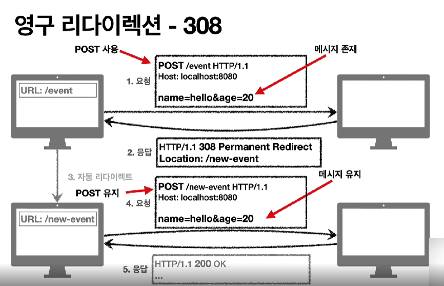

- [상태 코드](#상태-코드)
- [1xx (Informational)](#1xx-informational)
- [2xx (Successful)](#2xx-successful)
- [3xx (Redirection)](#3xx-redirection)
  - [리다이렉션 종류](#리다이렉션-종류)
    - [영구 리다이렉션](#영구-리다이렉션)
    - [일시 리다이렉션](#일시-리다이렉션)
      - [PRG: Post/Redirect/Get](#prg-postredirectget)
    - [특수 리다이렉션](#특수-리다이렉션)
- [4xx (Client Error)](#4xx-client-error)
- [5xx (Server Error)](#5xx-server-error)

# 상태 코드

클라이언트가 보낸 요청의 처리 상태를 응답에서 알려주는 기능

- 1xx (Informational)
  - 요청이 수신되어 처리중
- 2xx (Successful)
  - 요청 정상 처리
- 3xx (Redirection)
  - 요청을 완료하려면 추가 행동이 필요
- 4xx (Client Error)
  - 클라이언트 오류, 잘못된 문법 등으로 서버가 요청을 수행할 수 없음
- 5xx (Server Error)
  - 서버 오류, 서버가 정상 요청을 처리하지 못함

# 1xx (Informational)

거의 사용하지 않는다.

# 2xx (Successful)

200

- OK
- 요청 성공

201

- Created
- 요청 성공해서 새로운 리소스가 생성됨

- POST 메서드로 요청했을 경우 서버에서 리소스를 생성하고, 리소스에 대한 URI도 관리한다.
- 그래서 서버가 정상적으로 리소스를 생성했다고 201을 띄우는 것

202

- Accepted
- 요청이 접수되었지만 처리가 완료되지 않았음
- 예)
  - 서버가 클라이언트의 요청을 접수했지만, 1시간 뒤에 배치 프로세스가 요청을 처리하는 경우

204

- No Content
- 서버가 요청을 성공적으로 수행했지만, 응답 페이로드 본문에 보낼 데이터가 없음
- 예)
  - 웹 문서 편집기에서 save 버튼
    - save 버튼의 결과로 아무 내용이 없어도 되고, 버튼을 눌렀을 때 같은 화면을 유지해야 한다.
    - 결과 내용이 없어도 204메시지만으로 성공을 인식할 수 있다.

# 3xx (Redirection)

요청을 완료하기 위해 유저 에이전트의 추가적인 조치가 필요하다.

>*리다이렉션?* 
>웹 브라우저는 3xx 응답의 결과에 Location 헤더가 있으면, Location 위치로 자동 이동

1. `/event` 라는 URL에 접속을 요청
2. 하지만 페이지의 URL이 `/event`에서 `/new-event`로 바뀌었다.
3. 이를 처리하기 위해 `/event`로 요청이 들어오면 301 Moved Permanently 상태 코드를 사용하여 `/new-event`에 자동으로 리다이렉트 되게 설정한다.
4. 자동 리다이렉트 되면 클라이언트는 다시 `/new-event`로 서버에 요청을 보낸다.
5. 서버는 200 OK를 띄운다.

## 리다이렉션 종류

### 영구 리다이렉션

- 특정 리소스의 URI가 영구적으로 이동되었을 때 사용
  - 예)
    - /members에서 /users로 이동
- 301 Moved Permanently
  - 리다이렉트시 요청 메서드가 GET으로 변한다.
  - 본문이 제거될 수도 있다.
- 308 Permanent Redirect
  - 301과 기능은 같음
  - 리다리렉트시 요청 메서드와 본문 유지

- 어차피 URL이 바뀌면 그 내부 데이터들도 전부 변경하는 것이 일반적이므로 GET으로 리다이렉트를 많이 한다.

### 일시 리다이렉션

- 리소스의 URI가 일시적으로 변경
- 검색 엔진 등에서 URL을 변경하면 안된다.
  - 예)
    - 주문 완료 후 주문 내역 화면으로 이동하게 만들 때 사용
    - PRG (Post/Redirect/Get)
- 302 Found
  - 리다이렉트시 요청 메서드가 GET으로 변하고, 본문이 제거될 수도 있다.
- 307 Temporary Redirect
  - 302와 기능 같음
  - 리다이렉트시  요청 메서드와 본문 유지
- 303 See Other
  - 302와 기능은 같음
  - 리다이렉트시 요청 메서드가 GET으로 변경

#### PRG: Post/Redirect/Get

POST로 주문 후에 웹 브라우저를 새로고침하면 중복주문이 될 수도 있다.

- 요즘은 경고창을 띄어주긴 한다.

PRG 사용전

- 이런 식으로 중복 주문이 될 수 있다.

POST로 주문 후에 새로 고침으로 인한 중복 주문 방지

- POST로 주문후에 주문 겨로가 화면을 GET 메서드로 리다이렉트
  - 새로고침하면 결과 화면을 GET으로 조회

- PRG를 쓰기 전에는 주문 완료 했을 시에 서버에서 응답을 200으로 했다.
- 지금은 주문 완료에 대한 응답을 302로 줘서 클라이언트에서 새로 고침을 했을 경우 POST 메서드가 아닌 GET 메서드로 새로고침할 수 있게 한다.
  - GET으로 결과 화면만 조회

### 특수 리다이렉션

- 결과 대신 캐시를 사용(304 Not Modified)
  - 클라이언트에서 캐시가 만료된것 같아 서버에 캐시의 정보를 보내며 캐시의 만료를 확인할 때 사용한다.
  - 만료되지 않았을 경우 서버는 그 캐시를 그대로 써도 된다고 응답한다.
    - 클라이언트는 로컬 PC에 저장된 캐시를 재사용한다.
    - 캐시로 리다이렉트

# 4xx (Client Error)

- 오류의 원인이 클라이언트에 있음

400 Bad Request

- 클라이언트가 잘못된 요청을 해서 서버가 요청을 처리할 수 없다.

401 Unauthorized

- 클라이언트가 해당 리소스에 대한 인증이 필요함
- 인증(Authentication) 되지 않음

403 Forbidden

- 서버가 요청을 이해했지만 승인을 거부함
- 어드민 등급이 아닌 사용자가 로그인을 했어도 어드민 등급의 리소스에 접근할 경우

404 Not Found

- 요청 리소스를 찾을 수 없음
- 요청 리소스가 서버에 없거나 클라이언트가 권한이 부족한 리소스에 접근할 때 해당 리소스를 숨기고 싶을 때

# 5xx (Server Error)

- 서버 오류
- 서버 문제로 오류 발생
- 재시도하면 성공할 수도 있다.

500 Interval Server Error

- 서버 내부 문제로 오류 발생, 애매하면 500 오류

503 Service Unavailable

- 서비스 이용 불가
- 서버의 일시적인 과부하 또는 예정된 작업으로 잠시 요청을 처리할 수 없을 때
