- [HTTP 헤더](#http-헤더)
	- [표현](#표현)
	- [협상(Contents Negotiation)](#협상contents-negotiation)
		- [협상과 우선순위1](#협상과-우선순위1)
		- [협상과 우선순위2](#협상과-우선순위2)
	- [전송 방식](#전송-방식)
	- [일반 정보](#일반-정보)
	- [특별한 정보](#특별한-정보)
	- [인증](#인증)
	- [쿠키](#쿠키)

# HTTP 헤더

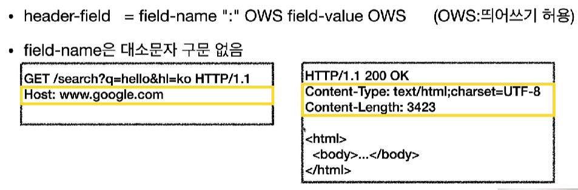

용도

- HTTP 전송에 필요한 모든 부가정보

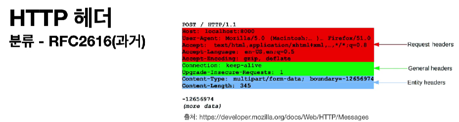

헤더 분류

- General 헤더
  - 메시지 전체에 적용되는 정보
- Request 헤더
  - 요청 정보(클라이언트 정보 등)
- Reponse 헤더
  - 응답 정보(서버 정보 등)
- Entity 헤더
  - 엔티티 바디 정보(Context-Type, Content-Length)

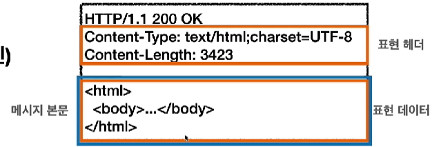

엔티티(Entity) -> 표현(Representation)

- 표현(Representation) = 표현 메타데이터(Representation Metadata) + 표현 데이터(Representation Data)
  - 메시지 바디를 통해 표현 데이터 전달
    - 메시지 바디 = payload
  - 표현은 요청이나 응답에서 전달할 실제 데이터
  - 표현 헤더
    - 표현 데이터를 해석할 수 있는 정보 제공
      - 데이터 유형(html, json), 데이터 길이, 압축 정보 등

## 표현

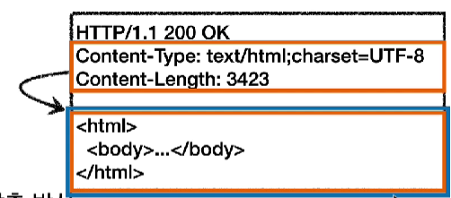

Content-Type

- 표현 데이터의 형식
  - 미디어 타입, 문자 인코딩 등
  - text/html;charset=utf-8
  - application/json
  - image/png

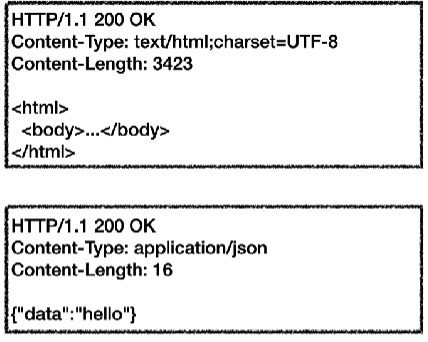

Content-Encoding

- 표현 데이터의 압축 방식
- 데이터를 전달하는 곳에서 압축 후 인코딩 헤더 추가
- 데이터를 읽는 쪽에서 인코딩 헤더의 정보로 압축 해제

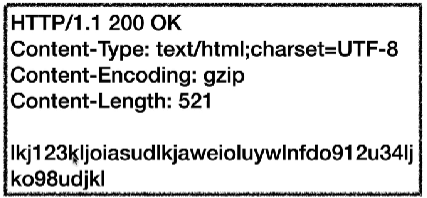

Content-Language

- 표현 데이터의 자연 언어

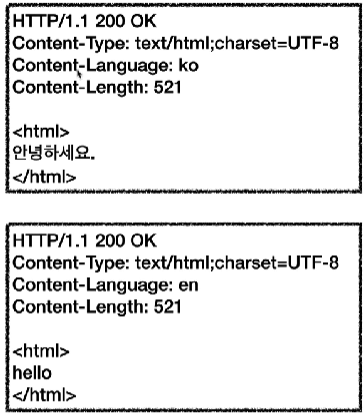

Content-Length

- 표현 데이터의 길이
- 바이트 단위

## 협상(Contents Negotiation)

클라이언트가 선호하는 표현을 서버에 요청하는 것

- 협상 헤더는 요청시에만 사용

Accept

- 클라이언트가 선호하는 미디어 타입 전달

Accept-Charset

- 클라이언트가 선호하는 문자 인코딩

Accept-Encoding

- 클라이언트가 선호하는 압축 인코딩

Accept-Language

- 클라이언트가 선호하는 자연 언어

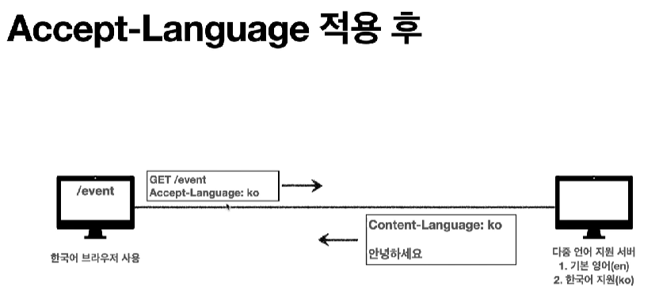

클라이언트가 요청한 언어를 서버가 지원하지 않을 경우

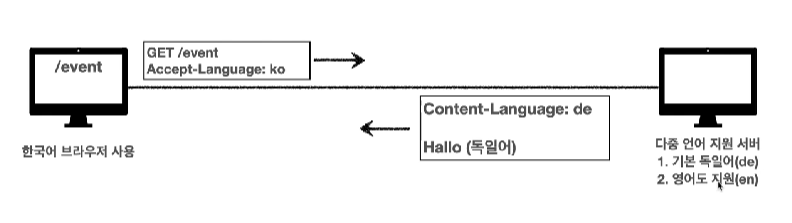

클라이언트가 한국어를 요청했는데, 서버는 한국어를 지원하지 않으므로 기본 언어인 독일어로 응답한다. 하지만 두 번째 언어로 영어를 지원하는데, 클라이언트는 영어에 익숙하지만 이를 알지 못하여 불편함을 느낄 경우가 생길 수도 있다.

- 우선순위 필요

### 협상과 우선순위1

- Quality Values(q) 값 사용
- 0 ~ 1, 클수록 높은 우선순위

### 협상과 우선순위2

- 구체적인 것이 우선
- 예) `text/*`, `text/plain`, `text/plain;format=flowed`, `*/*`
  - 순서: `text/plain;format=flowed`, `text/plain`, `text/*`, `*/*`

## 전송 방식

- 단순 정송

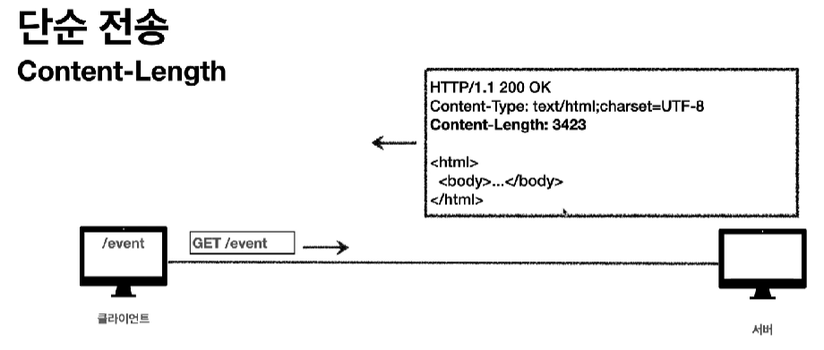

- 압축 전송

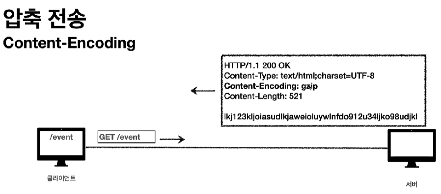

- 분할 전송
  - Content-Length를 설정하면 안된다.
  - 나눠서 보내기 때문에 길이를 알지 못함

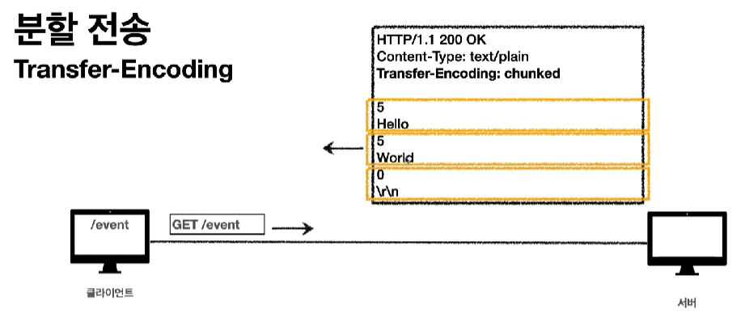

- 범위 전송
  - 너무 큰 데이터의 경우에는 중간에 전송이 끊길 경우 그 다음 재전송할 때 처음부터 보내는 불상사가 일어날 수도 있다.
  - 그러므로 범위를 지정해서 그 부분만 전송받겠다고 서버에 알려주면 서버는 범위 전송을 해주는 것이다.

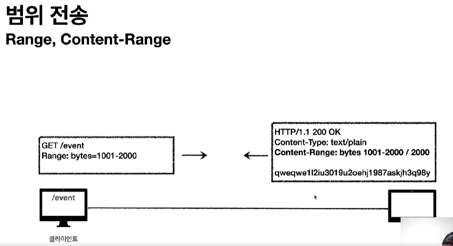

## 일반 정보

From

- 유저 에이전트의 이메일 정보
- 잘 사용하지 않는다.
- 요청에서 사용

Referer

- 현재 요청된 페이지의 이전 웹 페이지 주소
- A에서 B로 이동하는 경우 B를 요청할 떄 Referer: A를 포함해서 요청
  - Referer를 사용해서 유입 경로 분석 가능
- 요청에서 사용

User-Agent( = Client Application)

- 클라이언트 애플리케이션 정보(웹 브라우저 정보 등)
- 어떤 종류의 브라우저에서 장애가 발생하는지 파악 가능
- 통계 정보 뽑을 수 있다.
- 요청에서 사용

Server

- 요청을 처리하는 ORIGIN 서버의 소프트웨어 정보
- ORIGIN 서버
  - HTTP는 수많은 proxy 서버를 거치는데, 이런 중간 서버들 말고 내 데이터의 TCP/IP 패킷에 담긴 목적 IP를 가진 서버
- 응답에서 사용

Date

- 메시지가 발생한 날짜와 시간
- 응답에서 사용

## 특별한 정보

Host

- 요청한 호스트 정보(도메인)
- 필수
- 요청에서 사용
- 하나의 서버가 여러 도메인을 처리해야할 떄
- 하나의 IP 주소에 여러 도메인이 적용되어 있을 때 구분해주는 역할

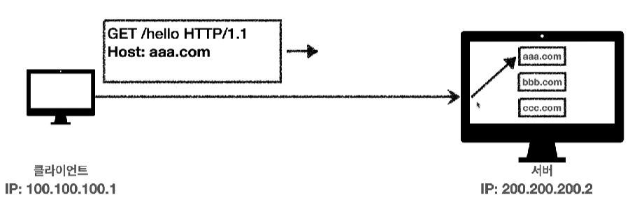

Location

- 웹 브라우저는 3xx 응답의 결과에 Location 헤더가 있으면, Location 위치로 자동 이동(리다이렉트)
- 201 Created
  - Location 값은 요청에 의해 생성된 리소스 URI
- 3xx (Redirection)
  - Location 값은 요청을 자동으로 리다이렉트하기 위한 대상 리소스를 가리킨다.

Allow

- 허용 가능한 HTTP 메서드
- 405(Method Not Allowed)에서 응답에 포함시켜줘야 한다.

Retry-After

- 유저 에이전트가 다음 요청을 하기까지 기다려야 하는 시간
- 503(Service Unavailable)
  - 서비스가 언제까지 불능인지 알려준다.
- 날짜를 표기해서 언제까지 불능인지 알려줄 수 있고, 초단위를 표기해서 얼마동안 불능인지도 알려줄 수 있다.
  - Retry-After: Fri, 31 Dec 1999 23:59:59 GMT (날짜)
  - Retry-After: 120 (초단위)

## 인증

Authorization

- 클라이언트 인증 정보를 서버에 전달

WWW-Authenticate

- 리소스 접근시 필요한 인증 방법 정의
- 401 Unauthorized 응답과 함께 사용

## 쿠키

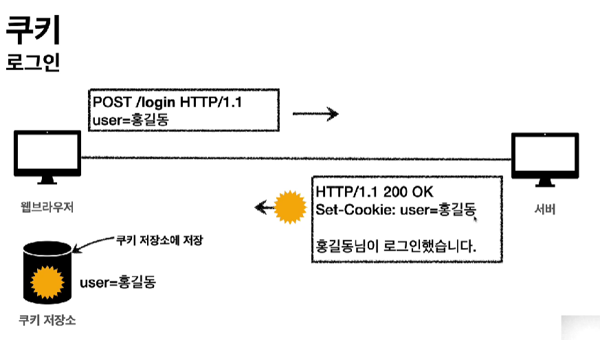

- 클라이언트가 홍길동으로 회원가입을 하면 서버는 그 계정에 대한 쿠키를 만들어 응답과 함께 클라이언트로 보낸다.
- 클라이언트는 쿠키를 쿠기 저장소에 저장한다.

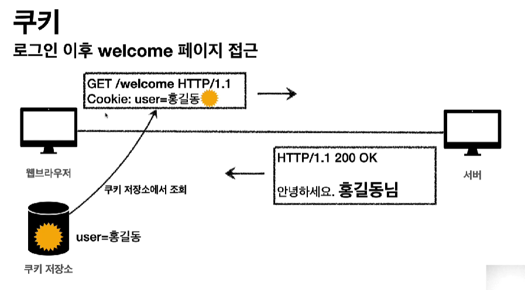

- 클라이언트가 welcome 페이지에 접근하면 쿠키 저장소를 뒤져서 현재 계정의 쿠키를 찾아 요청과 함께 보낸다.
- 서버는 쿠키를 확인하여 해당 계정에 대한 응답을 보낸다.
- 이 외에도 모든 요청에 쿠키를 담아 서버에 전송한다.

쿠키의 예

- set-cookie: sessionId=abcde1234; expires=Sat, 26-Dec-2020 00:00:00 GMT; path=/;domain=.google.com; Secure

쿠키 사용처

- 사용자 로그인 세션 관리
- 광고 정보 트래킹

쿠키 정보는 항상 서버에 전송되는 것

- 네트워크 트래픽 추가 유발 가능
  - 그러므로 최소한의 정보만 사용한다.(세션 id, 인증 토큰 등)

보안에 민감한 데이터는 저장하면 안된다.

쿠키 생명 주기

- Set-Cookie: expires=Sat, 26-Dec-2020 00:00:00 GMT;
  - 만료일이 되면 쿠키는 삭제된다.
- Set-Cookie: max-age=3600(초단위)
  - 0이나 음수를 지정하면 쿠키는 바로 삭제된다.
- 세션 쿠키
  - 만료 날짜를 생략하면 브라우저 종료시까지만 유지된다.
- 영속 쿠키
  - 만료 날짜를 입력하면 해당 날짜까지 유지

쿠키 도메인

예) domain=example.org

- 명시했을 경우
  - 명시한 문서 기준 도메인 + 서브 도메인
  - domain = example.org를 지정해서 쿠키를 생성
    - example.org는 물론이고, dev.example.org도 쿠키 접근 가능
- 생략했을 경우
  - 현재 문서 기준 도메인만 적용
  - example.org에서 쿠키를 생성하고 domain 지정은 생략
    - example.org에서만 쿠키 접근 가능하고, dev.example.org는 쿠키 접근 불가

쿠키 경로

예) path=/home

이 경로를 포함한 하위 경로 페이지만 쿠키 접근 가능

- 일반적으로 `path=/` 루트로 지정
- 예) path=/home로 지정하면
  - /home 접근 가능
  - /home/lv1 접근 가능
  - /home/lv1/lv2 접근 가능
  - /hello 접근 불가능

쿠키 보안

- Secure
  - 쿠키는 http, https를 구분하지 않고 전송한다.
  - Secure를 적용하면 https인 경우에만 전송 가능
- HttpOnly
  - XSS 공격 방지
  - 자바스크립트에서 접근 불가능
  - HTTP 전송에만 사용
- SameSite
  - XSRF 공격 방지
  - 요청 도메인과 쿠키에 설정된 도메인이 같은 경우만 쿠키 전송
