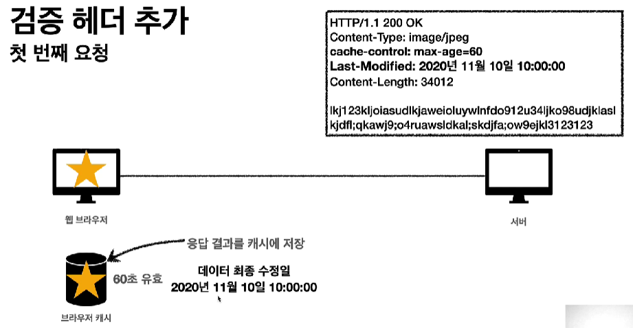
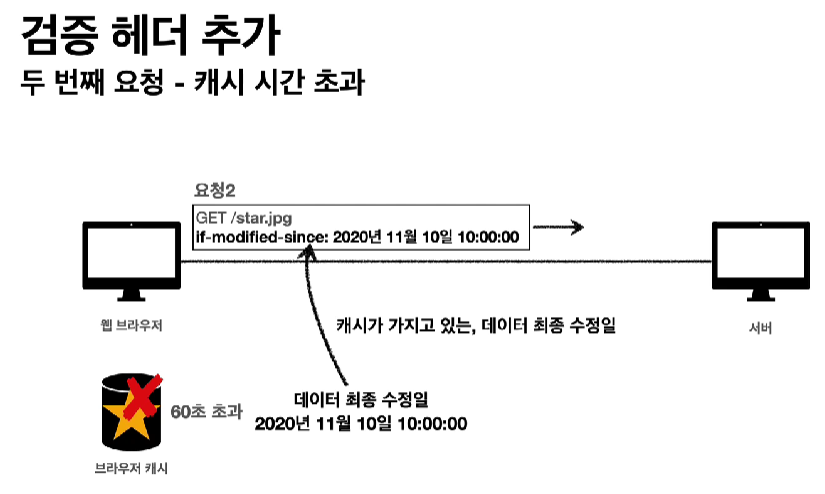
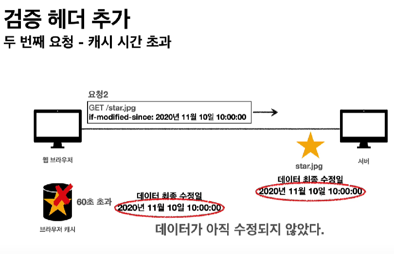
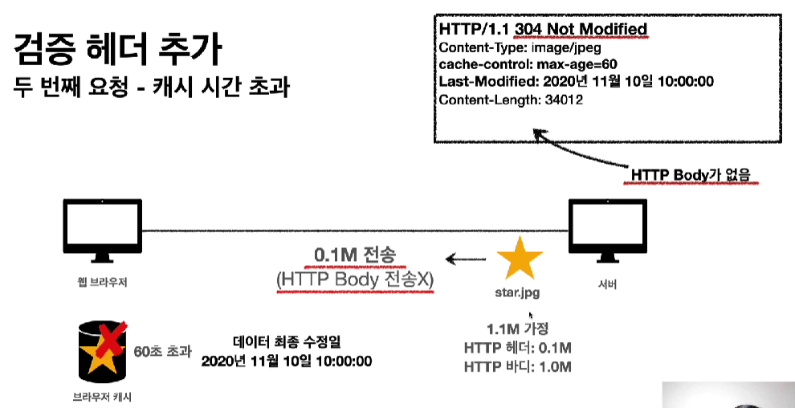
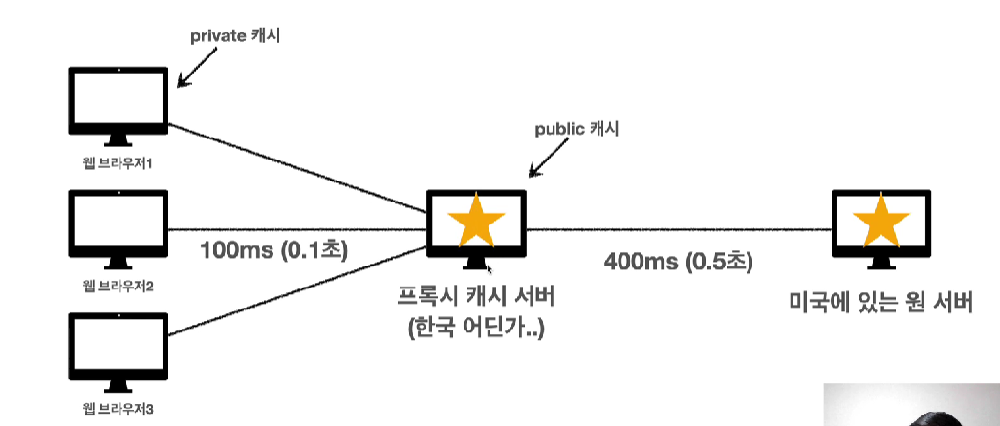
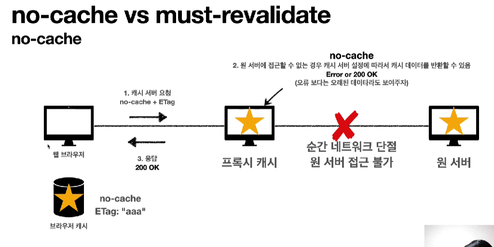
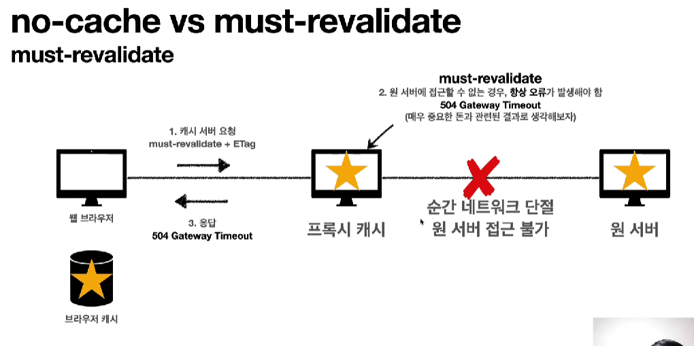

# 검증 헤더와 조건부 요청

검증 헤더(Validator)

- ETag, Last-Modified

조건부 요청 헤더

- If-Match, If-None-Match
  - ETag 값 사용
- If-Modified-Since, If-Unmodified-Since
  - Last-Modified 값 사용

## last-modified, If-Modified-Since

캐시 유효 시간이 초과해서 서버에 다시 요청하면 두가지 상황이 나타난다.

1. 서버에서 기존 데이터를 변경함
2. 서버에서 기존 데이터를 변경하지 않음

서버에서 기존 데이터를 변경하지 않았을 경우

- 저장해놨던 로컬 캐시를 그대로 사용하는게 효율이 좋다.
- 클라이언트의 데이터와 서버의 데이터가 같다는 것을 확인할 수 있는 방법이 필요하다.
  - 검증 헤더



- 서버에서 last-modified 헤더를 추가하여 클라이언트에서 요청한 캐시를 클라이언트로 전송한다.



- 캐시가 만료되었을 경우 캐시에 last-modified가 있으면 브라우저는 서버에 요청을 보낼 때 if-modified-since 헤더를 추가해서 서버에 다시 캐시를 요청한다.



- 서버가 요청을 받은 후에 검증헤더의 정보를 자신의 데이터 최종 수정일과 비교한다.
- 만약 수정이 되었으면 새로운 데이터를 클라이언트에 전송한다.(200 OK)



- 만약 수정이 되지 않았다면 서버는 304응답을 한다.
- 헤더만 보내서 네트워크 부하를 최소화한다.
- 응답을 받은 클라이언트는 서버가 보낸 응답 헤더 정보로 캐시의 메타 정보를 갱신하고, 해당 캐시 데이터를 재활용한다.

Last-Modified, If-Modified-Since의 단점

- 서버에서 데이터를 A에서 B로 수정한 후에 다시 A로 변경했을 경우, Last-Modified가 바뀌어 클라이언트는 불필요한 데이터 갱신을 한다.
  - 네트워크 불필요한 부하

## ETag, If-None-Match

ETag(Entity Tag)

- 캐시용 데이터에 임의의 고유한 버전 이름을 달아둔다.
- 데이터가 변경되면 이 이름을 바꾸어서 변경한다.(Hash를 다시 생성)
  - Hash는 데이터가 같으면 똑같은 Hash 값이 나온다.
- 클라이언트 입장에서 If-None-Match로 ETag만 보내서 같으면 캐시를 유지, 다르면 다시 받는다.

# 캐시 제어 헤더

## Cache-Control

캐시 지시어(directives)

Cache-Control: max-age

- 캐시 유효 시간, 초 단위

Cache-Control: no-cache

- 데이터는 캐시해도 되지만, 항상 origin 서버에 검증하고 사용해야 하는 옵션
- 중간 proxy cache 서버가 아닌 origin의 데이터와 검증을 하는 것

Cache-Control: no-store

- 데이터에 민감한 정보가 있으므로 저장하지 않고 사용 후에 최대한 빨리 삭제하는 옵션

# Proxy 캐시

origin 서버에 직접 접근을 하면 너무 오래 걸린다.

- 프록시 캐시 도입



Cache-Control: public

- 응답이 public 캐시에 저장되어도 된다.

Cache-Control: private

- 응답이 해당 사용자만을 위한 것.
- privat 캐시에만 저장해야 함(default 값)

Cache-Control: s-maxage

- 프록시 캐시에만 적용되는 max-age
- public 캐시에만 적용된다.

Age: 60(HTTP 헤더)

- origin 서버에서 응답 후 프록시 캐시 내에 머문 시간(초)

# 캐시 무효화

확실한 캐시 무효화 응답

```
Cache-Control: no-cache, no-store, must-revalidate
Pragma: no-cache
```

- 이렇게 하면 확실하게 캐시 되는 것을 방지할 수 있다.

Cache-Control: no-cache

- 데이터는 캐시해도 되지만, 항상 origin 서버에 검증하고 사용해야 한다.

Cache-Control: no-store

- 데이터에 민감한 정보가 있으므로 저장하면 안된다.
- 사용하고 최대한 빨리 삭제

Cache-Control: must-revalidate

- 캐시 만료후 최초 조회 시 origin 서버에 검증해야 한다.
- origin 서버에 접근 실패시 반드시 504(Gateway Timeout)오류가 발생해야 한다.
- 캐시 유효 시간이라면 캐시를 그대로 사용한다.


## no-cache vs must-revalidate





- no-cache
  - origin 서버와 순간적으로 네트워크 단절이 되면 프록시 캐시 서버에서 그냥 200 OK를 띄운다.
  - 오류보다는 원래 있었던 캐시를 사용하는게 합리적이라고 판단한 것
- must-revalidate
  - origin 서버와 순간저그으로 네트워크 단절이 되면 프록시 캐시 서버에서 504 오류를 띄운다.