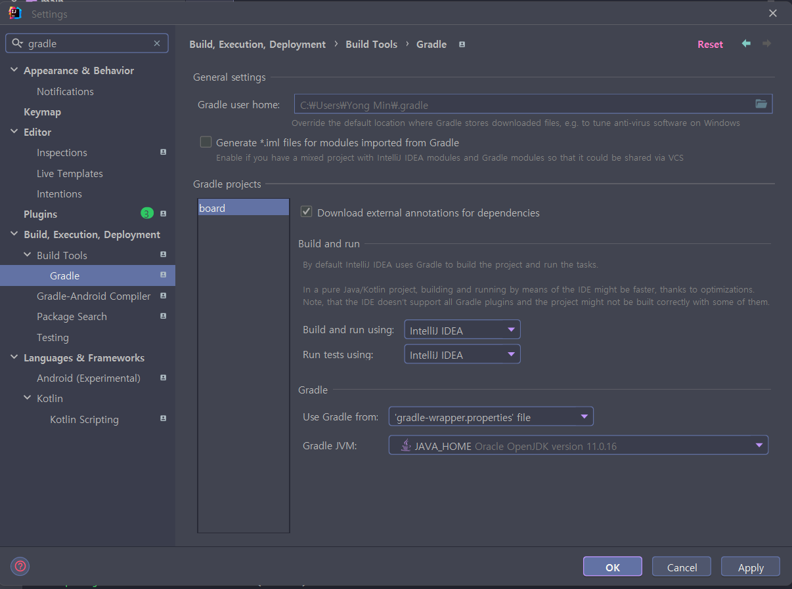
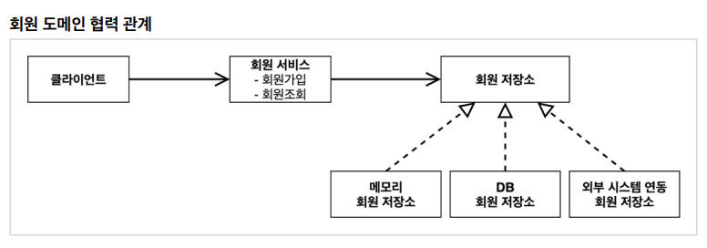
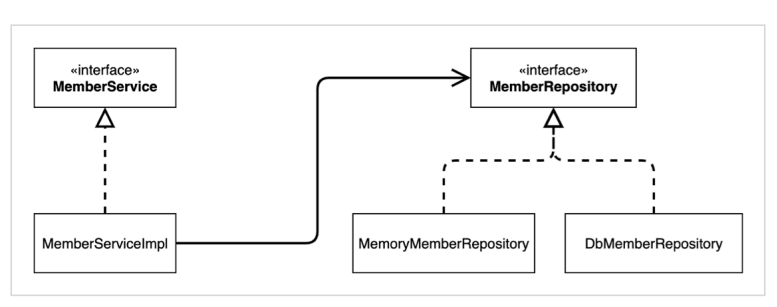
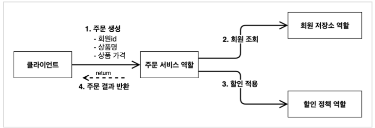
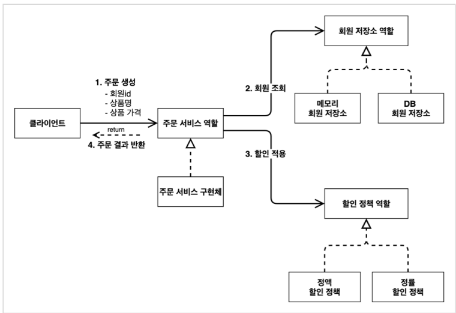
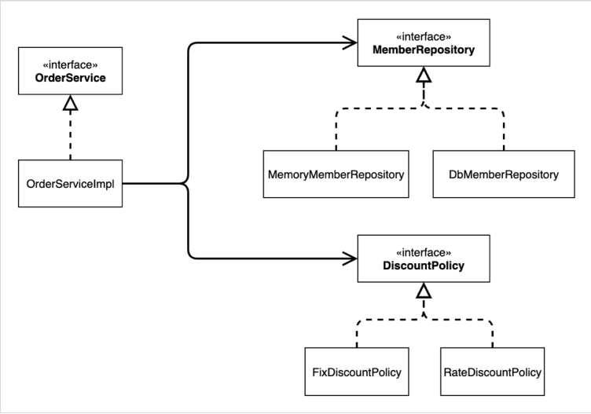

- [시작](#시작)
- [회원 도메인 설계](#회원-도메인-설계)
  - [회원 클래스 다이어그램](#회원-클래스-다이어그램)
  - [회원 도메인 개발](#회원-도메인-개발)
    - [회원 엔티티](#회원-엔티티)
  - [회원 저장소](#회원-저장소)
    - [회원 저장소 인터페이스](#회원-저장소-인터페이스)
    - [회원 저장소 인터페이스 구현체](#회원-저장소-인터페이스-구현체)
  - [회원 서비스](#회원-서비스)
    - [회원 서비스 인터페이스](#회원-서비스-인터페이스)
    - [회원 서비스 구현체](#회원-서비스-구현체)
  - [회원 도메인 실행과 테스트](#회원-도메인-실행과-테스트)
    - [회원 도메인 - 회원가입(main)](#회원-도메인---회원가입main)
    - [회원 도메인 - JUnit](#회원-도메인---junit)
  - [문제점](#문제점)
- [주문과 할인 도메인 설계](#주문과-할인-도메인-설계)
  - [다이어 그램](#다이어-그램)
  - [주문과 할인 도메인 개발](#주문과-할인-도메인-개발)
    - [할인 정책 인터페이스](#할인-정책-인터페이스)
    - [정액 할인 정책 구현체](#정액-할인-정책-구현체)
    - [주문 엔티티](#주문-엔티티)
    - [주문 서비스 인터페이스](#주문-서비스-인터페이스)
    - [주문 서비스 구현체](#주문-서비스-구현체)
  - [주문과 할인 정책 테스트](#주문과-할인-정책-테스트)

# 시작

spring initializer에서 gradle project 생성 후 다운로드

다운로드 한 파일을 압축 해제하여 인텔리제이로 열어준다.

- 인텔리제이를 실행하면 빌드를 시작한다.



# 회원 도메인 설계

회원 도메인 요구사항

- 회원 가입 & 조회
- 등급 3가지
- DB
  - 자체 DB or 외부 DB



## 회원 클래스 다이어그램



## 회원 도메인 개발

### 회원 엔티티

회원 등급

```java
package yback.board.member;

public enum Grade {
     BASIC,
     VIP,
     MANAGER
}
```

일반 회원, VIP회원, 운영진으로 등급을 나눔

회원 엔티티

- 회원 정보(ID, 이름, 등급)를 다루기 위한 엔티티

```java
package yback.board.member;

public class Member {
     private Long id;
     private String name;
     private Grade grade;

     public Member(Long id, String name, Grade grade) {
          this.id = id;
          this.name = name;
          this.grade = grade;
     }

     public Long getId() {
          return id;
     }

     public void setId(Long id) {
          this.id = id;
     }

     public String getName() {
          return name;
     }

     public void setName(String name) {
          this.name = name;
     }

     public Grade getGrade() {
          return grade;
     }

     public void setGrade(Grade grade) {
          this.grade = grade;
     }
}
```

## 회원 저장소

### 회원 저장소 인터페이스

```java
package yback.board.member;

public interface MemberRepository {
     void save(Member member);

     Member findById(Long memberId);
}
```

### 회원 저장소 인터페이스 구현체

```java
package yback.board.member;

import java.util.HashMap;
import java.util.Map;

public class MemoryMemberRepository implements MemberRepository {
     private static Map<Long, Member> store = new HashMap<>();


     @Override
     public void save(Member member) {
          store.put(member.getId(), member);
     }

     @Override
     public Member findById(Long memberId) {
          return store.get(memberId);
     }
}
```

- 외부 DB를 사용할 것인지 자체 DB를 사용할 것인지 파악이 되지 않은 상황이므로, 개발을 위한 가장 단순한 형태를 구현한 것이다.
  - **저장과 조회만** 구현한 것

>HashMap은 동시성 이슈가 발생할 수 있다. ConcurrentHashMap으로 대체하는게 좋다.

## 회원 서비스

### 회원 서비스 인터페이스

```java
package yback.board.member;

public interface MemberService {
     void join(Member member);

     Member findMember(Long memerId);
}
```

### 회원 서비스 구현체

```java
package yback.board.member;

public class MemberServieImpl implements MemberService{

     private final MemberRepository memberRepository = new MemberRepositoryImpl();

     @Override
     public void join(Member member) {
          memberRepository.save(member);
     }

     @Override
     public Member findMember(Long memerId) {
          return memberRepository.findById(memerId);
     }
}
```

- MemberRepositoryImpl 구현체를 받아 함수를 사용한 것이다.

## 회원 도메인 실행과 테스트

### 회원 도메인 - 회원가입(main)

```java
package yback.board;

import yback.board.member.Grade;
import yback.board.member.Member;
import yback.board.member.MemberService;
import yback.board.member.MemberServieImpl;

public class MemberApp {
     public static void main(String[] args) {
          MemberService memberService = new MemberServieImpl();
          Member member = new Member(1L, "memberA", Grade.VIP);
          memberService.join(member);

          Member findMember = memberService.findMember(1L);
          System.out.println("new member = " + member.getName());
          System.out.println("find member = " + findMember.getName());
     }
}
```

- 이렇게 main에다가 직접 테스트를 하는 것은 좋은 방법이 아니다.
  - 테스트를 하다가 실수로 코드를 변경해버릴 수도 있고, 오류가 발생할 가능성이 올라가는 불상사가 일어난다.
  - **JUnit 테스터**를 사용한다.

### 회원 도메인 - JUnit

```java
package yback.board.member;

import org.assertj.core.api.Assertions;
import org.junit.jupiter.api.Test;

public class MemberServiceTest {
     MemberService memberService = new MemberServieImpl();

     @Test
     void join() {
          //given
          Member member = new Member(1L, "memberA", Grade.VIP);

          //when
          memberService.join(member);
          Member findMember = memberService.findMember(1L);

          //then
          Assertions.assertThat(member).isEqualTo(findMember);
     }
}
```

- JUnit 테스터로 테스트를 해본다.
- given, when, then 구조를 활용한다.
  - given
    - 주어진 물리적 조건
  - when
    - 물리적 조건과 비교할 대상
  - then
    - 두 조건을 비교
- Assertions.**assertThat()**은 **org.assertj.core.api.Assertions**

## 문제점

인터페이스와 구현체 모두에 의존하는 문제가 발생

ex) `private final MemberRepository memberRepository = new MemberRepositoryImpl();`

# 주문과 할인 도메인 설계

주문과 할인 정책

- 등급에 따른 할인 정책
- 할인 정책
  - 고정 금액 할인
  - 비율 할인
- 할인 정책을 그때 그때 변경해야 할 필요가 있다.

## 다이어 그램



1. 주문 생성
    - 클라이언트가 주문 서비스에 주문 생성을 요청
2. 회원 조회
    - 할인을 위한 회원 등급이 필요하므로, 회원 저장소에서 회원을 조회한다.
3. 할인 적용
    - 회원 등급을 반영항여 할인을 적용한다.
4. 주문 결과 반환
    - 주문 서비스는 할인 결과를 포함한 주문 결과를 반환

위의 과정을 모두 나타낸 다이어그램





## 주문과 할인 도메인 개발

### 할인 정책 인터페이스

```java
package yback.board.discount;

import yback.board.member.Member;

public interface DiscountPolicy {
     int discount(Member member, int price);
}
```

- 이렇게 인터페이스를 만들어줘야 나중에 정액 할인 정률 할인을 편하게 번갈아가며 사용할 수 있다.

### 정액 할인 정책 구현체

```java
package yback.board.discount;

import yback.board.member.Grade;
import yback.board.member.Member;

public class FixDiscountPolicy implements DiscountPolicy{

     private final int discountForManager = 2000;
     private final int discountForVIP = 1000;

     @Override
     public int discount(Member member, int price) {
          if (member.getGrade() == Grade.VIP) {
               return discountForVIP;
          } else if (member.getGrade() == Grade.MANAGER) {
               return discountForManager;
          }
          return 500;
     }
}
```

### 주문 엔티티

```java
package yback.board.discount;

public class Order {
     public Long getMemberId() {
          return memberId;
     }

     public void setMemberId(Long memberId) {
          this.memberId = memberId;
     }

     public String getItemName() {
          return itemName;
     }

     public void setItemName(String itemName) {
          this.itemName = itemName;
     }

     public int getItemPrice() {
          return itemPrice;
     }

     public void setItemPrice(int itemPrice) {
          this.itemPrice = itemPrice;
     }

     public int getDiscountPrice() {
          return discountPrice;
     }

     public void setDiscountPrice(int discountPrice) {
          this.discountPrice = discountPrice;
     }

     public Order(Long memberId, String itemName, int itemPrice, int discountPrice) {
          this.memberId = memberId;
          this.itemName = itemName;
          this.itemPrice = itemPrice;
          this.discountPrice = discountPrice;
     }

     @Override
     public String toString() {
          return "Order{" +
                  "memberId=" + memberId +
                  ", itemName='" + itemName + '\'' +
                  ", itemPrice=" + itemPrice +
                  ", discountPrice=" + discountPrice +
                  '}';
     }

     private Long memberId;
     private String itemName;
     private int itemPrice;
     private int discountPrice;
}

```

- 주문 정보
  - 회원 ID
  - 품목 이름
  - 가격
  - 할인액

### 주문 서비스 인터페이스

```java
package yback.board.discount;

public interface OrderService {
     Order CreateOrder(Long memberId, String itemName, int itemPrice);
}
```

### 주문 서비스 구현체

```java
package yback.board.discount;

import yback.board.member.Member;
import yback.board.member.MemberRepository;
import yback.board.member.MemberRepositoryImpl;

public class OrderServiceImpl implements OrderService{
     private final MemberRepository memberRepository = new MemberRepositoryImpl();
     private final DiscountPolicy discountPolicy = new FixDiscountPolicy();

     @Override
     public Order CreateOrder(Long memberId, String itemName, int itemPrice) {
          Member member = memberRepository.findById(memberId);
          int discountPrice = discountPolicy.discount(member, itemPrice);

          return new Order(memberId, itemName, itemPrice, discountPrice);
     }
}
```

- 주문 생성이 요청되면 주문 객체를 생성해서 반환한다.(`new Order()`)
  - 이 주문 객체에는 다음의 정보들이 들어간다.
    - 회원 ID
    - 품목 이름
    - 가격
    - 할인액

## 주문과 할인 정책 테스트

```java
package yback.board.discount;

import org.assertj.core.api.Assertions;
import org.junit.jupiter.api.Test;
import yback.board.member.Grade;
import yback.board.member.Member;
import yback.board.member.MemberService;
import yback.board.member.MemberServieImpl;

import static org.junit.jupiter.api.Assertions.*;

class OrderServiceTest {
     MemberService memberService = new MemberServieImpl();
     OrderService orderService = new OrderServiceImpl();

     @Test
     void createOrder() {
          //given
          long memberId = 1L;
          Member member = new Member(memberId, "memberA", Grade.VIP);
          memberService.join(member);

          //when
          Order order = orderService.CreateOrder(memberId, "itemA", 10000);
          
          //then
          Assertions.assertThat(order.getDiscountPrice()).isEqualTo(1000);
     }
}
```
