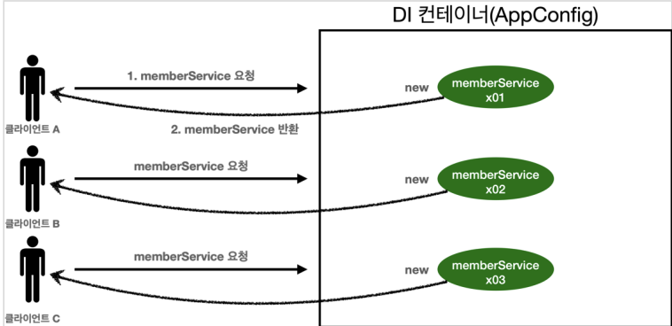
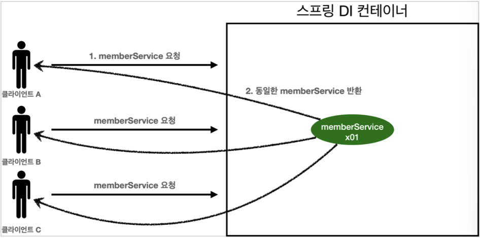
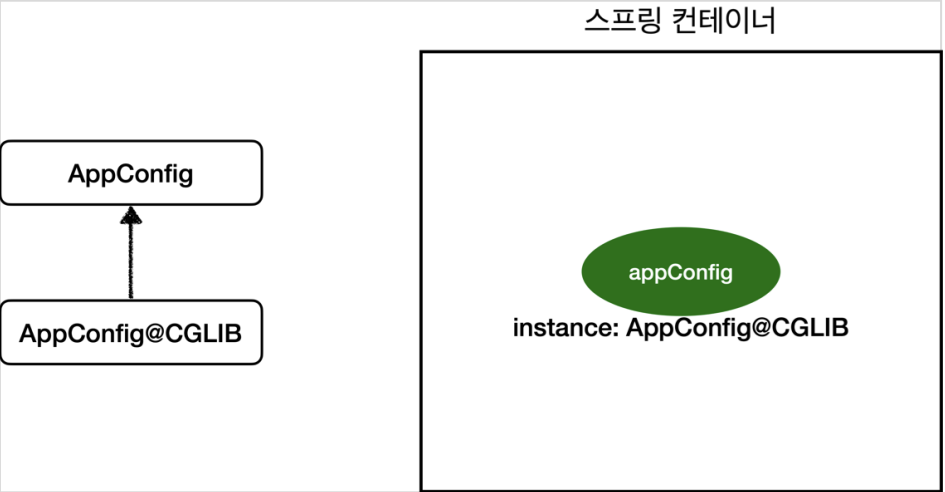

- [웹 애플리케이션과 싱글톤](#웹-애플리케이션과-싱글톤)
- [싱글톤 패턴](#싱글톤-패턴)
  - [싱글톤 패턴을 적용한 테스트 코드](#싱글톤-패턴을-적용한-테스트-코드)
  - [싱글톤 패턴의 문제점](#싱글톤-패턴의-문제점)
- [싱글톤 컨테이너](#싱글톤-컨테이너)
  - [싱글톤 방식의 주의점](#싱글톤-방식의-주의점)
  - [@Configuration과 바이트코드 조작의 마법](#configuration과-바이트코드-조작의-마법)

# 웹 애플리케이션과 싱글톤

웹 애플리케이션은 보통 여러 고객이 동시에 요청을 한다.



```java
package yback.board.singleton;

import org.assertj.core.api.Assertions;
import org.junit.jupiter.api.DisplayName;
import org.junit.jupiter.api.Test;
import yback.board.AppConfig;
import yback.board.member.MemberService;

public class SingletonTest {

     @Test
     @DisplayName("스프링 없는 순수한 DI 컨테이너")
     void pureContainer() {

          AppConfig appConfig = new AppConfig();

          //1. 조회: 호출할 때 마다 객체를 생성
          MemberService memberService1 = appConfig.memberService();
          //2. 조회: 호출할 때 마다 객체를 생성
          MemberService memberService2 = appConfig.memberService();

          //두 객체의 참조값이 다르다.
          System.out.println("memberService1 = " + memberService1);
          System.out.println("memberService2 = " + memberService2);
          Assertions.assertThat(memberService1).isNotSameAs(memberService2);
     }
}
```

- 이런 스프링이 없는 순수한 DI 컨테이너는 AppConfig 요청이 있을 때마다 객체를 새로 생성하기 때문에 메모리 낭비가 심하다.
  - 싱글톤 패턴으로 방지
    - 객체가 하나만 생성되고, 이를 공유

# 싱글톤 패턴

클래스의 인스턴스가 단 한개만 생성되는 것을 보장하는 디자인 패턴이다.

- 객체를 2개 이상 생성하지 못하도록 막아줘야 한다.
  - private 생성자로 외부의 new 연산자 사용을 막는다.

```java
package yback.board.singleton;

public class SingletonService {

     //1. static 영역에 객체를 딱 1개만 생성한다.
     private static final SingletonService instance = new SingletonService();

     //2. public으로 열어서 객체 인스턴스가 필요하면 이 static 메서드를 통해서만 조회하도록 허용한다.
     public static SingletonService getInstance() {
          return instance;
     }
     
     //3. 생성자를 private으로 선언해서 외부에서 new 키워드를 사용한 객체 생성을 못하게 막는다.
     private SingletonService() {
     }
     
     public void logic() {
          System.out.println("싱글톤 객체 로직 호출");  
     }
}
```

- 생성자를 `private`으로 선언했기 때문에 객체 인스턴스가 필요하면 오직 `getInstance()` 메서드를 호출해야 한다. 생성자로 생성하지 않아도 어차피 `static` 영역에 객체를 `instance`라는 이름으로 하나 만들어놨기 때문에 괜찮다.

## 싱글톤 패턴을 적용한 테스트 코드

```java
     @Test
     @DisplayName("싱글톤 패턴을 적용한 객체 사용")
     public void singletonServiceTest() {
//          SingletonService singletonService = new SingletonService();

          SingletonService singletonService1 = SingletonService.getInstance();
          SingletonService singletonService2 = SingletonService.getInstance();

          System.out.println("singletonService1 = " + singletonService1);
          System.out.println("singletonService2 = " + singletonService2);
          Assertions.assertThat(singletonService1).isSameAs(singletonService2);
          singletonService1.logic();
     }
```

- private으로 외부에서 new 연산자로 객체를 생성하는 것을 막아뒀기 때문에 주석 처리한 부분은 에러가 뜬다.
- 이렇게 getInstance() 메소드를 사용해서 같은 객체 인스턴스를 넘겨주면 호출할 때 마다 같은 객체 인스턴스를 반환한다.

## 싱글톤 패턴의 문제점

- 싱글톤 패턴을 구현하는 코드 자체가 많이 들어간다.
- 클라이언트가 구체 클래스에 의존하기 때문에 DIP, OCP 원칙을 위반할 가능성이 높다.
- 내부 속성을 변경하거나 초기화하기 어렵다.
- 생성자가 private이므로 자식 클래스를 만들기 어렵다.
  - 유연성이 떨어진다.

# 싱글톤 컨테이너

스프링 컨테이너

- 싱글톤 패턴의 문제점을 해결하면서, 객체 인스턴스를 싱글톤으로 관리한다.
  - 싱글톤 패턴을 위한 지저분한 추가 코드가 들어가지 않아도 된다.
  - DIP, OCP, private 생성자로 부터 자유롭게 싱글톤 사용 가능
- 싱글톤 컨테이너 역할

```java
     @Test
     @DisplayName("스프링 컨테이너와 싱글톤")
     void springContainer() {
          ApplicationContext ac = new AnnotationConfigApplicationContext(AppConfig.class);

          //1. 조회: 호출할 때 마다 같은 객체를 반환
          MemberService memberService1 = ac.getBean("memberService", MemberService.class);

          //2. 조회: 호출할 때 마다 같은 객체를 반환
          MemberService memberService2 = ac.getBean("memberService", MemberService.class);

          System.out.println("memberService1 = " + memberService1);
          System.out.println("memberService2 = " + memberService2);

          //memberService1 == memberService2
          Assertions.assertThat(memberService1).isSameAs(memberService2);
     }
```

싱글톤 컨테이너를 적용한 모습



>스프링의 기본 빈 등록 방식은 싱글톤이지만, 요청할 때 마다 새로운 객체를 생성해서 반환할 수도 있다.

## 싱글톤 방식의 주의점

싱글톤 방식은 여러 클라이언트가 하나의 같은 인스턴스를 공유하기 때문에 싱글톤 객체는 상태를 유지(stateful)하게 설계하면 안된다.

- 무상태(stateless)로 설계해야 한다.
  - 특정 클라이언트에 의존적인 필드가 있으면 안된다.
  - 특정 클라이언트가 값을 변경할 수 있는 필드가 있으면 안된다.
  - 가급적 읽기만 가능해야 한다.
- 스프링 빈의 필드에 공유 값을 설정하면 정말 큰 장애가 발생할 수 있다.

상태를 유지(stateful)하는 클래스

```java
package yback.board.singleton;

public class StatefulService {
     private int price; //상태 유지 필드

     public void order(String name, int price) {
          System.out.println("name = " + name + ", price = " + price);
          this.price = price;
     }

     public int getPrice() {
          return price;
     }
}
```

- order 메소드에서 `this.price = price`로 인해 `price`는 항상 최신의 `price`로 갱신된다. 이렇게 되면 가장 최신의 `price`만 저장되기 때문에, 그 전의 `price`값은 기억하지 못하게 되므로 문제가 발생한다.

상태를 유지할 경우 발생하는 문제

```java
package yback.board.singleton;

import org.assertj.core.api.Assertions;
import org.junit.jupiter.api.DisplayName;
import org.junit.jupiter.api.Test;
import org.springframework.context.ApplicationContext;
import org.springframework.context.annotation.AnnotationConfigApplicationContext;
import org.springframework.context.annotation.Bean;

import static org.junit.jupiter.api.Assertions.*;

class StatefulServiceTest {

     @Test
     void statefulServiceSingleton() {
          ApplicationContext ac = new AnnotationConfigApplicationContext(TestConfig.class);
          StatefulService statefulService1 = ac.getBean("statefulService", StatefulService.class);
          StatefulService statefulService2 = ac.getBean("statefulService", StatefulService.class);

          //ThreadA: A사용자가 10000원 주문
          statefulService1.order("userA", 10000);

          //ThreadB: B사용자 20000월 주문
          statefulService2.order("userB", 20000);

          //ThreadA: 사용자A 주문 금액 조회
          int price = statefulService1.getPrice();

          //ThreadA: 사용자A는 10000원을 기대했지만, 기대와 다르게 20000원 출력
          System.out.println("price = " + price);
          Assertions.assertThat(statefulService1.getPrice()).isNotEqualTo(10000);
     }

     static class TestConfig {

          @Bean
          public StatefulService statefulService() {
               return new StatefulService();
          }
     }

}
```

- 위의 코드를 본다면 `statefulService1`과 `statefulService2`에 같은 빈을 넣어서 싱글톤 패턴을 계획했다.
  - 하지만 `StatefulService`가 stateful이기 때문에, 각각 다른 값을 넣어도 가장 최근에 넣은 값만 저장되기 때문에 그 전에 저장한 값은 무시되어 버리는 불상사가 일어난다.
    - 공유 필드에 변수를 선언하는 것은 위험하다.
    - 항상 stateless로 설계하는 것이 좋다.

## @Configuration과 바이트코드 조작의 마법

스프링 컨테이너

- 싱글톤 레지스트리
  - 따라서 스프링 빈이 싱글톤이 되도록 보장해줘야 한다.
  - 스프링은 클래스의 바이트코드를 조작하는 라이브러리를 사용한다.
    - @Configuration
- AnnotationCofigApplicationContext에 파라미터로 넘긴 값은 스프링 빈으로 등록된다.
  - AppConfig도 스프링으로 등록된다는 소리
  - 스프링이 CGLIB이라는 바이트코드 조작 라이브러리를 사용해서 AppConfig클래스를 상속받은 임의의 클래스를 만들고, 그 다른 클래스를 스프링 빈으로 등록한 것이다.



AppConfig 클래스를 상속받은 임의의 클래스가 바로 싱글톤이 보장되도록 해준다.

만약 @Configuration annotation이 없다면 AppConfig는 CGLIB 기술 없이 순수한 스프링 빈으로 등록될 것이다.

- 이렇게 되면 싱글톤 방식을 보장하지 못한다.
