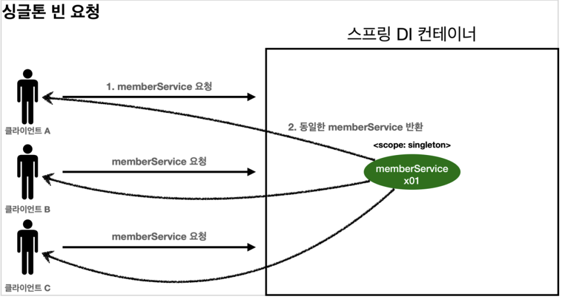
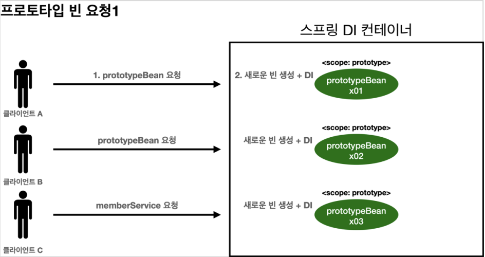
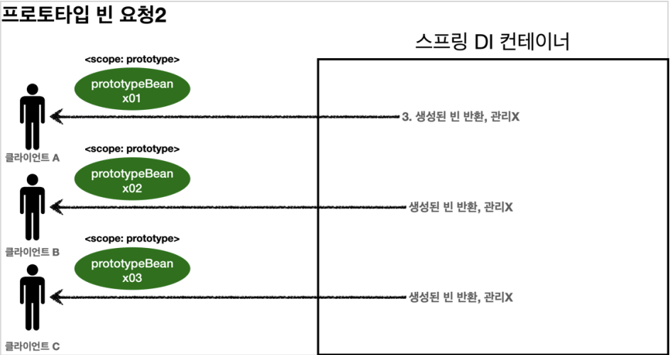
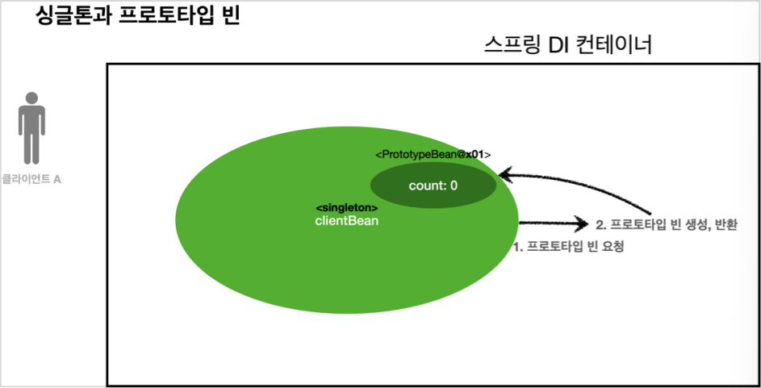
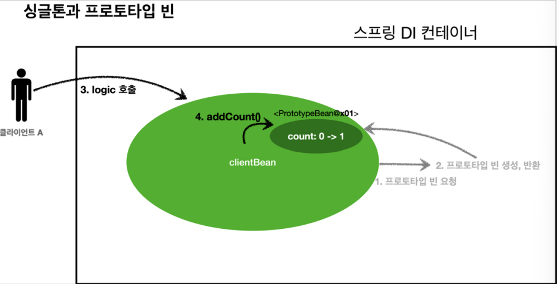
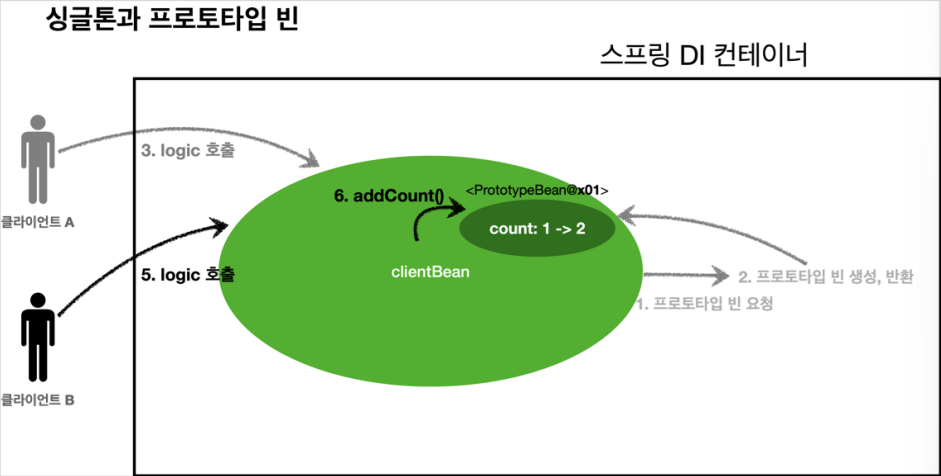
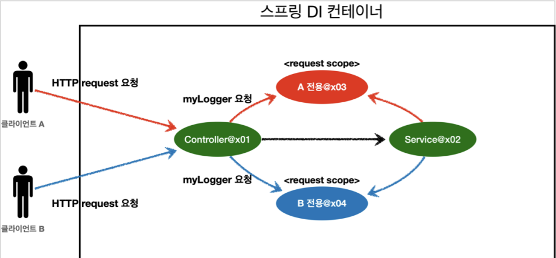

- [빈 스코프](#빈-스코프)
  - [프로토타입 스코프](#프로토타입-스코프)
  - [프로토타입 스코프 - 싱글톤 빈과 함께 사용시 문제점](#프로토타입-스코프---싱글톤-빈과-함께-사용시-문제점)
    - [프로토타입 스코프만 사용](#프로토타입-스코프만-사용)
    - [싱글톤 빈에서 프로토타입 빈 사용](#싱글톤-빈에서-프로토타입-빈-사용)
  - [프로토타입 스코프 - 싱글톤 빈과 함께 사용시 Provider로 문제 해결](#프로토타입-스코프---싱글톤-빈과-함께-사용시-provider로-문제-해결)
    - [스프링 컨테이너에 요청](#스프링-컨테이너에-요청)
    - [ObjectFactory, ObjectProvider](#objectfactory-objectprovider)
    - [JSR-330 Provider](#jsr-330-provider)
- [웹 스코프](#웹-스코프)
- [request 스코프 예제 만들기](#request-스코프-예제-만들기)
  - [웹 환경 추가](#웹-환경-추가)
  - [request 스코프 예제 개발](#request-스코프-예제-개발)
  - [해결방안 - 스코프와 Provider](#해결방안---스코프와-provider)
  - [해결방안 - 스코프와 프록시](#해결방안---스코프와-프록시)
    - [웹 스코프와 프록시 동작 원리](#웹-스코프와-프록시-동작-원리)

# 빈 스코프

빈이 존재할 수 있는 범위

스프링은 다음과 같은 다양한 스코프를 지원한다.

- 싱글톤
  - 기본 스코프
  - 스프링 컨테이너의 시작과 종료까지 유지되는 가장 넓은 범위의 스코프
- 프로토타입
  - 스프링 컨테이너가 프로토타입 빈의 생성과 의존관계 주입가지만 관여하고 그 이상은 관여하지 않는 매우 짧은 범위의 스코프
- 웹 관련 스코프
  - request
    - 웹 요청이 들어오고 나갈 때까지 유지되는 스코프
  - session
    - 웹 세션이 생성되고 종료될 때까지 유지되는 스코프
  - application
    - 웹의 서블릿 컨텍스트와 같은 범위로 유지되는 스코프

컴포넌트 스캔 자동 등록

```java
@Scope("prototype")
@Component
public class HelloBean {}
```

컴포넌트 스캔 수동 등록

```java
@Scope("prototype")
@Bean
PrototypeBean HelloBean() {
    return new HelloBean();
}
```

- 반환 타입이 PrototypeBean이다.

## 프로토타입 스코프

||싱글톤|프로토타입|
|:---:|:--:|:--:|
|컨테이너 조회시 반환타입|스프링 컨테이너는 항상 같은 인스턴스의 스프링 빈 반환|스프링 컨테이너가 항상 새로운 인스턴스를 생성해서 반환|







프로토타입 빈 요청의 핵심

- 스프링 컨테이너는 프로토타입 빈을 생성하고, 의존관계 주입, 초기화까지만 처리한다.
  - 클라이언트에 빈을 반환하고, 스프링 컨테이너는 생성된 프로토타입 빈을 관리하지 않는다.
  - 프로토타입 빈 관리의 책임은 클라이언트에 있다.
    - @PreDestroy 같은 종료 메서드 호출 불가

싱글톤 스코프 빈 테스트

```java
package yback.board.scope;

import org.assertj.core.api.Assertions;
import org.junit.jupiter.api.Test;
import org.springframework.context.annotation.AnnotationConfigApplicationContext;
import org.springframework.context.annotation.Scope;

import javax.annotation.PostConstruct;
import javax.annotation.PreDestroy;

public class SingletonTest {

     @Test
     public void singletonBeanFind() {
          AnnotationConfigApplicationContext acac = new AnnotationConfigApplicationContext(SingletonBean.class);
          SingletonBean singletonBean1 = acac.getBean(SingletonBean.class);
          SingletonBean singletonBean2 = acac.getBean(SingletonBean.class);
          System.out.println("singletonBean1 = " + singletonBean1);
          System.out.println("singletonBean2 = " + singletonBean2);
          Assertions.assertThat(singletonBean1).isSameAs(singletonBean2);
          acac.close();
     }

     @Scope("singleton")
     static class SingletonBean {

          @PostConstruct
          public void init() {
               System.out.println("SingletonBean.init");
          }

          @PreDestroy
          public void destroy() {
               System.out.println("SingletonBean.destroy");
          }
     }
}
```

Test output

```
SingletonBean.init
singletonBean1 = yback.board.scope.SingletonTest$SingletonBean@61544ae6
singletonBean2 = yback.board.scope.SingletonTest$SingletonBean@61544ae6
20:35:42.478 [main] DEBUG org.springframework.context.annotation.AnnotationConfigApplicationContext - Closing org.springframework.context.annotation.AnnotationConfigApplicationContext@6253c26, started on Mon Sep 26 20:35:42 KST 2022
SingletonBean.destroy
```

- 같은 인스턴스 빈을 조회한다.

프로토타입 스코프 빈 테스트

```java
package yback.board.scope;

import org.assertj.core.api.Assertions;
import org.junit.jupiter.api.Test;
import org.springframework.context.annotation.AnnotationConfigApplicationContext;
import org.springframework.context.annotation.Scope;

import javax.annotation.PostConstruct;
import javax.annotation.PreDestroy;

public class PrototypeTest {

     @Test
     public void prototypeBeanFind() {
          AnnotationConfigApplicationContext acac = new AnnotationConfigApplicationContext(PrototypeBean.class);

          System.out.println("find prototypeBean1");
          PrototypeBean prototypeBean1 = acac.getBean(PrototypeBean.class);

          System.out.println("find prototypeBean2");
          PrototypeBean prototypeBean2 = acac.getBean(PrototypeBean.class);

          System.out.println("prototypeBean1 = " + prototypeBean1);
          System.out.println("prototypeBean2 = " + prototypeBean2);
          Assertions.assertThat(prototypeBean1).isNotSameAs(prototypeBean2);
          acac.close();

     }

     @Scope("prototype")
     static class PrototypeBean {

          @PostConstruct
          public void init() {
               System.out.println("PrototypeBean.init");
          }

          @PreDestroy
          public void destroy() {
               System.out.println("PrototypeBean.destroy");
          }
     }
}
```

```
find prototypeBean1
PrototypeBean.init
find prototypeBean2
PrototypeBean.init
prototypeBean1 = yback.board.scope.PrototypeTest$PrototypeBean@61544ae6
prototypeBean2 = yback.board.scope.PrototypeTest$PrototypeBean@4b41dd5c
20:44:50.551 [main] DEBUG org.springframework.context.annotation.AnnotationConfigApplicationContext - Closing org.springframework.context.annotation.AnnotationConfigApplicationContext@6253c26, started on Mon Sep 26 20:44:50 KST 2022
```

- 프로토타입 빈을 2번 조회했으므로 완전히 다른 스프링 빈이 생성된다.
- 프로토타입 빈은 스프링 컨테이너가 종료될 때 @PreDestroy같은 종료 메서드가 전혀 실행되지 않는다.
  - 싱글톤 빈은 스프링 컨테이너가 관리하므로 종료될 때 빈의 종료 메서드가 실행된다.

||싱글톤|프로토타입|
|:--:|:--:|:--:|
|초기화 메서드 실행 시점|스프링 컨테이너가 생성될 때|스프링 컨테이너에서 빈을 조회할 때 스프링 빈이 생성되고, 이때 초기화 메서드도 실행|

프로토타입 빈의 특징

- 스프링 컨테이너에 요청할 때마다 새로 생성
- 스프링 컨테이너는 프로토타입 빈의 생성과 의존관계 주입 그리고 초기화까지만 관여한다.
- 프로토타입 빈은 프로토타입 빈을 조회한 클라이언트가 관리해야 한다.
  - 종료 메서드 호출도 클라이언트가 직접 해야한다.

## 프로토타입 스코프 - 싱글톤 빈과 함께 사용시 문제점

### 프로토타입 스코프만 사용

```java
package yback.board.scope;

import org.assertj.core.api.Assertions;
import org.junit.jupiter.api.Test;
import org.springframework.context.annotation.AnnotationConfigApplicationContext;
import org.springframework.context.annotation.Scope;

import javax.annotation.PostConstruct;
import javax.annotation.PreDestroy;

public class SingletonWithPrototypeTest1 {

     @Test
     void prototypeFind() {
          AnnotationConfigApplicationContext acac = new AnnotationConfigApplicationContext(PrototypeBean.class);
          PrototypeBean prototypeBean1 = acac.getBean(PrototypeBean.class);
          prototypeBean1.addCount();
          Assertions.assertThat(prototypeBean1.getCount()).isEqualTo(1);

          PrototypeBean prototypeBean2 = acac.getBean(PrototypeBean.class);
          prototypeBean2.addCount();
          Assertions.assertThat(prototypeBean2.getCount()).isEqualTo(1);
     }

     @Scope("prototype")
     static class PrototypeBean {
          private int count = 0;

          public void addCount() {
               count++;
          }

          public int getCount() {
               return count;
          }

          @PostConstruct
          public void init() {
               System.out.println("PrototypeBean.init" + this);
          }

          @PreDestroy
          public void destroy() {
               System.out.println("PrototypeBean.destroy");
          }
     }
}
```

- 각각 다른 빈을 스프링 컨테이너에게서 받았다.

```
PrototypeBean.inityback.board.scope.SingletonWithPrototypeTest1$PrototypeBean@6ccdb29f
PrototypeBean.inityback.board.scope.SingletonWithPrototypeTest1$PrototypeBean@6187d1f5
```

### 싱글톤 빈에서 프로토타입 빈 사용



- `clientBean`은 싱글톤이므로, 보통 스프링 컨테이너 생성 시점에 함께 생성되고, 의존관계 주입도 발생한다.
  - `clientBean`은 의존관계 자동주입을 사용한다. 주입 시점에 스프링 컨테이너에 프로토타입 빈을 요청한다.
  - 스프링 컨테이너는 요청받은 프로토타입 빈을 생성해서 `clientBean`에 반환한다.
  - `clientBean`은 스프링 컨테이너로부터 받은 프로토타입 빈을 내부 필드에 보관한다.(참조값을 보관하는 것)



- 클라이언트 A는 `clientBean`을 스프링 컨테이너에 요청해서 받는다. 싱글톤이므로 항상 같은 `clientBean` 반환
  - `clientBean`은 `prototypeBean`의 `addCount()`를 호출해서 프로토타입 빈의 `count`를 증가시킨다. `count`값은 1이 된다.



- 클라이언트 B는 `clientBean`을 스프링 컨테이너에 요청해서 받는다. 싱글톤이므로 항상 같은 `clientBean`을 반환 받는다.
  - `clientBean`은 `prototypeBean`의 `addCount()`를 호출해서 프로토타입 빈의 `count`를 증가시킨다. `count`의 값은 1에서 2가 된다.

```java
package yback.board.scope;

import org.assertj.core.api.Assertions;
import org.junit.jupiter.api.Test;
import org.springframework.beans.factory.annotation.Autowired;
import org.springframework.context.annotation.AnnotationConfigApplicationContext;
import org.springframework.context.annotation.Scope;

import javax.annotation.PostConstruct;
import javax.annotation.PreDestroy;

public class SingletonWithPrototypeTest1 {

     @Test
     void singletonClientUsePrototype() {
          AnnotationConfigApplicationContext acac = new AnnotationConfigApplicationContext(ClientBean.class, PrototypeBean.class);
          ClientBean clientBean1 = acac.getBean(ClientBean.class);
          int count1 = clientBean1.logic();
          Assertions.assertThat(count1).isEqualTo(1);

          ClientBean clientBean2 = acac.getBean(ClientBean.class);
          int count2 = clientBean2.logic();
          Assertions.assertThat(count2).isEqualTo(2);
     }


     static class ClientBean {
          private final PrototypeBean prototypeBean;

          @Autowired
          ClientBean(PrototypeBean prototypeBean) {
               this.prototypeBean = prototypeBean;
          }

          public int logic() {
               prototypeBean.addCount();
               return prototypeBean.getCount();
          }
     }

     @Scope("prototype")
     static class PrototypeBean {
          private int count = 0;

          public void addCount() {
               count++;
          }

          public int getCount() {
               return count;
          }

          @PostConstruct
          public void init() {
               System.out.println("PrototypeBean.init " + this);
          }

          @PreDestroy
          public void destroy() {
               System.out.println("PrototypeBean.destroy");
          }
     }
}
```

- 스프링은 일반적으로 싱글톤 빈을 사용하므로, 싱글톤 빈이 프로토타입 빈을 사용하게 된다.
  - 싱글톤 빈은 생성 시점에만 의존관계 주입을 받기 때문에, 프로토타입 빈이 새로 생성되지만, 싱글톤 빈과 함께 유지된다.
  - 사용할 때마다 새로 생성해서 사용하는 것을 원할 수도 있다.

## 프로토타입 스코프 - 싱글톤 빈과 함께 사용시 Provider로 문제 해결

### 스프링 컨테이너에 요청

가장 간단한 방법은 싱글톤 빈이 프로토타입을 사용할 때마다 스프링 컨테이너에 새로 요청하는 것이다.

```java
package yback.board.scope;

import org.assertj.core.api.Assertions;
import org.junit.jupiter.api.Test;
import org.springframework.beans.factory.annotation.Autowired;
import org.springframework.context.ApplicationContext;
import org.springframework.context.annotation.AnnotationConfigApplicationContext;
import org.springframework.context.annotation.Scope;

import javax.annotation.PostConstruct;
import javax.annotation.PreDestroy;

public class PrototypeProviderTest {

     @Test
     void singletonClientUsePrototype() {
          AnnotationConfigApplicationContext acac = new AnnotationConfigApplicationContext(ClientBean.class, PrototypeBean.class);

          ClientBean clientBean1 = acac.getBean(ClientBean.class);
          int count1 = clientBean1.logic();
          Assertions.assertThat(count1).isEqualTo(1);

          ClientBean clientBean2 = acac.getBean(ClientBean.class);
          int count2 = clientBean2.logic();
          Assertions.assertThat(count2).isEqualTo(1);
     }


     static class ClientBean {

          @Autowired
          private ApplicationContext ac;

          public int logic() {
               PrototypeBean prototypeBean = ac.getBean(PrototypeBean.class);
               prototypeBean.addCount();
               return prototypeBean.getCount();
          }
     }

     @Scope("prototype")
     static class PrototypeBean {
          private int count = 0;

          public void addCount() {
               count++;
          }

          public int getCount() {
               return count;
          }

          @PostConstruct
          public void init() {
               System.out.println("PrototypeBean.init " + this);
          }

          @PreDestroy
          public void destroy() {
               System.out.println("PrototypeBean.destroy");
          }
     }
}

```

- ClientBean 클래스의 logic() 메서드를 실행할 때마다 새로운 프로토타입 빈이 생성된다.
- 이렇게 스프리으이 애플리케이션 컨텍스트 전체를 주입받게 되면, 스프링 컨테이너에 종속적인 코드가 되고, 단위 테스트도 어려워진다.

### ObjectFactory, ObjectProvider

지정한 빈을 컨테이너에서 대신 찾아주는 DL(Dependency Lookup) 서비스를 제공하는 것이 ObjectProvider이다.

- 과거에는 ObjectFactory를 썼고, 편의 기능을 추가하여 요즘은 ObjectProvider를 사용한다.

```java
     static class ClientBean {

          @Autowired
          private ObjectProvider<PrototypeBean> prototypeBeanProvider;

          public int logic() {
               PrototypeBean prototypeBean = prototypeBeanProvider.getObject();
               prototypeBean.addCount();
               return prototypeBean.getCount();
          }
     }
```

- `ClientBean`을 위와 같이 바꾸면 된다.
- `prototypeBeanProvider.getObject()`을 통해 항상 새로운 프로토타입 빈이 생성된다.
- ObjectProvider의 `getObject()`를 호출하면 내부에서는 스프링 컨테이너를 통해 해당 빈을 찾아서 반환한다.(DL)

### JSR-330 Provider

javax.inject.Provider라는 JSR-330 자바 표준을 사용하는 방법

- implementation 'javax.inject:javax.inject:1' gradle 추가 필수

```java
     static class ClientBean {

          @Autowired
          private Provider<PrototypeBean> provider;
          public int logic() {
               PrototypeBean prototypeBean = provider.get();
               prototypeBean.addCount();
               return prototypeBean.getCount();
          }
     }
```

- `provider.get()`을 통해 항상 새로운 프로토타입 빈이 생성된다.
  - provider의 get()을 호출하면 내부에서는 스프링 컨테이너를 통해 해당 빈을 찾아서 반환한다.(DL)
- 별도의 라이브러리가 필요하다.
- 자바 표준이므로 스프링이 아닌 다른 컨테이너에서도 사용 가능하다.

# 웹 스코프

웹 스코프

- 웹 환경에서만 동작
- 프로토타입과 다르게 스프링이 해당 스코프의 종료시점까지 관리
  - 종료 메서드 호출된다.
- 종류
  - request
    - HTTP 요청 하나가 들어오고 나갈 때까지 유지되는 스코프
    - 각각의 HTTP 요청마다 별도의 빈 인스턴스가 생성되고, 관리된다.
  - session
    - HTTP Session과 동일한 생명주기를 가지는 스코프
  - application
    - 서블릿 컨텍스트(ServletContext)와 동일한 생명주기를 가지는 스코프
  - websocket
    - 웹 소켓과 동일한 생명주기를 가지는 스코프



- HTTP request 요청 당 각각 다른 request 스코프가 할당된다.

# request 스코프 예제 만들기

## 웹 환경 추가

build.gradle에 web 라이브러리 추가

```java
implementation 'org.springframework.boot:spring-boot-starter-web'
```

- 이렇게 추가하고 BoardApplication 메소드를 실행하면 웹 애플리케이션이 실행된다.
- 내장 톰캣 서버를 활용해서 웹 서버와 스프링을 함께 실행시킨다.

스프링 부트는

- 웹 라이브러리가 없으면 `AnnotationConfigApplicationContext`을 기반으로 애플리케이션을 구동한다.
- 웹 라이브러리가 있으면 `AnnotationConfigServletWebServerApplicationContext`를 기반으로 애플리케이션을 구동한다.

## request 스코프 예제 개발

동시에 여러 HTTP 요청이 오면 정확히 어떤 요청이 남긴 로그인지 구분하기 어렵다.

- 이럴 때 request 스코프를 사용

MyLogger

```java
package yback.board.common;

import org.springframework.context.annotation.Scope;
import org.springframework.stereotype.Component;

import javax.annotation.PostConstruct;
import javax.annotation.PreDestroy;
import java.util.UUID;

@Component
@Scope(value = "request")
public class MyLogger {
     
     private String uuid;
     private String requestURL;

     public void setRequestURL(String requestURL) {
          this.requestURL = requestURL;
     }

     public void log(String message) {
          System.out.println("[" + uuid + "]" + "[" + requestURL + "] " + message);
     }
     
     @PostConstruct
     public void init() {
          uuid = UUID.randomUUID().toString();
          System.out.println("[" + uuid + "] request scope bean create: " + this);
     }
     
     @PreDestroy
     public void close() {
          System.out.println("[" + uuid + "] request scope bean close: " + this);
     }
}
```

- 로그를 출력하기 위한 MyLogger 클래스
- `@Scope(value = "request")`
  - request 스코프로 지정하는 것
  - 이 애너테이션이 빈에 붙어있으면 그 빈은 HTTP 요청 당 하나씩 생성되고, HTTP 요청이 끝나면 소멸된다.
- 빈이 생성되는 시점에 자동으로 @PostConstruct 초기화 메서드를 사용해서 uuid를 생성해 저장한다.
  - 이 빈은 HTTP 요청 당 하나씩 생성되므로, uuid를 저장해두면 다른 HTTP 요청과 구분할 수 있다.
- 빈이 소멸되는 시점에 @PreDestroy를 사용해서 종료 메시지를 남긴다.

LogDemoController

```java
package yback.board.web;

import lombok.RequiredArgsConstructor;
import org.springframework.stereotype.Controller;
import org.springframework.web.bind.annotation.RequestMapping;
import org.springframework.web.bind.annotation.ResponseBody;
import yback.board.common.MyLogger;

import javax.servlet.http.HttpServletRequest;

@Controller
@RequiredArgsConstructor
public class LogDemoController {
     private final LogDemoService logDemoService;
     private final MyLogger myLogger;

     @RequestMapping("log-demo")
     @ResponseBody
     public String logDemo(HttpServletRequest request) {
          String requestURL = request.getRequestURL().toString();
          myLogger.setRequestURL(requestURL);

          myLogger.log("controller test");
          logDemoService.logic("testId");
          return "OK";
     }
}
```

- 로거가 잘 작동하는지 확인하는 테스트용 컨트롤러이다.
- 여기서 HTTPServletRequest를 통해서 URL을 받는다.
  - URL: <http://localhost:8080/log-demo>
- 이렇게 받은 requestURL 값을 myLogger에 저장해둔다.
  - myLogger는 HTTP 요청 당 각각 구분되므로 다른 HTTP 요청 때문에 값이 섞이지 않는다.

>requestURL을 myLogger에 저장하는 부분은 컨트롤러 보다는 공통 처리가 가능한 스프링 인터셉터나 서블릿 필터 같은 곳을 활용하는 것이 좋다.

LogDemoService 추가

```java
package yback.board.logdemo;

import lombok.RequiredArgsConstructor;
import org.springframework.stereotype.Service;
import yback.board.common.MyLogger;

@Service
@RequiredArgsConstructor
public class LogDemoService {

     private final MyLogger myLogger;

     public void logic(String id) {
          myLogger.log("service id = " + id);
     }
}
```

- request 스코프를 사용하지 않고 파라미터로 이 모든 정보를 서비스 계층에 넘기면, 파라미터가 많이 지저분해진다.
  - requestURL 같은 웹과 관련된 정보가 웹과 관련없는 서비스 계층까지 넘어가게 된다.
  - 웹과 관련된 부분은 컨트롤러까지만 사용해야 한다.
- request 스코프의 MyLogger 덕분에 이런 부분을 파라미터로 넘기지 않고, MyLogger의 멤버변수에 저장해서 코드와 계층을 깔끔하게 유지할 수 있다.

애플리케이션을 실행해보면 에러가 뜬다.

- 스프링 애플리케이션을 실행하는 시점에 싱글톤 빈은 생성해서 주입이 가능하지만, request 스코프 빈은 아직 생성되지 않았다.
  - 이 빈은 실제로 고객의 요청이 와야 생성된다.

## 해결방안 - 스코프와 Provider

```java
package yback.board.web;

import lombok.RequiredArgsConstructor;
import org.springframework.beans.factory.ObjectProvider;
import org.springframework.stereotype.Controller;
import org.springframework.web.bind.annotation.RequestMapping;
import org.springframework.web.bind.annotation.ResponseBody;
import yback.board.common.MyLogger;
import yback.board.logdemo.LogDemoService;

import javax.servlet.http.HttpServletRequest;

@Controller
@RequiredArgsConstructor
public class LogDemoController {
     private final LogDemoService logDemoService;
     private final ObjectProvider<MyLogger> myLoggerProvider;

     @RequestMapping("log-demo")
     @ResponseBody
     public String logDemo(HttpServletRequest request) {
          String requestURL = request.getRequestURL().toString();
          MyLogger myLogger = myLoggerProvider.getObject();
          myLogger.setRequestURL(requestURL);

          myLogger.log("controller test");
          logDemoService.logic("testId");
          return "OK";
     }
}
```

```java
package yback.board.logdemo;

import lombok.RequiredArgsConstructor;
import org.springframework.beans.factory.ObjectProvider;
import org.springframework.stereotype.Service;
import yback.board.common.MyLogger;

@Service
@RequiredArgsConstructor
public class LogDemoService {

     private final ObjectProvider<MyLogger> myLoggerProvider;

     public void logic(String id) {
          MyLogger myLogger = myLoggerProvider.getObject();
          myLogger.log("service id = " + id);
     }
}
```

- ObjectProvider 덕분에 ObjectProvider.getObject()를 호출하는 시점까지 request 스코프 빈의 생성을 지연시킬 수 있다.
- ObjectProvider.getObject()를 호출하는 시점에는 HTTP 요청이 진행중이므로 request 스코프 빈의 생성이 정상 처리된다.
- ObjectProvider.getObject()를 LogDemoController, LogDemoService에서 각각 한 번씩 따로 호출해도 같은 HTTP 요청이면 같은 스프링 빈이 반환된다.

## 해결방안 - 스코프와 프록시

MyLogger의 스코프 옵션을 다음과 같이 바꿔주자.

```java
@Component
@Scope(value = "request", proxyMode = ScopedProxyMode.TARGET_CLASS)
public class MyLogger {
}
```

- `proxyMode = ScopedProxyMode.TARGET_CLASS`
  - 적용대상이 클래스
    - TARGET_CLASS
  - 적용대상이 인터페이스
    - INTERFACES
- 이렇게 하면 MyLogger의 가짜 프록시 클래스를 만들어두고 HTTP request와 상관없이 가짜 프록시 클래스를 다른 빈에 미리 주입해 둔다.

그리고 LogDemoService, LogDemoController를 ObjectProvider 이전으로 되돌린다.

```java
package yback.board.web;

import lombok.RequiredArgsConstructor;
import org.springframework.stereotype.Controller;
import org.springframework.web.bind.annotation.RequestMapping;
import org.springframework.web.bind.annotation.ResponseBody;
import yback.board.common.MyLogger;
import yback.board.logdemo.LogDemoService;

import javax.servlet.http.HttpServletRequest;

@Controller
@RequiredArgsConstructor
public class LogDemoController {
     private final LogDemoService logDemoService;
     private final MyLogger myLogger;

     @RequestMapping("log-demo")
     @ResponseBody
     public String logDemo(HttpServletRequest request) {
          String requestURL = request.getRequestURL().toString();
          myLogger.setRequestURL(requestURL);

          myLogger.log("controller test");
          logDemoService.logic("testId");
          return "OK";
     }
}
```

```java
package yback.board.logdemo;

import lombok.RequiredArgsConstructor;
import org.springframework.stereotype.Service;
import yback.board.common.MyLogger;

@Service
@RequiredArgsConstructor
public class LogDemoService {

     private final MyLogger myLogger;

     public void logic(String id) {
          myLogger.log("service id = " + id);
     }
}
```

잘 동작한다.

### 웹 스코프와 프록시 동작 원리

미리 주입시키는 가짜 myLogger를 확인해보자.

```java
package yback.board.logdemo;

import lombok.RequiredArgsConstructor;
import org.springframework.stereotype.Service;
import yback.board.common.MyLogger;

@Service
@RequiredArgsConstructor
public class LogDemoService {

     private final MyLogger myLogger;

     public void logic(String id) {
          System.out.println("myLogger = " + myLogger.getClass());
          myLogger.log("service id = " + id);
     }
}
```

output

```
[d5b2c85b-88f6-4470-9b92-d5df8c5a6fab] request scope bean create: yback.board.common.MyLogger@4f752c6c
[d5b2c85b-88f6-4470-9b92-d5df8c5a6fab][http://localhost:8080/log-demo] controller test
myLogger = class yback.board.common.MyLogger$$EnhancerBySpringCGLIB$$8b7de0a3
[d5b2c85b-88f6-4470-9b92-d5df8c5a6fab][http://localhost:8080/log-demo] service id = testId
[d5b2c85b-88f6-4470-9b92-d5df8c5a6fab] request scope bean close: yback.board.common.MyLogger@4f752c6c
```

`myLogger = class yback.board.common.MyLogger$$EnhancerBySpringCGLIB$$8b7de0a3`

- 결과를 확인해보면 순수한 MyLogger 클래스(`MyLogger`)가 아닌 CGLIB이라는 라이브러리로 내 클래스를 상속받은 가짜 프록시 객체(`MyLogger$$EnhancerBySpringCGLIB$$8b7de0a3`)를 만들어서 주입한다.
- @Scope의 proxyMode = ScopedProxyMode.TARGET_CLASS를 설정하면 스프링 컨테이너는 CGLOB이라는 바이트코드를 조작하는 라이브러리를 사용해서, MyLogger를 상속받은 가짜 프록시 객체를 생성한다.
- 생성하고 이 가짜 프록시 객체를 등록한다. 의존관계 주입도 이 가짜 프록시 객체가 주입된다.

**가짜 프록시 객체는 요청이 오면 그제서야 내부에서 진짜 빈을 요청하는 위임 로직을 호출한다.**
- 가짜 프록시 객체는 내부에 진짜 myLogger를 찾는 방법을 이미 알고 있다.
- 클라이언트가 myLogger.logic()을 호출하면 가짜 프록시 객체의 메서드를 호출하는 것이다.
  - 하지만 가짜 프록시 객체는 request 스코프의 진짜 myLogger.logic()을 호출한다.
  - 가짜 프록시 객체가 원본 클래스를 상속 받아서 만들어졌기 때문에 가능한 것

프록시 객체 덕분에 클라이언트는 마치 싱글톤 빈을 사용하듯이 편리하게 request 스코프를 사용할 수 있다.

**사실 Provider를 사용하든, 프록시를 사용하든 핵심 아이디어는 진짜 객체 조회를 꼭 필요한 시점까지 지연처리 한다는 점이다.**