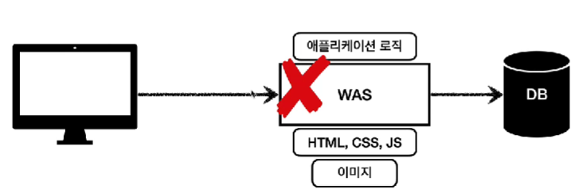
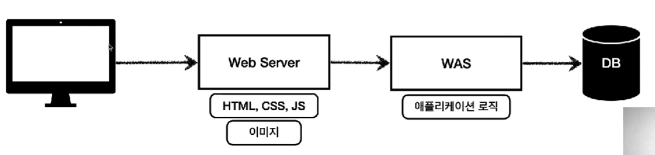
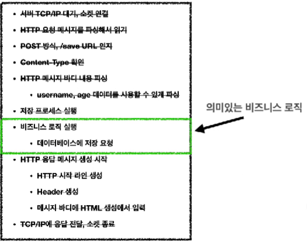
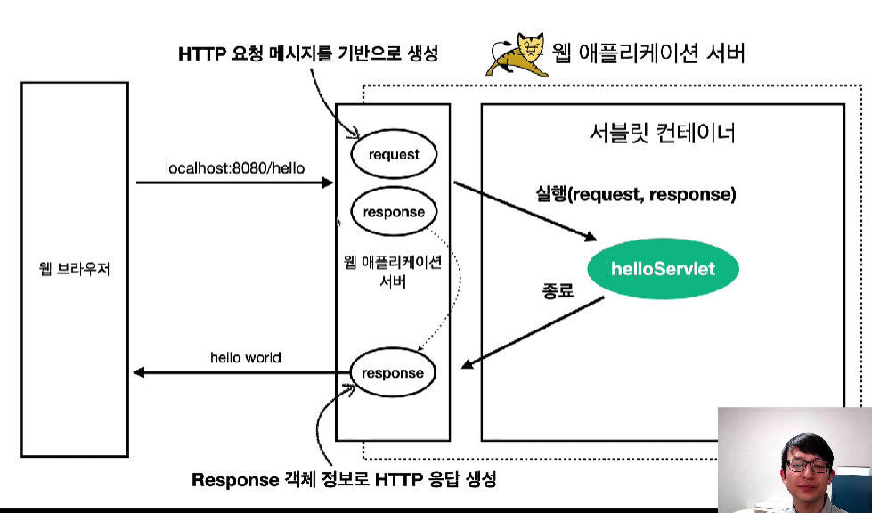
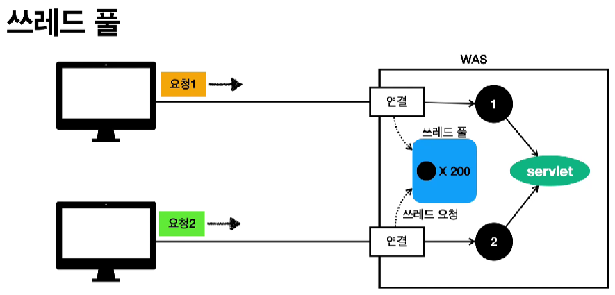
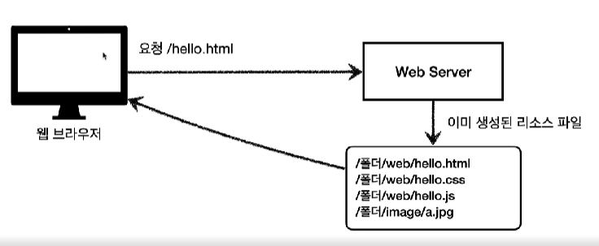
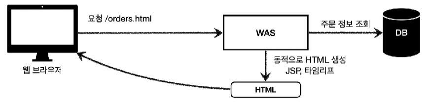
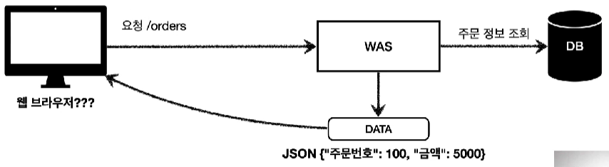
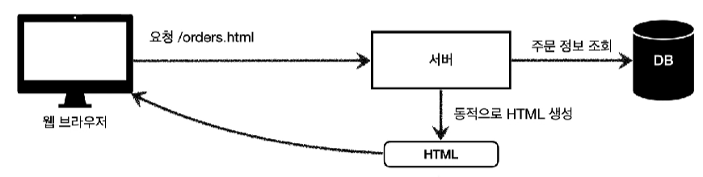
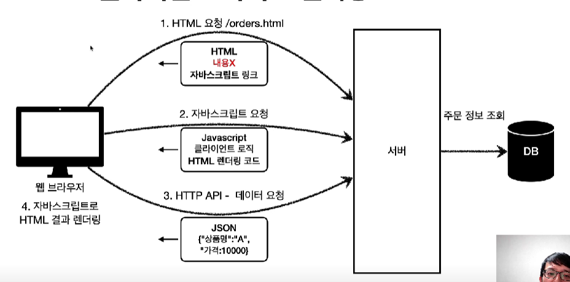

- [웹 서버(Web Server)](#웹-서버web-server)
- [웹 애플리케이션 서버(WAS, Web Application Server)](#웹-애플리케이션-서버was-web-application-server)
- [웹 서버, 웹 애플리케이션(WAS) 차이](#웹-서버-웹-애플리케이션was-차이)
- [웹 시스템 구성](#웹-시스템-구성)
  - [WAS, DB](#was-db)
  - [WEB, WAS, DB](#web-was-db)
- [서블릿](#서블릿)
  - [서블릿 컨테이너](#서블릿-컨테이너)
- [동시요청 - 멀티 쓰레드](#동시요청---멀티-쓰레드)
- [HTML, HTTP API, CSR, SSR](#html-http-api-csr-ssr)
  - [정적 리소스](#정적-리소스)
  - [HTML 페이지](#html-페이지)
  - [HTTP API](#http-api)
  - [SSR - 서버 사이드 렌더링](#ssr---서버-사이드-렌더링)
  - [CSR - 클라이언트 사이드 렌더링](#csr---클라이언트-사이드-렌더링)

# 웹 서버(Web Server)

- HTTP 기반으로 동작하는 서버
- 정적 리소스, 기타 부가기능 제공
  - http 프로토콜로 정적(파일) HTML, CSS, JS, 이미지, 영상을 주고 받을 수 있는 서버

# 웹 애플리케이션 서버(WAS, Web Application Server)

- HTTP 기반으로 동작
- 웹 서버 기능(정적 리소스 제공 등) 포함
- 프로그램 코드를 실행해서 애플리케이션 로직 수행한다.
  - 정적 리소스와는 달리 사용자마다 다르게 html 파일을 보여줄 수 있다.
- 동적 HTML, HTTP API(JSON)
- 서블릿, JSP, 스프링 MVC

# 웹 서버, 웹 애플리케이션(WAS) 차이

웹 서버는 정적 리소스(파일) 처리

WAS는 애플리케이션 로직(코드) 처리

# 웹 시스템 구성

## WAS, DB



간단하게 웹 시스템은 WAS와 DB로 구성이 가능하다.

- 하지만 이렇게 되면 WAS가 너무 많은 역할을 담당한다.
  - 서버 과부하 우려
- 애플리케이션 로직이 정적 리소스 때문에 수행이 어려워질 수도 있다.
- WAS는 쉽게 죽을 수도 있다.
  - 개발자의 실수
  - 해당 오류에 대한 화면도 보여줄 수 없다.

## WEB, WAS, DB



정적 리소스는 웹 서버가 처리하게끔 만드는 것이다.

- 웹 서버는 애플리케이션 로직같은 동적인 처리가 필요하면 WAS에 요청을 위임
- 이렇게 되면 WAS는 중요한 애플리케이션 로직 처리만 전담할 수 있다.
- 효율적인 리소스 관리도 가능
  - 정적 리소스가 많이 사용되면 웹 서버 증설
  - 애플리케이션 리소스가 많이 사용되면 WAS 증설
- 정적 리소스만 제공하는 WEB 서버는 잘 죽지 않지만, WAS는 잘 죽는다.
  - WAS, DB 장애시 WEB 서버가 오류 화면을 제공할 수 있다.

# 서블릿

웹 애플리케이션을 직접 구현한다고 가정하면, 다음의 과정을 모두 만들어야 한다.


하지만 서블릿을 지원하는 WAS를 사용한다면 의미있는 비즈니스 로직을 제외한 모든 과정을 WAS가 처리해준다.



서블릿의 특징

```java
@WebServlet(name = "helloServlet", urlPatterns = "/hello")
public class HelloServlet extends HttpServlet {

  @Override
  protected void Service(HttpServletRequest request, HttpServletResponse response){
    //애플리케이션 로직
  }
}
```

- 위의 코드에 따라 `url/hello`의 URL이 호출되면 위의 서블릿 코드가 실행된다.
- HTTP 요청, 응답 정보를 편리하게 사용하고, 제공할 수 있는 HttpServletRequest, HttpServletResponse 클래스



1. `localhost:8080/hello`로 요청을 WAS로 보낸다.
2. WAS에서 요청을 기반으로 request, response 객체를 생성한다.
3. request, response 객체를 기반으로 helloServlet이라는 웹 서블릿 객체를 호출한다.
4. response 객체를 바탕으로 HTTP 응답 정보를 만들어 응답을 보낸다.

## 서블릿 컨테이너

서블릿 컨테이너

- 서블릿 객체를 생성, 호출, 관리한다.
- 톰캣처럼 서블릿을 지원하는 WAS를 서블릿 컨테이너라고 한다.
- 서블릿 객체는 싱글톤으로 관리한다.
  - 최초 로딩 시점에 서블릿 객체를 미리 만들어두고 재활용
  - 모든 고객 요청은 동일한 서블릿 객체 인스턴스에 접근
  - 공유 변수는 사용시에 주의해야 한다.
  - 서블릿 컨테이너 종료시 함께 종료된다.
- 동시 요청을 위한 멀티 쓰레드 처리 지원

# 동시요청 - 멀티 쓰레드

쓰레드

- 애플리케이션 코드 하나하나를 순차적으로 실행하는 것
- 동시 처리가 필요하면 쓰레드를 추가로 생성
- 자바 메인 메서드를 처음 실행하면 main이라는 이름의 쓰레드가 생성되는 것

멀티 쓰레드

- 동시 요청이 너무 많을 경우, 요청마다 쓰레드를 생성하고 해당 요청에 대해 응답하면 쓰레드를 없애는 방식으로 WAS를 구현할 수 있다.
  - 장점
    - 동시 요청 처리 가능
    - 리소스가 허용되는 선에서 처리 가능
    - 하나의 쓰레드가 지연되어도, 나머지 쓰레드는 정상 작동
  - 단점
    - 쓰레드 생성 비용이 비쌈
    - 쓰레드는 컨텍스트 스위칭 비용이 발생한다.
    - 리소스의 한계까지 쓰레드를 만들면 서버가 죽을 수도 있다.

쓰레드 풀



- 쓰레드 풀안에 미리 쓰레드를 만들어 둔다.
  - 요청이 있을 때 빌려주고, 응답하면 다시 반납
- 요청 마다 쓰레드 생성하는 방식의 단점을 보완
- 쓰레드 풀에 생성 가능한 쓰레드의 최대치를 관리한다.
- 장점
  - 쓰레드를 생성하고 종료하는 비용이 절약되고, 빠르다.
  - 생성 가능한 쓰레드의 최대치가 정해져있으므로, 더 많은 요청이 들어와도 기존 요청은 안전하게 처리할 수 있다.

쓰레드 풀의 실무 팁

- WAS의 주요 튜닝 포인트는 최대 쓰레드(max thread) 수
  - 너무 낮게 설정하면, 동시 요청이 많을 때 클라이언트에서 응답 지연
  - 너무 높게 설정하면, 동시 요청이 많을 때 리소스 임계점 초과로 서버 다운
  - 최대 쓰레드 수로 인해 장애가 발생하면
    - 클라우드를 사용한다면 서버를 늘리고 튜닝
    - 클라우드를 사용하지 않는다면 평소에 튜닝을 잘해야 한다.
  - 적정 숫자
    - 많은 성능 테스트를 통해서 찾아야 한다.
    - 툴: 아파치, ab, 제이미터, nGrinder

이 정도로 쓰레드 관리는 어렵다.

- WAS가 멀티 쓰레드에 대한 부분은 모두 처리해준다.
- 개발자는 싱글 쓰레드 프로그래밍을 하듯이 소스코드 개발
  - 멀티 쓰레드 환경이므로 싱글톤 객체(서블릿, 스프링 빈)는 주의해서 사용해야 한다.

# HTML, HTTP API, CSR, SSR

## 정적 리소스



정적 리소스의 겨우는 데이터가 고정된 파일들이기 때문에 클라이언트가 요청하면 웹 서버에서 파일들을 끌어다 사용한다.

## HTML 페이지



동적 데이터를 HTML 페이지에 표현하기 위해서는 WAS에 요청을 보내 DB에서 정보를 조회하고, 해당 정보로 HTML 파일을 생성해 클라이언트에 전달한다.

## HTTP API



DB에서 받은 정보들로 HTML 파일을 생성하는 것이 아닌, 데이터를 그대로 클라이언트에 전달하는 방식이다.

- 주로 JSON 형식을 사용한다.
- 웹 클라이언트, 앱 클라이언트, 다른 WAS(예) 결제 서버와 주문 서버)에서 데이터들을 받아 HTML 파일 등으로 렌더링한다.

## SSR - 서버 사이드 렌더링



서버에서 최종 HTML 파일을 동적으로 생성해 클라이언트에 전달

- 주로 정적인 화면에 사용

## CSR - 클라이언트 사이드 렌더링

HTML 결과를 JS를 사용해 웹 브라우저에서 동적으로 생성해 적용

- 주로 동적인 화면에 사용
- 웹 환경을 앱처럼 필요한 부분만 변경할 수 있다.
  - 구글 지도, 구글 캘린더 등



1. 웹 브라우저에서 HTML 파일을 요청한다.
2. 서버에서 응답으로 빈 HTML 파일과 해당 페이지에 관한 JS 링크를 전달한다.
3. 웹 브라우저는 JS 링크를 바탕으로 코드를 요청한다.
4. 서버에서 응답으로 JS 코드와 클라이언트 로직, HTML 렌더링 코드를 전달한다.
5. 클라이언트는 HTML 파일에 들어갈 데이터를 서버에 요청한다.
6. 서버는 DB에서 정보를 조회해 JSON 형식의 데이터를 웹 브라우저로 전달한다.
7. 웹 브라우저는 전달 받은 데이터를 바탕으로 HTML 페이지를 렌더링한다.
