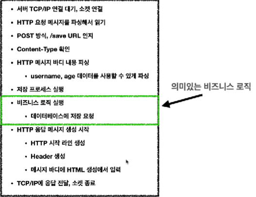

- [웹 서버(Web Server)](#웹-서버web-server)
- [웹 애플리케이션 서버(WAS, Web Application Server)](#웹-애플리케이션-서버was-web-application-server)
- [웹 서버, 웹 애플리케이션(WAS) 차이](#웹-서버-웹-애플리케이션was-차이)
- [웹 시스템 구성](#웹-시스템-구성)
  - [WAS, DB](#was-db)
  - [WEB, WAS, DB](#web-was-db)
- [서블릿](#서블릿)

# 웹 서버(Web Server)

- HTTP 기반으로 동작하는 서버
- 정적 리소스, 기타 부가기능 제공
  - http 프로토콜로 정적(파일) HTML, CSS, JS, 이미지, 영상을 주고 받을 수 있는 서버

# 웹 애플리케이션 서버(WAS, Web Application Server)

- HTTP 기반으로 동작
- 웹 서버 기능(정적 리소스 제공 등) 포함
- 프로그램 코드를 실행해서 애플리케이션 로직 수행한다.
  - 정적 리소스와는 달리 사용자마다 다르게 html 파일을 보여줄 수 있다.
- 동적 HTML, HTTP API(JSON)
- 서블릿, JSP, 스프링 MVC

# 웹 서버, 웹 애플리케이션(WAS) 차이

웹 서버는 정적 리소스(파일) 처리

WAS는 애플리케이션 로직(코드) 처리

# 웹 시스템 구성

## WAS, DB


간단하게 웹 시스템은 WAS와 DB로 구성이 가능하다.

- 하지만 이렇게 되면 WAS가 너무 많은 역할을 담당한다.
  - 서버 과부하 우려
- 애플리케이션 로직이 정적 리소스 때문에 수행이 어려워질 수도 있다.
- WAS는 쉽게 죽을 수도 있다.
  - 개발자의 실수
  - 해당 오류에 대한 화면도 보여줄 수 없다.

## WEB, WAS, DB


정적 리소스는 웹 서버가 처리하게끔 만드는 것이다.

- 웹 서버는 애플리케이션 로직같은 동적인 처리가 필요하면 WAS에 요청을 위임
- 이렇게 되면 WAS는 중요한 애플리케이션 로직 처리만 전담할 수 있다.
- 효율적인 리소스 관리도 가능
  - 정적 리소스가 많이 사용되면 웹 서버 증설
  - 애플리케이션 리소스가 많이 사용되면 WAS 증설
- 정적 리소스만 제공하는 WEB 서버는 잘 죽지 않지만, WAS는 잘 죽는다.
  - WAS, DB 장애시 WEB 서버가 오류 화면을 제공할 수 있다.

# 서블릿

웹 애플리케이션을 직접 구현한다고 가정하면, 다음의 과정을 모두 만들어야 한다.



하지만 서블릿을 지원하는 WAS를 사용한다면 의미있는 비즈니스 로직을 제외한 모든 과정을 WAS가 처리해준다.


서블릿의 특징

```java
@WebServlet(name = "helloServlet", urlPatterns = "/hello")
public class HelloServlet extends HttpServlet {

  @Override
  protected void Service(HttpServletRequest request, HttpServletResponse response){
    //애플리케이션 로직
  }
}
```
- 위의 코드에 따라 `url/hello`의 URL이 호출되면 위의 서블릿 코드가 실행된다.
- HTTP 요청, 응답 정보를 편리하게 사용하고, 제공할 수 있는 HttpServletRequest, HttpServletResponse 클래스