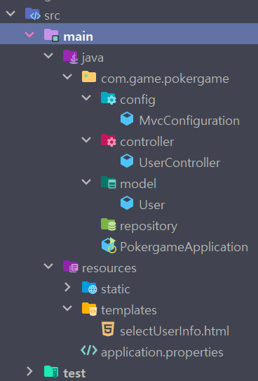
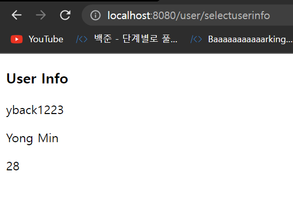

# Thymeleaf 맛보기

## Thymeleaf란?

- 뷰 템플릿 엔진
- 컨트롤러가 전달하는 데이터를 이용하여 동적으로 화면을 구성 가능
- html 태그를 기반으로 동적인 View 제공
- `th:`를 이용하여 데이터를 바인딩

```html
<p th:text="${name}"><p>
```

## Spring Boot + Thymeleaf 환경 설정

Maven

- pom.xml에 dependency 추가

```xml
<dependency>
  <groupId>org.springframework.boot</groupId>
  <artifactId>spring-boot-starter-thymeleaf</artifactId>
</dependency>
```

Gradle

- build.gradle에 dependency 추가

```
dependencies {
 implementation 'org.springframework.boot:spring-boot-starter-thymeleaf'
}
```

## 디렉토리 구조

html 파일이 src/main/resources 하위의 templates 폴더에 위치한다면 자동으로 path가 지정되어 호출 가능



User.java

```java
package com.game.pokergame.model;

import lombok.Data;

@Data
public class User {

    private String id;
    private String name;
    private int age;
}
```

UserController.java

```java
package com.game.pokergame.controller;

import com.game.pokergame.model.User;
import org.springframework.stereotype.Controller;
import org.springframework.web.bind.annotation.RequestMapping;
import org.springframework.web.servlet.ModelAndView;

@Controller
@RequestMapping("user")
public class UserController {

    @RequestMapping("selectuserinfo")
    ModelAndView selectUserInfo() {
        ModelAndView mav = new ModelAndView("/selectUserInfo");

        User user = new User();
        user.setId("yback1223");
        user.setName("Yong Min");
        user.setAge(28);

        mav.addObject("title", "selected user");
        mav.addObject("user", user);

        return mav;
    }
}
```

selectUserInfo.html

```html
<!DOCTYPE html>
<html lang="en">
<head>
  <meta charset="UTF-8">
  <title th:text="${title}"></title>
</head>
<body>
  <h3>User Info</h3>
  <p th:text="${user.id}"></p>
  <p th:text="${user.name}"></p>
  <p th:text="${user.age}"></p>
</body>
</html>
```

