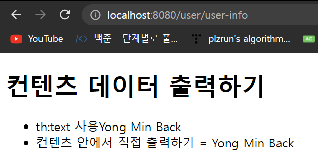
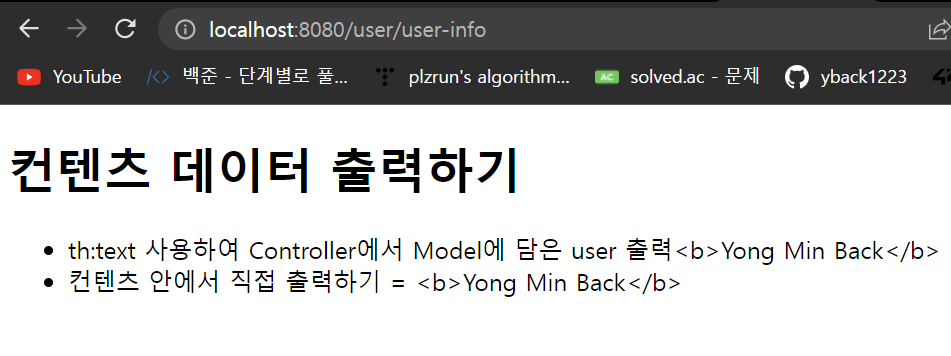
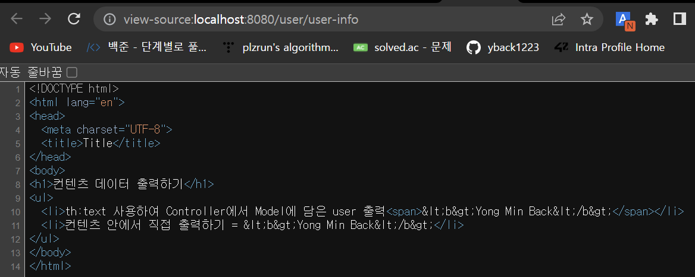
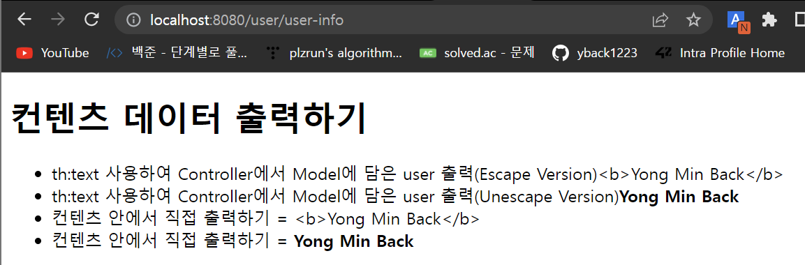
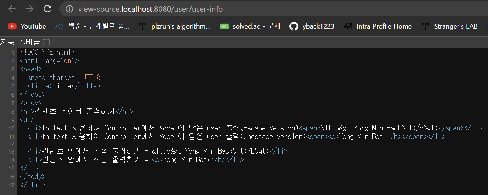
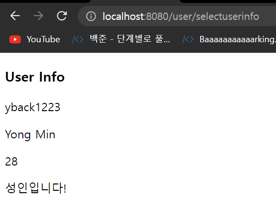

# thymeleaf 기본 문법 - 데이터 바인딩, 조건문

## 텍스트 - th:text, th:utext

서버에서 Model에 담아준 속성(attribute)들을 타임리프에서 표현하는 방법

- p, span, div 등의 태그에서 데이터를 텍스트로 바인딩할 때 사용

1. th:text

```html
<span th:text="${attributeName}"></span>
```

2. `[[...]]`

```html
<span>hello [[${attributeName}]]</span>
```

### Example

- UserController

```java
package com.game.pokergame.controller;

import org.springframework.stereotype.Controller;
import org.springframework.ui.Model;
import org.springframework.web.bind.annotation.GetMapping;
import org.springframework.web.bind.annotation.RequestMapping;

@Controller
@RequestMapping("/user")
public class UserController {

    @GetMapping("user-info")
    public String userInfo(Model model) {
        model.addAttribute("userDto", "Yong Min Back");
        return "user-info";
    }
}
```

- user-info.html

```html
<!DOCTYPE html>
<html lang="en" xmlns:th="http://www.thymeleaf.org">
<head>
  <meta charset="UTF-8">
  <title>Title</title>
</head>
<body>
<h1>컨텐츠 데이터 출력하기</h1>
<ul>
  <li>th:text 사용하여 Controller에서 Model에 담은 user 출력<span th:text="${userDto}"></span></li>
  <li>컨텐츠 안에서 직접 출력하기 = [[${userDto}]]</li>
</ul>
</body>
</html>  
```

- 실행 결과



### Escape example

서버에서 속성으로 추가할 데이터에 html 태그를 추가한다면 어떻게 될까?

- UserController

볼드체를 적용시켜보기 위해 넘겨주는 속성 문자열에 `<b></b>`를 추가해본다.

```java
package com.game.pokergame.controller;

import org.springframework.stereotype.Controller;
import org.springframework.ui.Model;
import org.springframework.web.bind.annotation.GetMapping;
import org.springframework.web.bind.annotation.RequestMapping;

@Controller
@RequestMapping("/user")
public class UserController {

    @GetMapping("user-info")
    public String userInfo(Model model) {
        model.addAttribute("userDto", "<b>Yong Min Back</b>");
        return "user-info";
    }
}
```

- 실행 결과





타임리프가 제공하는 `th:text`와 `[[...]]`는 기본적으로 escape를 지원하기 때문에 HTML의 태그를 받는다면 이를 HTML 태그로 받아들이지 않고, 문자열로 그대로 표현할 수 있게 `&lt;,b&gt;` 같은 문자열을 추가해준다. 이를 `HTML 엔티티`라고 한다.

- Unescappe 방법
  - `th:utext`
  - `[(...)]`

### Unescape example

- user-info.html

```java
<!DOCTYPE html>
<html lang="en" xmlns:th="http://www.thymeleaf.org">
<head>
  <meta charset="UTF-8">
  <title>Title</title>
</head>
<body>
<h1>컨텐츠 데이터 출력하기</h1>
<ul>
  <li>th:text 사용하여 Controller에서 Model에 담은 user 출력(Escape Version)<span th:text="${userDto}"></span></li>
  <li>th:text 사용하여 Controller에서 Model에 담은 user 출력(Unescape Version)<span th:utext="${userDto}"></span></li>

  <li>컨텐츠 안에서 직접 출력하기 = [[${userDto}]]</li>
  <li>컨텐츠 안에서 직접 출력하기 = [(${userDto})]</li>
</ul>
</body>
</html>
```






## 변수

`${...}`
- 기본적인 변수 표현식
- 이 변수 표현식에 SpringEL이라는 스프링 제공 표현식 사용 가능


### SpringEL 표현식

단순한 변수는 `${data}`로 표현 가능하지만, Object나, List 같은 객체는 다른 방법을 이용해야 한다.


## 조건문 - th:if, th:unless

조건문을 사용할 때 else 대신 unless를 사용

- if문의 조건식과 unless의 조건식이 같아야 한다.

selectUserInfo.html

```html
<!DOCTYPE html>
<html lang="en">
<head>
  <meta charset="UTF-8">
  <title th:text="${title}"></title>
</head>
<body>
  <h3>User Info</h3>
  <p th:text="${user.id}"></p>
  <p th:text="${user.name}"></p>
  <p th:text="${user.age}"></p>

  <p th:if="${user.age > 20}">성인입니다!</p>
  <p th:unless="${user.age > 20}">미성년자입니다!</p>
</body>
</html>
```



## form - th:object

form 태그에서 사용할 수 있는 3가지

- th:action
  - form data를 보낼 url을 설정
- th:object
  - form submit을 할 때, form의 데이터가 th:object에 설정해준 객체로 받아진다.
  - form data를 담을 객체를 설정
- th:field
  - 담는 객체의 필드를 동적으로 매핑

### example

먼저 form 태그를 사용할 페이지에 비어있는 객체를 전달해야 한다.

```java

```

## 중복 제거용(th:fragment, th:replace, th:insert)

- th:fragment

header, footer, navigation bar 같이 모든 페이지에 보여져야하는 항목인 경우 따로 분리해서 관리한다.

