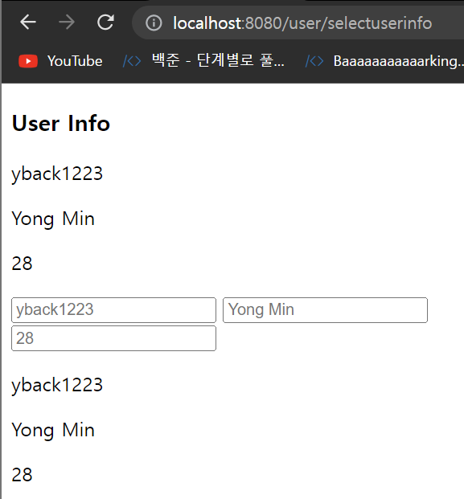

# thymeleaf 기본 문법 - 데이터 바인딩, 조건문

## 데이터 바인딩 - th:text, th:value, th:placeholder

p, span, div 등의 태그에서 데이터를 텍스트로 바인딩할 때 사용

selectUserInfo.html

```html
<!DOCTYPE html>
<html lang="en">
<head>
  <meta charset="UTF-8">
  <title th:text="${title}"></title>
</head>
<body>
  <h3>User Info</h3>
  <p th:text="${user.id}"></p>
  <p th:text="${user.name}"></p>
  <p th:text="${user.age}"></p>
  <label>
    <input type="text" th:placeholder="${user.id}">
  </label>
  <label>
    <input type="text" th:placeholder="${user.name}">
  </label>
  <label>
    <input type="text" th:placeholder="${user.age}">
  </label>
  <p><span th:utext="${user.id}"></span></p>
  <p><span th:utext="${user.name}"></span></p>
  <p><span th:utext="${user.age}"></span></p>
</body>
</html>
```



## 조건문 - th:if, th:unless

조건문을 사용할 때 else 대신 unless를 사용

- if문의 조건식과 unless의 조건식이 같아야 한다.

selectUserInfo.html

```html
<!DOCTYPE html>
<html lang="en">
<head>
  <meta charset="UTF-8">
  <title th:text="${title}"></title>
</head>
<body>
  <h3>User Info</h3>
  <p th:text="${user.id}"></p>
  <p th:text="${user.name}"></p>
  <p th:text="${user.age}"></p>

  <p th:if="${user.age > 20}">성인입니다!</p>
  <p th:unless="${user.age > 20}">미성년자입니다!</p>
</body>
</html>
```


