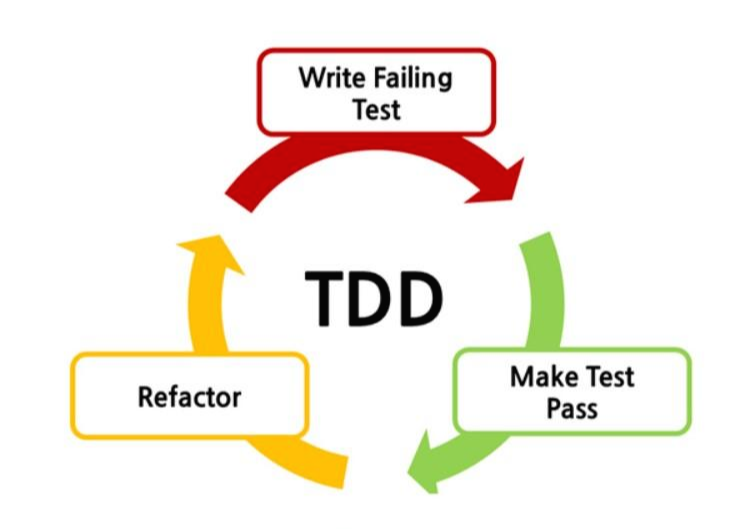
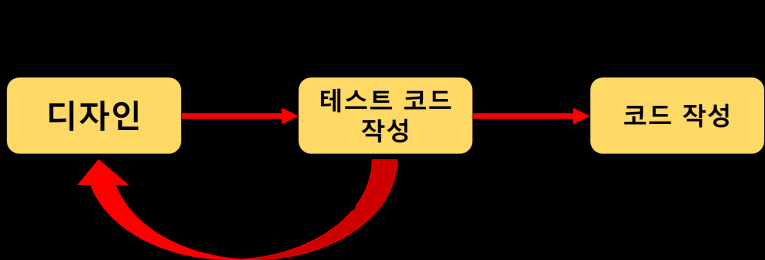

## TDD(Test-Driven-Development)

TDD

- 테스트 주도 개발
  - 테스트를 먼저 만들고 테스트를 통과하기 위한 것을 짜는 것
- 반복 테스트를 이용한 소프트웨어 방법론
- 작은 단위의 테스트 케이스를 작성하고 이를 통과하는 코드를 추가하는 단계를 반복하여 구현

- Red 단계
  - 실패하는 테스트 코드를 먼저 작성
- Green 단계
  - 테스트 코드를 성공시키기 위한 실제 코드 작성
- Yellow 단계
  - 중복 코드 제거, 일반화 등의 리팩토링 수행

### 중요한 점

- 실패하는 테스트 코드를 작성할 때까지 실제 코드를 작성하지 않는 것

- 실패하는 테스트를 통과할 정도의 최소 실제 코드를 작성해야 한다.

## 일반 개발 방식 vs TDD

일반 개발 방식

- 요구사항 분석 -> 설계 -> 개발 -> 테스트 -> 배포
- 소프트웨어 개발을 느리게 하는 잠재적 위험이 존재
  - 소비자의 요구사항이 처음부터 명확하지 않을 수 있다.
  - 자체 버그 검출 능력 저하 또는 소스코드의 품질이 저하된다.
  - 자체 테스트 비용이 증가
- 초기 설계가 완벽할 수 없기 때문에 문제가 발생하는 것
  - 고객의 요구사항 또는 디자인의 오류 등 많은 외부 또는 내부 조건에 의해 재설계하여 점진적으로 완벽한 설계로 나아간다.
- 작은 부분의 기능 수정에도 모든 부분을 테스트해야 하므로 전체적인 버그 검출이 어려워진다.
  - 자체 버그 능력 저하
  - 비용 증가

TDD 개발 방식

- 일반 개발 방식과 가장 큰 차이점
  - 테스트 코드를 작성한 뒤에 실제 코드를 작성
- 디자인(설계) 단계에서 프로그래밍 목적을 반드시 미리 정의해야 한다.
- 무엇을 테스트해야 할지 미리 정의(테스트 케이스 작성)해야만 한다.
- 테스트 코드를 작성하는 도중에 발생하는 예외 사항(버그, 수정사항)들은 테스트 케이스에 추가하고 설계를 개선한다.
  - 이후 테스트가 통과된 코드만을 코드 개발 단계에서 실제 코드로 작성

## TDD 개발 방식의 장점

보다 튼튼한 객체 지향적인 코드 생산

- 코드의 재사용 보장을 명시하므로 TDD를 통한 소프트웨어 개발 시 기능 별 철저한 모듈화가 이루어진다.
  - 종속성과 의존성이 낮은 모듈로 조합된 소프트웨어 개발을 가능
  - 필요에 따라 모듈을 추가하거나 제거해도 소프트웨어 전체 구조에 영향을 미치지 않게 된다.

재설계 시간의 단축

- 테스트 시나리오를 작성하면서 다양한 예외사항에 대해 생각해볼 수 있다.

추가 구현의 용이함

- 개발이 완료된 소프트웨어에 어떤 기능을 추가할 때 가장 우려되는 점은 해당 기능이 기존 코드에 어떤 영향을 미칠지 알지 못한다는 것이다.
  - TDD의 경우 자동화된 유닛 테스팅을 전제하므로 테스트 기간을 획기적으로 단축시킬 수 있다.

## TDD의 효과

불확실성이 높을 때 '피드백'과 '협력'이 중요하다.

- TDD는 피드백과 협력을 증진시키는 것

TDD를 해야하는 상황

- 처음해보는 프로그램 주제
  - 나에 대한 불확실성이 높은 경우
- 고객의 요구조건이 바뀔 수 있는 프로젝트
  - 외부적인 불확실성이 높은 경우
- 개발하는 중에 코드를 많이 바꿔야 된다고 생각하는 경우
- 내가 개발하고 나서 이 코드를 누가 유지보수할지 모르는 경우

즉, 불확실성이 높을 때 TDD를 한다.

TDD의 효과

- 피드백
  - TDD를 하면 피드백이 증가한다.
    - 테스트를 통과하는 것으로 잘되고 있는가를 자주 확인할 수 있다.
- 협력
  - 일반적인 테스트는 동사로 사용한다. 하지만 TDD를 하면 테스트는 명사가 된다.
  - 동사는 그 순간에만 하는 것이고, 명사(대상, 목적어)는 이후에도 소유할 수가 있다.
    - 테스트 코드를 남들과 공유할 수 있는 것이다.
  - TDD는 왜 협력을 증진?
    - 테스트가 명사(대상, 목적어)가 되는 순간 이것을 공유하기 쉬워지고, 공유를 통해 협력이 증진된다.
      - 다른 사람의 코드를 쉽고 빠르게 이해할 수 있다.
      - 다른 사람의 코드의 의도를 알고 있기 때문에 고쳐줄 수 있는 것이다.

### ‘TDD는 어떻길래 중복코드가 없어지는 마술을 보이는 걸까?’

1. 하나의 작은 단위의 테스트 코드를 작성한다.
2. 테스트를 한다.
3. 테스트가 통과될 때까지 테스트 코드를 수정한다.
4. 테스트가 통과된 테스트 코드는 리펙토링 한다.
5. 리펙토링한 코드를 테스트한다.
6. 리펙토링한 코드가 통과될 때까지 코드를 수정한다.
7. 테스트가 통과되면 테스트 케이스에 있는 다음 테스트 코드를 작성한다.

이렇게 작은 단위부터 시작하여 점진적으로 개발한다. 이때 일련의 반복적인 과정을 통해 자연스럽게 코드는 명확해지고 깔끔해진다.

### 클린 코드 저자 밥의 TDD 세 가지 규칙

나노 주기(초 단위 테스트 주기)

- 코드의 행 단위 개발 및 테스트가 이루어진다.

1. 먼저 실패하는 테스트 코드를 작성한다.
2. 컴파일은 실패하지 않으면서 실행이 실패하는 정도로만 테스트 코드를 작성한다.
3. 현재 실패하는 테스트 코드가 통과된 코드만 실제 코드에 작성한다.

켄트 벡과 밥은 테스트 코드 작성에 있어 다양한 스타일이 있지만, 위와 같은 세 가지 규칙을 벗어난 개발 스타일을 금기시하고 있다.

RGR 주기(분 단위 테스트 주기)

1. Red      실패하는 단위 테스트 만들기
2. Green    테스트가 통과하도록 작성하기
3. Refactor 통과된 테스트 코드를 리팩토링하기

Red에서 Green으로 진행되는 과정을 살펴보자

- 이 과정에서 켄트 벡은 테스트가 통과하기 위해 금기(복붙, 설계를 무시한 개발)가 되는 행동을 허용한다.
  - 어차피 Refactor 단계에서 해결할 것이기 때문

RGR 주기는 실제 개발 단계에서 개발과 동시에 리팩토링을 하기 위한 활동이다.

### 시간단위의 마일스톤

TDD의 마지막 주기는 이전의 주기들을 통해 Clean Architecture로 이끌어가는 주기이다.

나노 주기와 RGR 주기는 작은 단위에 초점을 맞춰 빠르게 진행되고 있어서 개발의 방향성을 잃을 위험성이 크다.

이 주기에서는 테스트 케이스를 통해 개발에 대한 방향성 및 구조적인 상황을 점검하는 시간을 가져야 한다.

Unit Test

- 일반적으로 Unit Test는 객체 또는 클래스에 초점을 맞춘다.
- 테스트가 단일 기능에 한정되도록 함으로써 테스트는 간단하고 신속하게 이루어진다.
- 코드가 작동하는지 확인하는 단위테스트가 있으면 코드를 안전하게 변경할 수 있고 실행 시 다른 부분에서 프로그램이 중단되지 않는다는 점을 확신할 수 있다.

Unit Test의 FIRST 규칙

- Fast
  - 단위 테스트는 빨라야 한다.
  - 빠름의 기준은 밀리 초(ms)
- Independent
  - 단위 테스트는 독립적으로 작성해야 한다.
  - 테스트에 사용된 데이터들은 서로 의존하면 안 된다.
  - 테스트에 필요한 데이터는 테스트 내부에서 독립적으로 사용해야 한다.
- Repeatable
  - 단위 테스트는 어느 환경에서든 반복 가능해야 한다.
  - 인터넷이 되든 안 되든 데이터베이스에 접속하든 안 하든 언제 어디서나 테스트를 할 수 있어야 한다.
- Self-Validating
  - 단위 테스트는 자체검증이 되어야 한다.
  - 테스트 검증은 자동화가 되어야 한다.(JUunit)
- Timely
  - 단위 테스트는 실제 코드 작성 전에 작성해야 한다.

>TDD를 도입한 소프트웨어는 약 15~35% 정도의 개발시간 증가, 결함율(버그)은 약 40~90% 정도 줄어들었다. – Microsoft, IBM