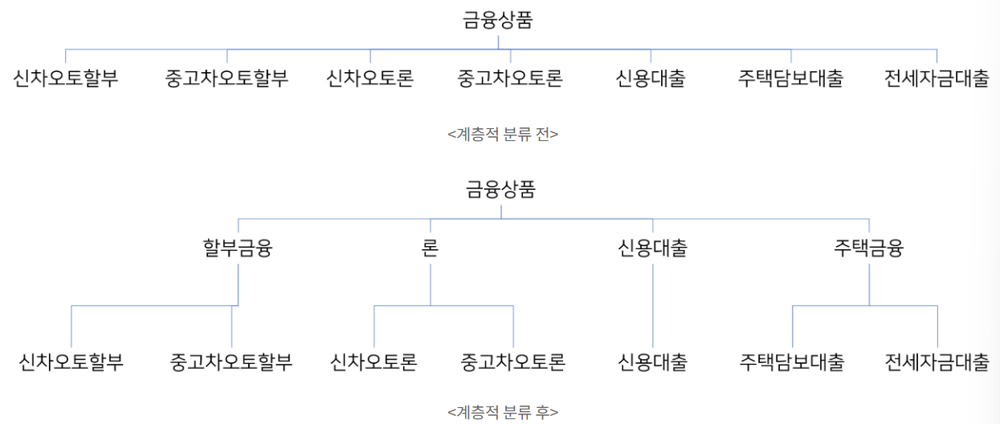

- [객체지향 생활체조 원칙](#객체지향-생활체조-원칙)
  - [규칙 1. 한 메서드에 오직 한 단계의 들여쓰기(indent)만 한다](#규칙-1-한-메서드에-오직-한-단계의-들여쓰기indent만-한다)
    - [숨은 의미](#숨은-의미)
  - [규칙2. else 예약어를 쓰지 않는다](#규칙2-else-예약어를-쓰지-않는다)
    - [숨은 의미](#숨은-의미-1)
    - [예시](#예시)
      - [else 문 기반의 코드 작성 예시](#else-문-기반의-코드-작성-예시)
      - [early return 구조를 적용한 예시](#early-return-구조를-적용한-예시)
      - [객체지향 설계](#객체지향-설계)
  - [규칙 3. 모든 원시값과 문자열을 포장한다](#규칙-3-모든-원시값과-문자열을-포장한다)
    - [숨은 의미](#숨은-의미-2)
      - [예시 - 상태 포장 전](#예시---상태-포장-전)
      - [예시 - 상태 포장 후](#예시---상태-포장-후)
  - [규칙 4. 한 줄에 점을 하나만 찍는다](#규칙-4-한-줄에-점을-하나만-찍는다)
    - [숨은 의미](#숨은-의미-3)
      - [예시 - 점이 여러개 있음](#예시---점이-여러개-있음)
      - [예시 - 해결](#예시---해결)
      - [예시 - 객체에 메시지를 보내라](#예시---객체에-메시지를-보내라)
  - [규칙 5. 줄여쓰지 않는다](#규칙-5-줄여쓰지-않는다)
    - [숨은 의미](#숨은-의미-4)
    - [의미의 축약 - 메소드 분리](#의미의-축약---메소드-분리)
  - [규칙 6. 모든 엔티티를 작게 유지한다](#규칙-6-모든-엔티티를-작게-유지한다)
    - [숨은 의미](#숨은-의미-5)
  - [규칙 7. 3개 이상의 인스턴스 변수를 가진 클래스를 쓰지 않는다](#규칙-7-3개-이상의-인스턴스-변수를-가진-클래스를-쓰지-않는다)
    - [숨은 의미](#숨은-의미-6)
      - [예시](#예시-1)
    - [인스턴스의 수를 줄여라 - 클래스는 계층적인 분류로 설게해야 한다](#인스턴스의-수를-줄여라---클래스는-계층적인-분류로-설게해야-한다)
  - [규칙 8. 일급 컬렉션을 쓴다](#규칙-8-일급-컬렉션을-쓴다)
    - [숨은 의미](#숨은-의미-7)
      - [예시 - 문제](#예시---문제)
      - [예시 - 문제 해결](#예시---문제-해결)
    - [Iterable 인터페이스를 구현해보자](#iterable-인터페이스를-구현해보자)
  - [규칙 9. getter/setter/property를 쓰지 않는다](#규칙-9-gettersetterproperty를-쓰지-않는다)
    - [숨은 의미](#숨은-의미-8)
    - [객체에 메시지를 전달해라](#객체에-메시지를-전달해라)
- [참고](#참고)

# 객체지향 생활체조 원칙

## 규칙 1. 한 메서드에 오직 한 단계의 들여쓰기(indent)만 한다

들여쓰기의 depth를 2 이상으로 두지 말자

- 예) for 또는 while 문 안에 if 문이 있으면 indent depth가 2인 코드이다.
- 예) 반복문 안에 반복문이 존재하는 것도 indent depth가 2인 코드이다.

### 숨은 의미

이 원칙의 제시의도는 메서드 구조를 분리함으로써 한 단락은 하나의 일만 하도록 설계하자는 것이다.

- 로직이 잘게 쪼개질수록 메서드간의 로직적 결합도는 낮아지고, 응집도는 높아진다.
  - 이러한 코드는 재사용성이 높고, 메서드명을 기반으로 작성되기 때문에 가독성도 좋다.

## 규칙2. else 예약어를 쓰지 않는다

else, switch/case 문을 허용하지 않는다.

### 숨은 의미

이 원칙의 제시의도는 한 메소드에서 발생하는 분기문을 줄이자는 것이다.

- 분기문을 많이 가지고 있는 메소드는 많은 기능을 가지고 있을 확률이 높다.
- 메소드를 분리하거나, 객체지향적인 구조를 적용해 분기문을 줄일 수 있다.

### 예시

#### else 문 기반의 코드 작성 예시

```java
public String getProductName(String productCode) {
 String productName = "";

 if ("1".equals(productCode)) {
  productName = "할부";
 } else if ("2".equals(productCode)) {
  productName = "리스";
 } else if ("3".equals(productCode)) {
  productName = "담보";
 } else {
  productName = "신용";
 }
 
 return productName;
}
```

- 코드의 길이가 길지 않아서 가독성이 나쁘지 않지만, 모든 조건문의 분기를 다 확인하기 전까지는 메소드가 어떻게 동작할지 확신하기 어렵다.
- 비즈니스적 구조로 보았을 때에도 문제가 있다.
  - 마지막 else 문의 경우에는 n:1 관계를 가진다고 표현된다.
  - 비즈니스적으로 `productCode`와 `productName`은 1:1 관계를 가져야 옳다고 보기 때문에 마지막 1, 2, 3외의 모든 경우의 수를 "신용"으로 처리하는 것은 문제가 있다.

#### early return 구조를 적용한 예시

```java
public String getProductName(String productCode) {
 if ("1".equals(productCode)) {
  return "할부";
 }
 if ("2".equals(productCode)) {
  return "리스";
 }
 if ("3".equals(productCode)) {
  return "담보";
 }
 if ("4".equals(productCode)){
  return "신용";
 }
 throw new IllegalArgumentException("존재하지 않는 상품입니다.");
}
```

- early return - throw exception 구조를 적용하면 메소드의 가독성을 높일 수 있다.
  - 개발자가 의도한 조건일 경우에만 자신의 역할을 수행하고 종료한다.
  - 코드를 읽을 때 중간에 리턴을 하기 때문에 메소드를 끝까지 확인하지 않아도 된다.
  - early return 패턴으로 코드를 작성하면 불필요한 지역변수의 생성을 막을 수 있다.

#### 객체지향 설계

분기점이 많아진다는  것은, 클래스의 구조를 변경해야 함을 의미할 확률이 높다. 위 로직을 enum을 활용해서 다음과 같이 변경할 수 있다.

```java
public enum LoanProduct {

    INSTALLMENT("1", "할부"),
    LEASE("2", "리스"),
    COLLATERAL("3", "담보"),
    CREDIT("4", "신용")
    ;

    private String productCode;
    private String productName;

    LoanProduct(String productCode, String productName) {
        this.productCode = productCode;
        this.productName = productName;
    }

    public static String productName(String productCode) {
        return Arrays.stream(values())
                .filter(bankingProduct -> bankingProduct.productCode.equals(productCode))
                .findFirst()
                .orElseThrow( () -> new IllegalArgumentException("상품이 존재하지 않습니다."))
                .name();
    }
}

public String getProductName(String productCode) {
 return LoanProduct.productName(productCode);
}
```

- enum을 통해서 상품명을 통합적으로 관리할 수 있게 된다.
  - 상품정보의 변경이 일어나도, enum 내부에서 모두 처리할 수 있는 유연한 코드가 된다.

## 규칙 3. 모든 원시값과 문자열을 포장한다

int, long, String과 같은 원시타입, 문자열 변수를 객체로 포장해 사용하라는 지침이다.

### 숨은 의미

프로그래밍에서 변수는 '상태'로 쓰일 수 있다. 상태는 '자료'가 아니라 '정보'다.

- 단순히 값을 나타내는 것 뿐 아니라, 비즈니스적인 의미를 함께 표현해준다.
- 이렇게 업무적 의미를 갖는 변수를 포장해 사용하면 이점이 많다.

#### 예시 - 상태 포장 전

```java
public class EvaluateService {

    private static final int MIN_CREDIT_SCORE = 0;
    private static final int MAX_CREDIT_SCORE = 1000;

    public void evaluateCustomerCreditRate(int score) {

        if (score < MIN_CREDIT_SCORE || score > MAX_CREDIT_SCORE) {
            throw new IllegalArgumentException("신용점수는 " + MIN_CREDIT_SCORE + " 점 이상, " + MAX_CREDIT_SCORE + " 점 미만이어야 합니다.");
        }

        // 검증로직...
    }
}
```

- `EvaluateService` 클래스는 신용점수를 기반으로 고객을 심사해주는 역할을 한다.
  - 문제
    - `score`에 대한 검증을 `EvaluateService` 클래스만 할 수 있다는 것이 문제
    - 다른 클래스에서 신용점수를 사용해야 한다면 동일한 로직을 다시 구현해 주어야 한다.

#### 예시 - 상태 포장 후

```java
public class CreditScore {

    private static final int MIN_CREDIT_SCORE = 0;
    private static final int MAX_CREDIT_SCORE = 1000;

    private int value;

    public CreditScore(int value) {
        if (value < MIN_CREDIT_SCORE || value > MAX_CREDIT_SCORE) {
            throw new IllegalArgumentException("신용점수는 " + MIN_CREDIT_SCORE + " 점 이상, " + MAX_CREDIT_SCORE + " 점 미만이어야 합니다.");
        }
        this.value = value;
    }
}

public class EvaluateService {

    public void evaluateCustomerCreditRate(CreditScore creditScore) {
        
        // 검증로직
    }
}
```

- 기존의 int 타입 score 변수를 CreditScore 클래스로 포장했다.
  - 이렇게 값을 사용하면 `EvaluateService` 클래스에 의존하는 프로그램에서는 반드시 `CreditScore` 클래스의 인스턴스를 생성해야 한다.
    - 인스턴스를 생성할 때 자동으로 값에 대한 유효성 체크를 하는 것이다.
- 유효성 검증의 기준을 클래스가 직접 가지게 되므로, 신용점수에 음수구간이 신설되거나, 최대점수가 상향되더라도 대응하기 용이하다.
- 원시타입을 포장함으로써 메소드의 시그니처가 명확해진다.
  - 클래스로 포장한 타입을 메소드의 파라미터로 사용하게 되면 메소드를 설명하기가 더욱 편리해진다.

```java
public void evaluateCustomerCreditRate(int score)
public void evaluateCustomerCreditRate(CreditScore creditScore)
```

- int 타입의 경우에는 값에 대한 검증이 구현되어 있지 않기 때문에, 유효성을 확인하기 위해서 메소드의 로직을 열어서 확인해봐야 한다.
- 객체 타입의 경우에 해당 객체의 생성자를 확인해주면 되기 때문에 별도의 validation을 확인해야 하는 번거로움이 적어진다.

## 규칙 4. 한 줄에 점을 하나만 찍는다

코드를 작성할 때 한 라인에 점이 여러 개 생기면, 설계에 대한 고민을 해보라는 지침이다.

### 숨은 의미

단순히 라인에 존재하는 점의 개수를 헤아려 줄이라는 의미가 아니다.

- 점을 찍는 행위
  - 필드나 메소드를 통해 인스턴스에 접근하는 행위를 의미
  - 점의 개수가 많아지는 것은 대상 객체의 내부에 깊이 접근하겠다는 의도
    - 이는 호출자와 피호출자 사이에 강한 결합도가 형성되었다는 것을 의미

#### 예시 - 점이 여러개 있음

```java
public class PaymentService {

    private MemberRepository memberRepository;

    public void payment(Long memberId, int accountSequenceNumber, Statement statement) {
        Member member = memberRepository.findById(memberId);
        member.getAccounts().get(accountSequenceNumber).getStatements().add(statement);
        ...
    }
}
```

- 위 코드는 회원의 특정 계좌에 입출금내역을 추가하기 위한 로직을 담고 있다.
- Member 클래스의 인스턴스가 `getter` 메소드를 반복 호출해 거래내역을 표현하기 위한 `Statement List`를 찾아내어 추가하는 구조
  - 이런 패턴을 반복해서 사용할 경우
    - 연계된 클래스의 레이아웃이 변경되는 순간 모든 코드에 영향을 줄 수 있다.
    - Member, Account, Statement 클래스가 서로 강한 결합으로 연결
      - 독립적인 클래스 인스턴스의 기능을 할 수 없도록 방해한다.

#### 예시 - 해결

클래스 간의 결합도가 높아지는 가장 큰 원인

- 도메인 구조의 이해부족
- 위의 코드에서 '회원의 특정 계좌를 찾아 입출금내역을 추가한다.'라는 문장의 요구사항은 자연스럽다.
  - 문장을 쪼개서 생각하면 문제가 있다.
  - 보통의 뱅킹 프로세스에서는 입출금 내역을 추가하는 시점에 해당 계좌를 이미 알고 있는 경우가 일반적이다.
    - 설계상 회원의 몇 번째 계좌를 찾아라라는 프로세스를 한 번에 구현할 필요가 없는 것

```java
public class AccountService {

    private AccountRepository accountRepository;

    public void payment(String accountNumber, Statement statement) {
        Account account = accountRepository.findByAccountNumber(accountNumber);
        account.addStatement(statement);
    }
}
```

- 위 코드에서는 Member 클래스는 보이지 않는다.
  - 회원의 계좌번호는 이미 앞선 프로세스를 통해 파악이 되어있을 것이다.
- 처음 이 원칙을 접하는 경우에 지역변수를 활용해 문장을 쪼개거나 로직을 풀어서 최대한 점을 없애기 위해 노력하지만, 이 규칙을 위해 먼저 생각해야 하는 것은 요구사항과 인스턴스의 역할이다.

#### 예시 - 객체에 메시지를 보내라

'한 줄에 점을 하나만 사용해라'라는 생활체조 원칙은 디미터의 법칙

- '낯선 사람과 대화하지 말아라. 친구하고만 대화해라'
- 좋은 객체지향 설계일수록 getter와 setter의 사용을 지양하게 된다.
  - getter/setter를 호출하는 행위는 점을 찍음으로써, 객체의 내부 필드에 접근하게 된다.
    - 이는 현재 사용중인 객체와 대화하지 않고, 내부에 존재하는 다른 객체에 접근해 대화를 하겠다는 것이다.

```java
public class AccountService {

    private AccountRepository accountRepository;

    public void payment(String accountNumber, Statement statement) {
        Account account = accountRepository.findByAccountNumber(accountNumber);
        account.addStatement(statement); // O
        account.getStatements().add(statement); // X
    }
}
```

- 클래스의 필드에 접근할 때 List나 Map과 같은 Collection 클래스를 getter로 불러와 처리를 하는 경우가 많다.
  - 이렇게 자료구조에 접근하는 것도 원칙을 위반하는 경우가 많다.
  - 이런 경우에는 일급 컬렉션과 같은 도메인 오브젝트 설계를 활용하는 것이 좋다.

## 규칙 5. 줄여쓰지 않는다

클래스, 메소드, 변수의 명명시에 축약을 하지 말자는 규칙

### 숨은 의미

이름의 길이를 줄이는 약어를 사용하면 프로젝트에서 용어의 일관성과 명확한 의미전달에 문제를 야기할 수 있다.

- 긴 이름을 줄이는 것은 단어가 가진 의미를 줄이는 것이다.
- 이름이 길어진다는 것은 해당 변수, 메소드, 클래스에 많은 책임이 부여되어 있다는 것을 의미한다.
- 이름이 길어질 경우
  - 설계의 변경을 통해 한 이름이 표현하고자 하는 의미를 가볍게 만들봐야 한다.

### 의미의 축약 - 메소드 분리

축약은 의미를 단순화하는 방향으로 이루어져야 한다.

- 메소드 분리

```java
// 메소드 분리 전
    public void example() {
        Customer customer = new Customer();
        customer.modifyNameAndAge("변경후이름", 20);
    }

// 메소드 분리 후
    public void example() {
        Customer customer = new Customer();
        customer.modifyName("변경후이름");
        customer.modifyAge(20);
    }
```

## 규칙 6. 모든 엔티티를 작게 유지한다

이 원칙에서 칭하는 엔티티는 클래스, 패키지를 통틀어 업무적 구분을 갖는 단위를 의미한다.

- 작은 엔티티
  - 50줄 이하의 클래스
  - 10개 이하의 파일을 갖는 패키지

### 숨은 의미

엔티티를 작성할 때 하나의 목적을 염두하고 설계하라는 의미이다.

- 먼저 클래스의 크기를 줄여 분리하기 시작하면, 작은 역할을 하게 된다.
- 이 때 작은 역할을 통해 이루려는 하나의 목적을 도출할 수 있다.
  - 그 목적을 이루기 위한 클래스들을 모아 패키지로 구성하면 된다.

## 규칙 7. 3개 이상의 인스턴스 변수를 가진 클래스를 쓰지 않는다

클래스의 인스턴스 변수를 제한하라는 지침이다.

- 여기서의 인스턴스 변수는 원시타입, 또는 컬렉션과 같이 기본 또는 자료구조형의 변수를 의미한다.

### 숨은 의미

클래스의 인스턴스 변수는 클래스가 관리하는 '상태'를 의미한다.

- 클래스의 정체성을 나타내는 요소
- 이 상태의 종류가 많다는 것은 클래스가 여러 종류의 정체성을 가지고 설계되었다는 것을 의미

#### 예시

```java
// 예시1
class Name {
    String firstName;
    String lastName;
    // ... 성과 이름에 대한 기능
}

// 예시2
public class Name {
    FirstName firstName;
    LastName lastName;
}

class FirstName {
    String name;
    // ... 이름에 대한 기능
}

class LastName {
    String name;
    // ... 성에 대한 기능
}
```

- 예시1
  - Name이라는 클래스가 String 형태의 속성을 두개 지니고 있다.
    - 성, 이름이라는 서로 다른 도메인 요소를 가지고 있는 상태가 동일한 String 형태로 한 클래스에서 관리된다.
    - 성, 이름이 갖는 역할과 책임을 Name 클래스에서 모두 구현해야 하는 문제가 있다.
- 예시2
  - 성과 이름을 각각 LastName, FirstName이라는 클래스로 표현했다.
  - 성과 이름에 대한 특별한 동작을 각자 클래스에서 처리할 수 있다.

### 인스턴스의 수를 줄여라 - 클래스는 계층적인 분류로 설게해야 한다

Class는 '분류'라는 뜻을 가지고 있다.

- 다른 클래스를 인스턴스 요소로 가질 수 있는데, 클래스 간의 소유관계가 생기며 계층적 분류가 이루어진다.



클래스에 빗대어 보면 금융상품이라는 클래스는 7개의 인스턴스 변수를 가지고 있었으나, 두 번째 설계에서 4개의 인스턴스 변수를 가지게 되었다.

- 인스턴스의 수를 줄인 것

## 규칙 8. 일급 컬렉션을 쓴다

일급 컬렉션

- 컬렉션을 wrapping 하면서 컬렉션 외의 다른 멤버 변수가 없는 상태를 일급 컬렉션이라고 한다.

### 숨은 의미

컬렉션은 '무리', '모음'이라는 의미를 갖는다.

- 클래스 인스턴스들을 컬렉션 자료구조로 감싸게 되면 그 구조로부터 도메인 로직을 얻을 수 있다.
  - 인스턴스들의 집합에서 특정 인스턴스를 찾아내거나, 정렬을 할 수도 있고, 특정한 패턴으로 자료구조의 내용을 변형하는 것도 가능하다.
- 일급 컬렉션은 인스턴스의 집합을 '복수형 클래스'로 정의함으로써 단수형 클래스가 가질 수 없는 비즈니스 로직을 구현할 수 있도록 도와주는 도메인 설계라고 볼 수 있다.

#### 예시 - 문제

고객이 자동차 할부 대출의 상답을 받는다고 가정할 때, 회사의 정책은 다음과 같다.

- 고객에게는 오직 한 대의 차량에 대해서만 대출해 줄 수 있다.
- H사의 차량에 대해서만 대출이 가능하다.

이를 구현한다면

```java
public class AutoLoanAccountService {

    private static final int AUTO_LOAN_CAR_COUNT = 1;
    private static final String AUTO_LOAN_AVAILABLE_COMPANY = "H";

    public void registerConsulation(AutoLoanConsulationRegisterDto registerDto) {
        validateCount(registerDto.getCarList());
        validateCompany(registerDto.getCarList());
        // ...
    }

    private void validateCount(List<Car> carList) {
        if (carList.size() != AUTO_LOAN_CAR_COUNT) {
            throw new IllegalArgumentException("오직 " + AUTO_LOAN_CAR_COUNT + " 대의 자동차만 등록이 가능합니다.");
        }
    }

    private void validateCompany(List<Car> carList) {
        for (Car car : carList) {
            // 제조사 검증로직 ...
        }
    }
}
```

- 위 코드는 회사의 정책이 바뀔 때 문제가 발생한다.
  - 고객에게는 두 대의 차량구입자금을 대출해 줄 수 있다.
  - H사와 K사의 차량에 대해서 대출이 가능하다.
  - 서로 다른 종류의 차량만 가능하다.
- 요건의 변동이 '차량'이라는 객체의 내부에서 관리할 수 있는 책임이 아니라 '차량들'이라는 클래스의 집합에서 해결할 수 있는 책임이라면 위의 코드에서는 동일한 부분의 로직을 모두 다 관리해줘야 하는 문제가 발생한다.

#### 예시 - 문제 해결

일급 컬렉션을 정의하면 '차량들'이라는 집합에 관한 도메인 로직을 단일 클래스에서 관리할 수 있다.

```java
public class AutoLoanCars {

    private static final int AUTO_LOAN_CARS_MAX_COUNT = 2;
    private static final int AUTO_LOAN_CARS_MIN_COUNT = 1;

    private List<Car> cars = new ArrayList<>();

    public AutoLoanCars(List<Car> cars) {
        validateSize(cars);
        validateDupCarType(cars);
        validateCompany(cars);
        this.cars = cars;
    }

    private void validateSize(List<Car> cars) {
        if (cars.size() < AUTO_LOAN_CARS_MIN_COUNT) {
            throw new IllegalArgumentException("최소 " + AUTO_LOAN_CARS_MIN_COUNT + " 대의 차량은 입력해야 합니다.");
        }
        if (cars.size() > AUTO_LOAN_CARS_MAX_COUNT) {
            throw new IllegalArgumentException("최대 " + AUTO_LOAN_CARS_MAX_COUNT + " 대의 차량을 입력할 수 있습니다.");
        }
    }

    private void validateDupCarType(List<Car> cars) {
        // ... 차량종류 중복체크
    }
    
    private void validateCompany(List<Car> carList) {
        for (Car car : carList) {
            // 제조사 검증로직 ...
        }
    }
}

public class AutoLoanAccountService {

    public void registerConsulation(AutoLoanConsulationRegisterDto registerDto) {
        AutoLoanCars autoLoanCars = new AutoLoanCars(registerDto.getCarList());
        // ...
    }
}
```

- 위 코드는 `AutoLoanCars`라는 일급 컬렉션 클래스를 새로 정의하고, `Car` 클래스의 집합이 생성자의 인자로 넘겨질 때 초기화 단계에서 검증처리를 하도록 구현하고 있다.
- 비즈니스 로직이 도메인 클래스 내부에 구현되면서 자연스럽게 Service 클래스도 가벼워졌음을 확인할 수 있다.

### Iterable 인터페이스를 구현해보자

일급 컬렉션은 컬렉션을 한 번 포장하고 있기 때문에, 인스턴스 요소에 접근하고자 할 때 다음과 같이 어색한 코드를 작성할 수 있다.

```java
    public void sampleService(AutoLoanCars autoLoanCars) {
        for (Car car : autoLoanCars.getCars()) {
            // Car 인스턴스 처리로직
        }
    }
```

- AutoLoanCars는 이미 인스턴스의 집합을 표현하고 있다.
  - 위의 코드는 집합에서 다시 집합을 꺼내와 내부 요소에 접근한다.
  - 그냥 다음과 같이 Iterable 인터페이스를 구현해주자.

```java
public class AutoLoanCars implements Iterable<Car> {

    private List<Car> cars = new ArrayList<>();

    @Override
    public Iterator<Car> iterator() {
        return cars.iterator();
    }
}
    public void sampleService(AutoLoanCars autoLoanCars) {
        for (Car car : autoLoanCars) {
            // Car 인스턴스 처리로직
        }
    }
```

- Iterable 인터페이스를 구현함으로써 AutoLoanCars는 '순회가능한' 특성을 표현하게 된다.
  - 내부 필드에 직접 접근하는 getter를 제거할 수 있다는 점에서 안전한 설계라고 할 수 있다.

## 규칙 9. getter/setter/property를 쓰지 않는다

도메인 오브젝트로 설계한 Entity 또는 VO 클래스에는 getter/setter/property 사용을 지양해 상태 노출을 최소화한다.

### 숨은 의미

캡슐화를 지키면서 객체에 메시지를 보내 스스로 상태에 대한 처리로직을 수행하도록 하라는 의미

- 이 지침은 데이터 전달을 목적으로 하는 DTO나 프로세스 처리를 목적으로 하는 컨트롤러, 서비스 빈 클래스를 대상으로 하지 않는다.

### 객체에 메시지를 전달해라

객체지향 프로그래밍은 객체의 '역할과 책임'이라는 핵심 가치를 잘 유지해야 한다.

- 역할과 책임
  - 객체가 자신의 상태, 즉 정보에 대한 처리 책임을 자신 스스로 가진다는 데 있다.
  - 객체가 가진 정보는 꺼내서 다른 객체가 처리할 것이 아니라 객체 스스로 처리해야 한다는 것
    - 이 처리에 대한 명령(메소드)을 호출하는 것을 메시지를 전달한다고 표현할 수 있다.

```java
public class VipMemberService {

    private static final BigDecimal VIP_DEPOSIT_AMOUNT = new BigDecimal("1000000000");

    public void saveBenefit(Member member) {
        if (VIP_DEPOSIT_AMOUNT.compareTo(member.getTotalDepositAmount()) > 0) {
            throw new IllegalStateException("VIP 고객이 아닙니다.");
        }
        // ...
    }
}
```

- 위 코드는 VIP 고객에 대해 혜택을 부여해주는 로직을 보여주고 있다.
  - 혜택 부여 전 VIP를 판별하는 기준을 체크해 예외를 발생시키고 있다.
- 문제
  - `Member` 클래스가 가진 정보(수신 총금액)를 직접 꺼내 업무적 판단을 위한 근거로 활용하고 있다.
    - 이럴 경우, VIP의 판별기준이 변경되는 경우 모든 코드를 수정해줘야 한다.
  - 단순히 Member 클래스의 정보를 꺼내 비교하는 것 외에 어떤 비즈니스적 의미를 표현하지 못한다.

```java
public class VipMemberService {

    public void saveBenefit(Member member) {
        if (!member.isVip()) {
            throw new IllegalStateException("VIP 고객이 아닙니다.");
        }
        // ...
    }
}
```

- getter를 제거한 로직
- member를 가져왔지만, VIP에 대한 판단은 Member 클래스 내부에서 처리한다.
- 이렇게 객체의 정보를 객체가 직접 처리하는 코드를 구현해야 한다.
- 특히 조건문의 활용에서 첫 번째 코드와 같은 설계 실수를 할 경우가 많다.
  - 조건문을 사용하려는 본래의 목적에 집중하다보면, 조건문의 판별기준이 자연스럽게 정보를 보유한 클래스의 내부로 이동할 것이다.

# 참고

[림딩동](https://limdingdong.tistory.com/category/%ED%94%84%EB%A1%9C%EA%B7%B8%EB%9E%98%EB%B0%8D/%ED%81%B4%EB%A6%B0%EC%BD%94%EB%93%9C%20%26%20%EB%A6%AC%ED%8C%A9%ED%86%A0%EB%A7%81)
